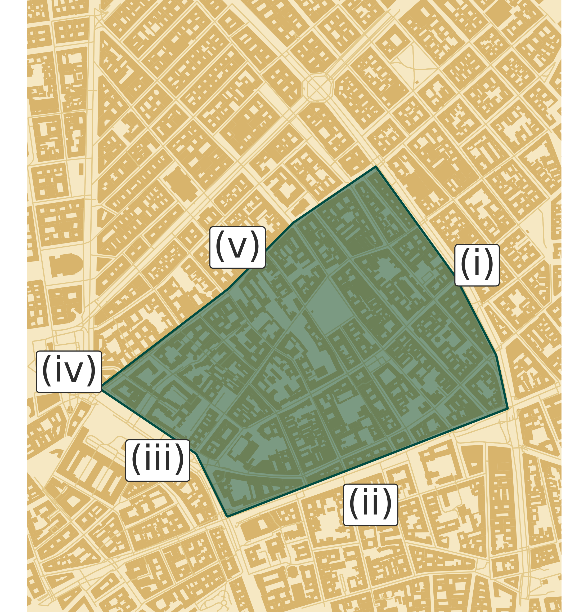
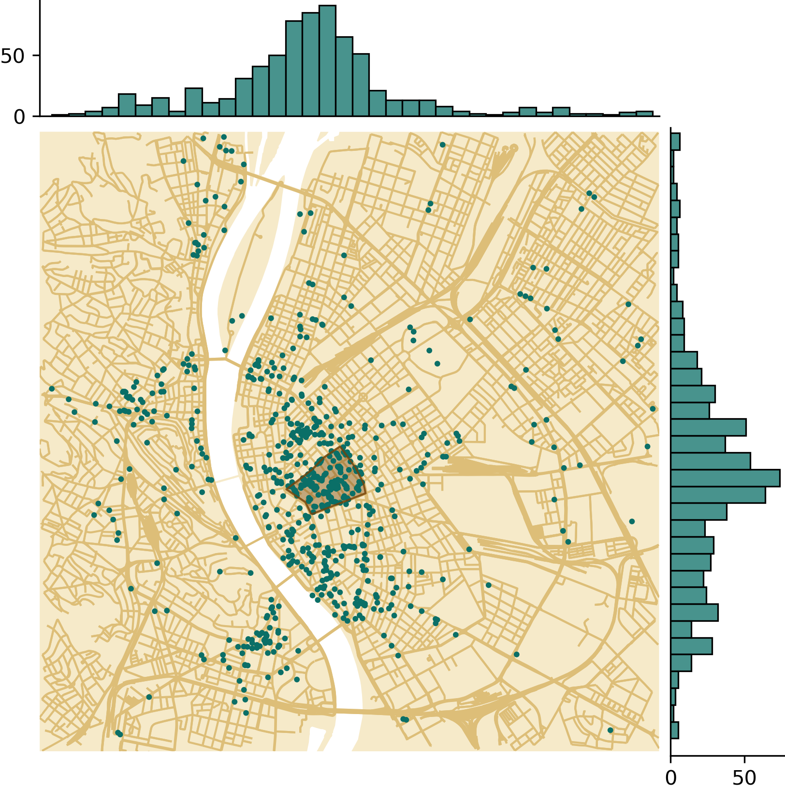

The so-called party district is not an official city area with definite borders. Usually, the area bounded by the Károly Boulevard (iii), Király Street (v), Erzsébet Boulevard (i), and Rákóczi Street (ii) is referred to as "party district" (see Figure <a href="/docs/dissertation/appendix#fig:party_district">A.1a</a>). This area is famous for ruin-pubs and nightlife, which also involves not being the most active area early in the morning. The vivid nightlife of downtown is not confined only to this area. The Deák Ferenc Square (iv), the northern side of the Király Street (v), and the eastern side of the Erzsébet Boulevard (i) can also be considered part of the party district.

Actually, how big is the party district? To answer this question, the points of interest (POI) have been downloaded from the OpenStreetMap (OSM) in the categories of "bar", "pub", "biergarten" and "nightclub", using the OSM terminology, and plotted to a map (see Figure <a href="/docs/dissertation/appendix#fig:pubs">A.1b</a>). There are 192 bars, 472 pubs, 12 beer gardens, and 31 nightclubs in the displayed, 9 km by 9 km part of Budapest, and the area from Figure <a href="/docs/dissertation/appendix#fig:party_district">A.1a</a> is also highlighted. Note that the POIs are queried in 2021 and cannot show the actual state of 2017. However, only the tendencies are important, which did not change fundamentally in the last decade. The concentration of bars and pubs is the highest within the highlighted "party district" area, but still very high on the whole Pest-side of the downtown, and there are also three smaller groups on the Buda-side of the city.

<figure id="fig:party_district_and_pubs">

<figcaption><strong>(a)</strong> </figcaption>

<figcaption><strong>(b)</strong> </figcaption>
<figcaption><strong>Figure A.1.:</strong> The borders of the party district (<strong>a</strong>), within District 7; and bars, pubs, beer gardens and nightclubs in Budapest downtown (<strong>b</strong>), based on OpenStreetMap data.</figcaption>
</figure>

