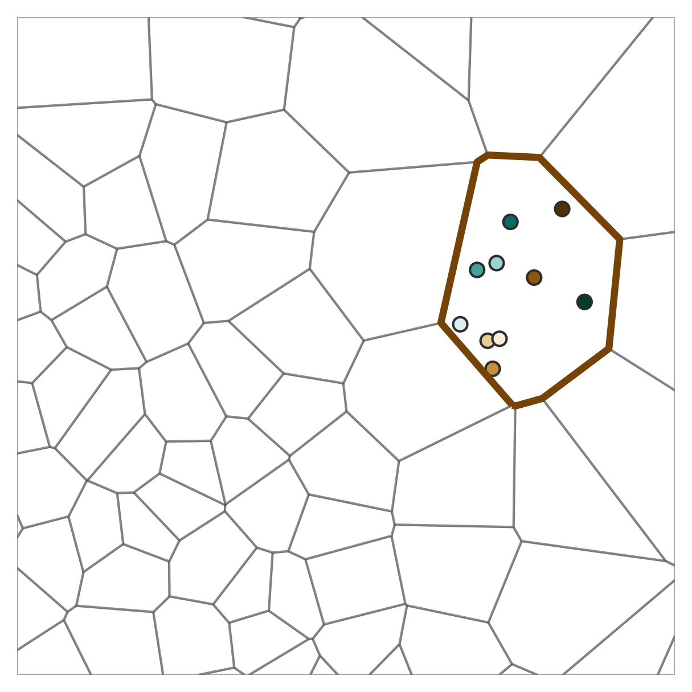
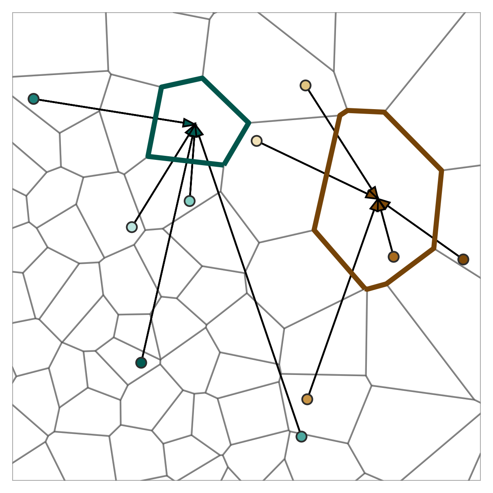
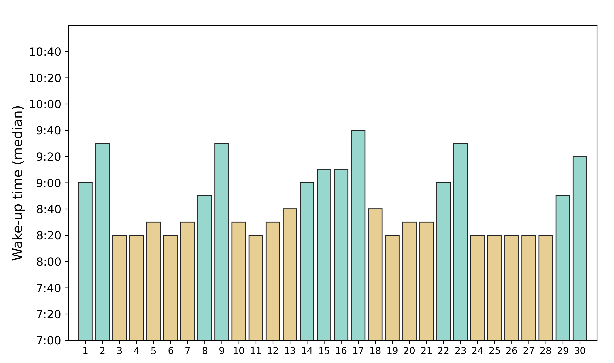
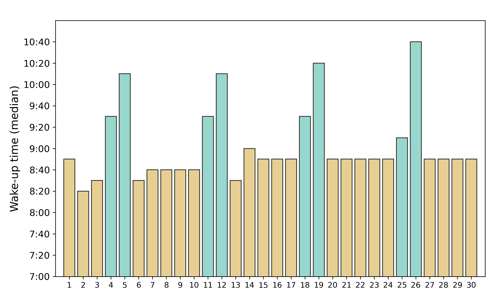
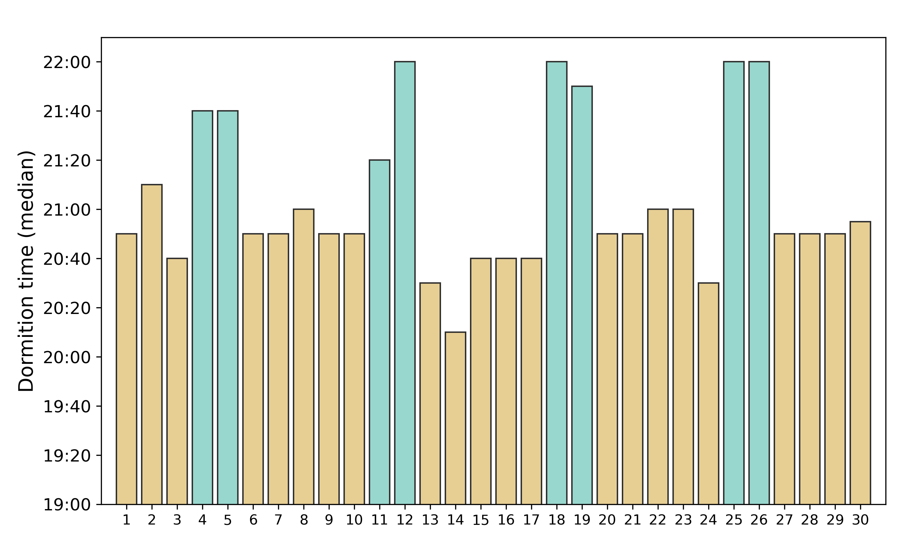
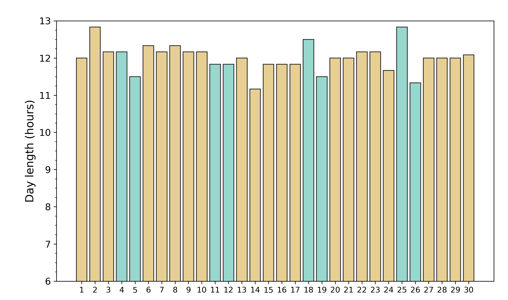
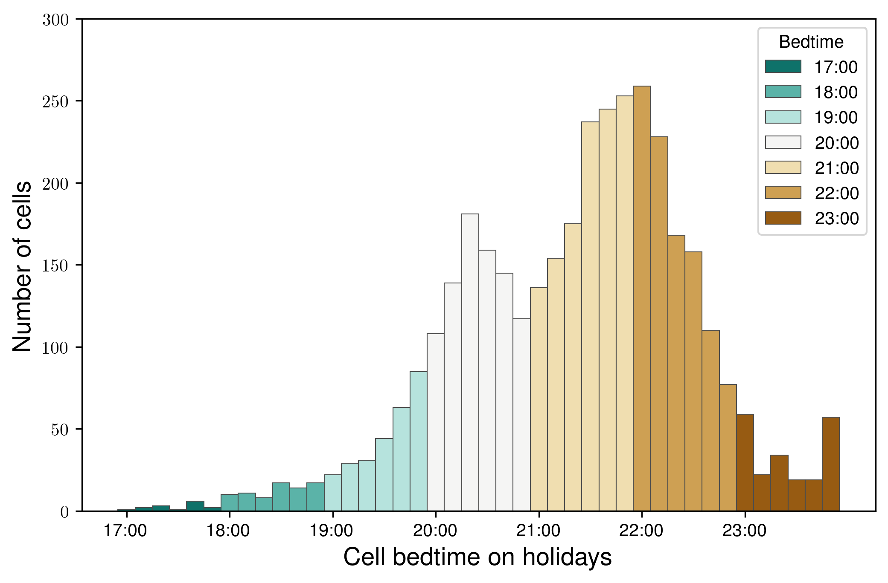
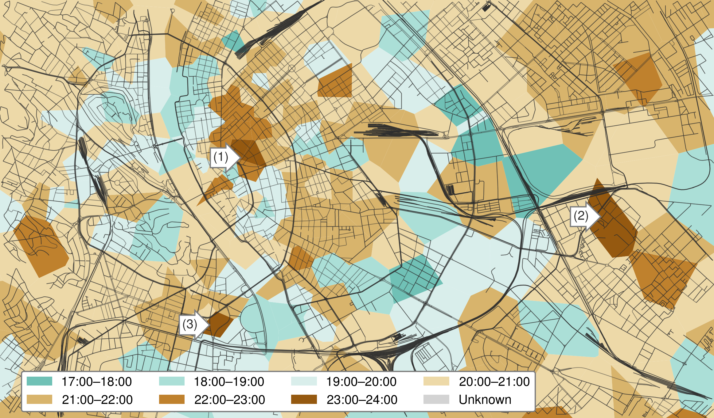
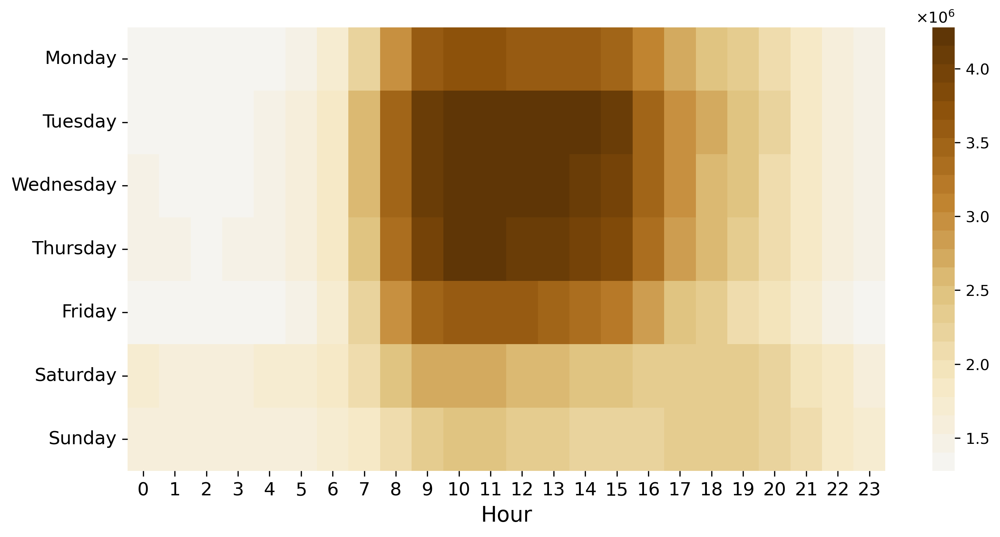
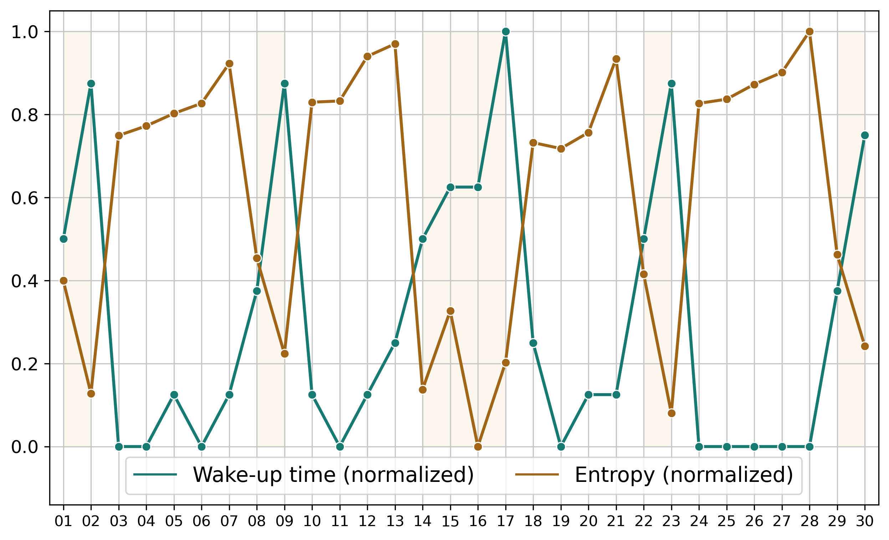

A mobile phone activity precisely follows the subscribers' daily routines. It is enough to see the daily periodicity in Figure <a href="/docs/data_sources#fig:vod201704_timeseries">3.3a</a>. As the daytime activity is so clearly distinguished from the nighttime activity, the question has arisen: "When does the day exactly begin?". And a set of follow-up questions along with it: When do the inhabitants awaken? Are there any differences between the given type of subscribers? When does the city awaken? Are there any differences between the given areas of the city? Furthermore, is it possible to cluster city areas by the time when the activity of the inhabitants, the workers, or the passers-by starts their activity in the morning or halts in the evening? Do city parts have "chronotypes"? Can neighborhoods or districts be described by the terms "morningness" or "eveningness"?

This chapter aims to answer these questions.

## Wake-up Time {#sec:wakeup_time}

<figure id="fig:wakeup_calc">

<figcaption><strong>Figure 7.1.:</strong> Calculation of the wake-up and the bedtimes</figcaption>
</figure>

The Call Detail Records were aggregated for every cell and 10-minute time intervals. Then, the moving average was applied with the window of 12. To determine the wake-up time, the positive edge of the curve needs to be detected when the number of mobile phone activity increases drastically in a short period of time. The wake-up time is considered when the activity value reaches the arithmetic mean of the minimum and the maximum value on the positive edge of the activity curve. The minimum of the aggregated records is usually in the middle of the night, and the maximum is in the afternoon. Figure <a href="/docs/awakening_city#fig:wakeup_calc">7.1</a>, illustrates the concept.

This process was repeated in the case of every day, then the median of the daily wake-up times was determined. Analogously to the wake-up time, the bedtime can be calculated to describe when the mobile phone activity decreases significantly by selecting the mean value on the negative edge. Note that these values are naturally not the actual times when people wake up or fall asleep. Those moments cannot be determined using only the mobile phone network. Using the screen-on events of the phone [<a href="/docs/bibliography#cuttone2017sensiblesleep" title="A. Cuttone, P. Bækgaard, V. Sekara, H. Jonsson, J. E. Larsen, and S. Lehmann, “Sensiblesleep: A bayesian model for learning sleep patterns from smartphone events,” PloS one, vol. 12, no. 1, p. e0169901, 2017.">90</a>] can be much closer to the actual values. Especially in the case of the wake-up time, if the phone is used as an alarm clock. In spite of this, it is supposed that this approximating method can reveal the rough tendencies of the daily routine. Still, the terms "wake-up time" and "bedtime" are used to refer to the time of the positive/rising and negative/falling edges of the daily activity curve, respectively.

## Aggregation of the Subscribers {#sec:grouping}

As the type of phone activity is unknown, the wake-up time of the individual is hard to estimate. Since making a call requires to be awake (whereas message could be received and data could be transferred autonomously), knowing which activities represent phone calls would provide more accurate information about when people are certainly awake. Instead of this, the significant activity increase is used to identify the wake-up time.

The activity of a single device is also sporadic and does not provide enough data to identify an activity increase for all the days. Because of the sporadic nature, the devices were grouped, which could be performed in two ways: calculating the wake-up time of an area (a cell or a cell group) or the inhabitants of an area.

In the first approach, the activity records were aggregated that took place in a given cell, regardless of which SIM cards produce them. In the case of the second version, those activity records were used, which were produced by the inhabitants of the given cell, regardless of where the activity took place. The first approach could be called cell-based grouping, and the latter inhabitant-based grouping. The two approaches are illustrated in Figure <a href="/docs/awakening_city#fig:grouping">7.2</a>. Cells can be grouped further to examine a larger area (e.g., residential, suburb, district).

<figure id="fig:grouping">

<figcaption><strong>(a)</strong> </figcaption>

<figcaption><strong>(b)</strong> </figcaption>
<figcaption><strong>Figure 7.2.:</strong> Visualizing the difference between the cell-based (<strong>a</strong>) and the inhabitant-based (<strong>b</strong>) approaches. The former considers subscribers present in a given cell wherever they live. The latter aggregates activity of the inhabitants to the home cell, regardless where the activity occurred.</figcaption>
</figure>

## Inhabitant-based Approach {#sec:dweller_based_wakeup}

Based on the results of the "April 2017" data set (Figure <a href="/docs/awakening_city#fig:vod201704_daily_wakeups">7.3a</a> and <a href="/docs/awakening_city#fig:vod201704_daily_dormitions">7.3b</a>), the wake-up time almost always around 7:10 on workdays. On Sundays (or Easter Monday in the case of the long holiday), it is later by about one hour. On Saturdays (and the other days of the holiday), it is later by about 30--40 minutes compared to an average workday.

The bedtimes are not so even, but also have a nice trend. The activity decreases between 19:40 and 20:10 on workdays, but the holiday values shifted by 30--50 minutes, similarly to the wake-up times. Interestingly, as bedtimes follow the wake-up times on the weekends, it results that the average day length remains approximately the same. Figure <a href="/docs/awakening_city#fig:vod201704_day_lengths">7.3c</a> shows the day lengths, calculated as a difference between the bedtime and the wake-up time, in minutes. The day lengths are between 12 hours 30 minutes and 13 hours 10 minutes. On average, the day length is 12 hours 45 minutes (the standard deviation is 10 minutes).

The same evaluation was performed on the "June 2016" data set. Figure <a href="/docs/awakening_city#fig:vod201606_daily_wakeups">7.3d</a> and <a href="/docs/awakening_city#fig:vod201606_daily_dormitions">7.3e</a>, show the daily wake-up times and bedtimes, respectively. Basically, the same tendencies can be observed: wake-up times and bedtimes are shifted on holidays. However, there are some irregularities, especially within the bedtimes. On June 22, the bedtime is almost on the same level as a weekend. The mobile phone activity decrease occurred 30 minutes later than on the other days of that week.

<figure id="fig:daily_wakeup_dormition_and_daylength">

<figcaption><strong>(a)</strong> </figcaption>

<figcaption><strong>(b)</strong> </figcaption>

<figcaption><strong>(c)</strong> </figcaption>

<figcaption><strong>(d)</strong> </figcaption>

<figcaption><strong>(e)</strong> </figcaption>

<figcaption><strong>(f)</strong> </figcaption>
<figcaption><strong>Figure 7.3.:</strong> Daily wake-up times (<strong>a</strong>,<strong>d</strong>), bedtimes (<strong>b</strong>,<strong>e</strong>), and the day lengths (<strong>c</strong>,<strong>e</strong>), for the “April 2017” (<strong>a</strong>--<strong>c</strong>) and the “June 2016” (<strong>e</strong>--<strong>e</strong>) dataset. Holidays are represented by a different color.</figcaption>
</figure>

<figure id="fig:dweller_based_wudo_histogram">

<figcaption><strong>Figure 7.4.:</strong> Inhabitant-based wake-up (brown) and bedtime (green) values of the cells, April 2017.</figcaption>
</figure>

Figure <a href="/docs/awakening_city#fig:dweller_based_wudo_histogram">7.4</a> displays the inhabitant-based wake-up and bedtimes of the cells. This result is comparable to [@cuttone2017sensiblesleep Figure 9], however in that case, the wake-up times ($t_{wake}$) were earlier and bedtimes were later ($t_{sleep}$). Note that the difference ensues from the nature of the approach. In [<a href="/docs/bibliography#cuttone2017sensiblesleep" title="A. Cuttone, P. Bækgaard, V. Sekara, H. Jonsson, J. E. Larsen, and S. Lehmann, “Sensiblesleep: A bayesian model for learning sleep patterns from smartphone events,” PloS one, vol. 12, no. 1, p. e0169901, 2017.">90</a>], the screen-on events of the phones are considered, while in Figure <a href="/docs/awakening_city#fig:dweller_based_wudo_histogram">7.4</a>, the active usage of the mobile phone network is aggregated for a larger area. The "SensibleSleep" application [<a href="/docs/bibliography#cuttone2017sensiblesleep" title="A. Cuttone, P. Bækgaard, V. Sekara, H. Jonsson, J. E. Larsen, and S. Lehmann, “Sensiblesleep: A bayesian model for learning sleep patterns from smartphone events,” PloS one, vol. 12, no. 1, p. e0169901, 2017.">90</a>] observes offline (from a mobile phone network perspective) smartphone activity that adjusts better to the actual SWC of an individual.

## The Length of the Day {#sec:day_length}

Figure <a href="/docs/awakening_city#fig:vod201704_daily_wakeups">7.3a</a> and <a href="/docs/awakening_city#fig:vod201704_daily_dormitions">7.3b</a> show that people start and end their days later on the holidays. This makes perfect sense since they do not need to go to work, they do not need to spend time traveling to get somewhere in time, and they probably like to rest more. But, the bedtime is shifted as well, which results that the length of the day remaining practically the same, see Figure <a href="/docs/awakening_city#fig:vod201704_day_lengths">7.3c</a>.

Although the two data sets (Section <a href="/docs/data_sources#sec:vod201606">Vodafone June 2016</a> and <a href="/docs/data_sources#sec:vod201704">Vodafone April 2017</a>) were not recorded in the same year, they still cover two different months of the year (April and June). Considering that a mid-spring month is well represented by the "April 2017" dataset and an early summer month by the "June 2016" dataset (for Budapest), the differences between the wake-up time, bedtime, and the day length can be compared between the two seasons.

Figure <a href="/docs/awakening_city#fig:vod201606_daily_wakeups">7.3d</a> shows a small increase in the wake-up times during the second half of the month. Although that 10-minute increase in the averages cannot be considered significant, it may reflect the end of the school term (June 15). During the intersession, the time schedule of the public transport services is adjusted. For many lines, the headway is increased on workdays, while for some lines, it is decreased, especially on weekends. In this way, the intersession affects the whole transportation system of Budapest and even its agglomeration to some extent.

<figure id="fig:sunrise_sunset">

<figcaption><strong>(a)</strong> </figcaption>

<figcaption><strong>(b)</strong> </figcaption>
<figcaption><strong>Figure 7.5.:</strong> Sunrise (<strong>a</strong>) and sunset (<strong>b</strong>) times of June 2016 and April 2017 projected to the same figure to highlight the differences between the seasons, using data from [<a href="/docs/bibliography#visualcrossing" title="V. C. Corporation, “Visual Crossing Weather (2016-2017).” 2021. Available: https://www.visualcrossing.com/">120</a>].     </figcaption>
</figure>

Until the summer solstice (June 20 in 2016 [<a href="/docs/bibliography#espenak2018solstices" title="F. Espenak, “Solstices and Equinoxes: 2001 to 2050.” Feb. 20, 2018. Available: http://astropixels.com/ephemeris/soleq2001.html">147</a>]), the days are getting longer, but can the longer daylight have an effect on mobile phone network activity? As a reference, astronomical information (sunrise and sunset) has obtained from [www.visualcrossing.com](www.visualcrossing.com) [<a href="/docs/bibliography#visualcrossing" title="V. C. Corporation, “Visual Crossing Weather (2016-2017).” 2021. Available: https://www.visualcrossing.com/">120</a>] for Budapest. Figure <a href="/docs/awakening_city#fig:sunrise_sunset">7.5</a> shows the difference between the sunrises and the sunsets during the two observation periods of the data sets, projected to the same figure. The dashed lines display the values of June, and the solid lines display the values of April. As the summer solstice is in June, the differences during the month are negligible, but in April, the differences between the beginning and the end of the month are much more significant.

So, in June, the Sun rises earlier and sets later than in April. Consequently, lighter periods of days are longer. June 15 is more than 2-hour longer than April 15, using the astronomical definitions of the sunrise and sunset. According to the calculated day lengths, the average workday length is 12 hours in the "June 2016" data set and 10 hours and 40 minutes in the "April 2017" data set, resulting in a difference of 80 minutes.

Although this is less than the astronomical difference, the Sun rises very early in the morning, when people are still sleeping. It may be more practical to compare the results with the sunset differences as the people do not wake up earlier to organize an activity before work but may do it after work if it is still bright and the weather is good. The Sun went under at 19:33 on April 15 and at 20:42 on June 15, which is a 69-minute difference that is more comparable to the calculated values. The average workday bedtime values are 19:43 and 20:47, respectively. This finding --- the day lengths are longer in June --- is in good agreement with [<a href="/docs/bibliography#monsivais2017seasonal" title="D. Monsivais, K. Bhattacharya, A. Ghosh, R. I. M. Dunbar, and K. Kaski, “Seasonal and geographical impact on human resting periods,” Scientific reports, vol. 7, no. 1, pp. 1–10, 2017.">97</a>], where the seasonal influence of the daylight was examined via the length resting period.

The wake-up times are 8:57 and 8:44 on average (workdays), which shows a slight decrease in the summer. Figure <a href="/docs/awakening_city#fig:vod201606_daily_wakeups">7.3d</a> shows slightly later wake-up times in the second half of the month. The average workday wake-up time in the first half of June 2016 is 8:39, and 8:50 in the second half. As mentioned in Section <a href="/docs/awakening_city#sec:dweller_based_wakeup">Inhabitant-based Approach</a>, it might be caused by the end of the school term.

## Area-based Approach {#sec:area_based_wakeup}

Based on the cell/area activity, the wake-up, and the bedtime has been determined for every cell. Figure <a href="/docs/awakening_city#fig:cell_wakeup_weekday_histogram">7.6a</a> and <a href="/docs/awakening_city#fig:cell_bedt_weekday_histogram">7.6c</a>, show the distribution for workdays, and Figure <a href="/docs/awakening_city#fig:cell_wakeup_weekend_histogram">7.6b</a> and <a href="/docs/awakening_city#fig:cell_bedt_weekend_histogram">7.6d</a>, show distribution for holidays, respectively. The results clearly show that the usage of the mobile phone network intensifies and reduces later on holidays, indicating that people wake up and go to sleep later when they do not work.

<figure id="fig:cell_wakeup_histograms">

<figcaption><strong>(a)</strong> </figcaption>

<figcaption><strong>(b)</strong> </figcaption>

<figcaption><strong>(c)</strong> </figcaption>

<figcaption><strong>(d)</strong> </figcaption>
<figcaption><strong>Figure 7.6.:</strong> Cell based wake-up (<strong>a</strong>, <strong>b</strong>) and bedtime (<strong>c</strong>, <strong>d</strong>) distribution for workdays and holidays, respectively, in the “April 2017” dataset.</figcaption>
</figure>

<figure id="fig:cell_wakeup_malls">

<figcaption><strong>Figure 7.7.:</strong> Spatial distribution of the cell-based wake-up times, malls (1-8) opens at 10:00.</figcaption>
</figure>

<figure id="fig:site_bedtime">

<figcaption><strong>Figure 7.8.:</strong> Spatial distribution of the cell-based bedtimes, aggregated to sites.</figcaption>
</figure>

Figure <a href="/docs/awakening_city#fig:cell_wakeup_malls">7.7</a> shows the spatial distribution of the cell-based wake-up times. The Voronoi polygons, representing the mobile phone cells, are colored by the calculated "wake-up" times. The map clearly shows some extrema, where the times are around 10:00. Extrema 1-8 are all malls (WestEnd City Center (1), Arena Mall (2), Árkád (3), KÖKI Terminál (4), Lurdy Ház (5), Allee (6), MOM Park (7) and Mammut (8)), that uniformly open at 10:00, though 5 and 8 partly serve as office buildings.

Figure <a href="/docs/awakening_city#fig:site_bedtime">7.8</a> shows the bedtime values of the sites on workdays. As the Figure <a href="/docs/awakening_city#fig:cell_bedt_weekday_histogram">7.6c</a> illustrates in respect of cells, the bedtime is usually between 20:00 and 22:00. There are, however, some sites with a later bedtime, and a few of them are denoted in the figure. Marker 1 at the party district (Appendix <a href="/docs/appendix#app:party_district">Party District</a>). The site at marker 2 does not have any distinctive object that could explain this result. However, East of that site, there is a beer factory that might have notable activity in the evening --- compared to the neighborhood --- and the distortion of the Voronoi tessellation could have resulted in this late bedtime. At marker 3, there is a student hostel and, in the neighborhood, there are sport and concert venues.

## Working Hours {#sec:working_hours}

Figure <a href="/docs/awakening_city#fig:day_hour_work-home_activity">7.9</a>, shows the activity distribution by days of week and hours, based on the "April 2017" data set, separating the workplace (<a href="/docs/awakening_city#fig:day_hour_work_activity">7.9a</a>) and the home (<a href="/docs/awakening_city#fig:day_hour_home_activity">7.9b</a>) activity, but using the same scale. At the workplace, most of the activity was recorded during the working hours on workdays, as expected. The activity increases fast in the mornings but decreases more slowly in the afternoon. The home activity was mostly clustered on the weekends, but it had a notable activity peak after the work hours in the evening. The home activity before the working hours does not seem so significant.

This procedure can be applied for every cell (or group of cells, like sites), then the activity of the workers and the inhabitants will represent the workplace and home activity tendencies. Note that a cell can have both workers and inhabitants, so every cell has two aspects. Figure <a href="/docs/awakening_city#fig:site_work_exclusive">7.10a</a> and <a href="/docs/awakening_city#fig:site_home_exclusive">7.10b</a>, illustrates the activity of the subscribers who work and live a selected site, respectively. Figure <a href="/docs/awakening_city#fig:site_work_exclusive">7.10a</a>, also demonstrates the concept of Figure <a href="/docs/awakening_city#fig:wakeup_calc">7.1</a>, using actual data.

As expected, Figure <a href="/docs/awakening_city#fig:site_work_exclusive">7.10a</a> and <a href="/docs/awakening_city#fig:site_home_exclusive">7.10b</a> is in accord with Figure <a href="/docs/awakening_city#fig:day_hour_work_activity">7.9a</a> and Figure <a href="/docs/awakening_city#fig:day_hour_home_activity">7.9b</a>. Workers' activity increases in the morning and decreases late in the afternoon, whereas the inhabitants' activity decreases in the morning and increases late in the afternoon and reaches its peak in the evening. The two aspects of the same site have the opposite tendency.

<figure id="fig:day_hour_work-home_activity">

<figcaption><strong>(a)</strong> </figcaption>

<figcaption><strong>(b)</strong> </figcaption>
<figcaption><strong>Figure 7.9.:</strong> The mobile phone activity distribution by days of week and hours based on the “April 2017” data set, for the work places (<strong>a</strong>) and the homes (<strong>b</strong>).     </figcaption>
</figure>

Applying the same inhabitant-based approach as in the case of the wake-up time (Figure <a href="/docs/awakening_city#fig:wakeup_calc">7.1</a>) to the workers' activity, it is possible to detect the positive and the negative edge of the activity curve. The positive edge could indicate the start of the working hours, and the negative edge could indicate the end of the working hours in a given cell (or site). Moreover, the difference between the two times can determine the length of the working hours.

In most of the sites, the working hours are about 8 hours (Figure <a href="/docs/awakening_city#fig:workday_length_site">7.11</a>), just as expected. In the rest of the sites, --- especially where the working hour is less than seven hours or over nine and a half hours --- the mobile phone activity proved to be so low during the working hours that the results cannot be considered appropriate. Nevertheless, the mobile phone network reflects the length of the working hours.

The work hours do not necessarily start and end at the same time in every workplace. Are there any differences in this regard from a mobile phone perspective?

<figure id="fig:work-home_exclusive_sample">

<figcaption><strong>(a)</strong> </figcaption>

<figcaption><strong>(b)</strong> </figcaption>
<figcaption><strong>Figure 7.10.:</strong> Activity of the workers (<strong>a</strong>) and the inhabitants (<strong>b</strong>) of a selected site, on a selected day.</figcaption>
</figure>

Figure <a href="/docs/awakening_city#fig:workday_length_site">7.11</a> shows the average workday length of the sites. The workday length in most of them is around eight hours, which agrees with the practice in Hungary. Moreover, the distribution of the working hour lengths also verifies the workplace detection approach, summarized in Section <a href="/docs/data_processing_framework#sec:work_home">Home and Work Locations</a>. Although there are some sites with very low (less than seven hours) or high (more than nine and a half hours), these sites have very few activities during the observation period: less than 2% of the total activity occurs in these sites.

The length of the working hours is usually around eight hours in most of the sites, but there might be differences at the beginning and the end of the labor-time. Figure <a href="/docs/awakening_city#fig:workinghours_sankey">7.12b</a> shows the five most frequent beginning and ending labor-time (defined as the positive and negative edge of the workplace activity curve of the site) and the connection between them, using a type of Sankey diagram. It is clear that in most of the sites, the mobile phone network activity increases between 8:30 and 9:30. The most notable group That is not surprising, considering the lunch break. Note that the observed time values may have a delay compared to the actual start of the work since an employee may not actively use the mobile phone network as soon as they arrive at their workplace (or when they leave it).

<figure id="fig:workday_length_site">

<figcaption><strong>Figure 7.11.:</strong> Distribution of workday length in sites.</figcaption>
</figure>

<figure id="fig:working_hours">

<figcaption><strong>(a)</strong> </figcaption>

<figcaption><strong>(b)</strong> </figcaption>
<figcaption><strong>Figure 7.12.:</strong> The distribution of the starting (brown) and the ending (green) of the working hours, in sites (<strong>a</strong>); and the connection between the starting and the ending times (<strong>b</strong>).</figcaption>
</figure>

## In Respect of Mobility

In Chapter <a href="/docs/commuting">Commuting</a>, I showed that the mobility has a weekly seasonality (Figure <a href="/docs/commuting#fig:daily">6.13</a>). As Figure <a href="/docs/awakening_city#fig:daily_wakeup_dormition_and_daylength">7.3</a> shows, the wake-up time also have a seasonality. To compare it with the mobility indicators described in Section <a href="/docs/literature_review#sec:mobility_indicators">Mobility Indicators</a>, the daily wake-up times and the mobility metrics were normalized using min-max feature scaling. Figure <a href="/docs/awakening_city#fig:entropy_vs_wakeup">7.13a</a> and Figure <a href="/docs/awakening_city#fig:gyration_vs_wakeup">7.13b</a> display the normalized Entropy and the normalized Radius of Gyration --- without the non-phone devices --- in contrast to the wake-up times, respectively. As the mobility indicators are determined per subscriber, the inhabitant-based version of the wake-up time is used.

During workdays, both the Entropy and the Radius of Gyration were high, but the wake-up time was low. On holidays, it is on the contrary. The wake-up times were higher, and the mobility indicators were lower. This is not surprising since people tend to wake up earlier on workdays to go to work. Thus people usually need to travel to their workplace. On holidays, it is common to spend more time at home, which also reduces the mobility values. Figure <a href="/docs/awakening_city#fig:mobility_vod201704">7.13</a> visualizes this clearly, especially in the case of Entropy. Numerically (Pearson's R), the correlation between the wake-up times and the mobility indicators (Entropy, Radius of Gyration) are -0.9019 and -0.6869, respectively.

Bedtimes show a similar trend (Figure <a href="/docs/awakening_city#fig:entropy_vs_bedtime">7.13c</a> and Figure <a href="/docs/awakening_city#fig:gyration_vs_bedtime">7.13d</a>) in contrast of the two mobility metrics (Entropy and Radius of Gyration), however, the correlations numerically are not that strong: -0.874 and -0.6479, respectively. This might have been caused by leisure activities after work. While people may go straight to work in the morning, they do not necessarily go home right after work.

<figure id="fig:mobility_vod201704">

<figcaption><strong>(a)</strong> </figcaption>

<figcaption><strong>(b)</strong> </figcaption>

<figcaption><strong>(c)</strong> </figcaption>

<figcaption><strong>(d)</strong> </figcaption>
<figcaption><strong>Figure 7.13.:</strong> Normalized, inhabitant-based wake-up times in contrast of the normalized daily Entropy (<strong>a</strong>) and Radius of Gyration (<strong>b</strong>). Pearson's Rs are -0.9019 and -0.6869, respectively.     Second row: Normalized, inhabitant-based bedtimes in contrast of the normalized daily Entropy (<strong>c</strong>) and Radius of Gyration (<strong>d</strong>). Pearson's Rs are -0.874 and -0.6479, respectively.</figcaption>
</figure>

## Limitations

As the activity curves do not reach their maxima immediately, the selected time does not accurately represent neither the wake-up time nor the time when the working hours actually start. These results can only be used relatively to other cells or areas of the city. The reason for this is that the CDRs in this study only represent the active (in other words, billed) usage of the mobile phone network. However, the employees usually do not actively use the network the moment they arrive at their workplace or home. There is a certain gap between that moment and the first activity. If the available data also contained the passive (cell-switching) communication, the time when a SIM card enters the home or work cell could be used. In this case, the terms "leaving home" and "arriving at the workplace" would be more accurate. Furthermore, the difference between the two could serve as a basis for a precise travel time estimation.

As the active mobile phone network activity is sporadic, most subscribers do not have enough activity records to trace back their daily movement accurately enough to determine when they leave their homes or arrive at their workplaces. Commonly, the subscribers do not have activity at home before work. It would be necessary to have multiple activities in the morning to select the first and last home activity at home to conclude when the subscribers tend to wake up and leave their homes. As this is not assured with this kind of data, this approach is unsuitable for individual-level analysis.

The phone price database does not contain launch prices (see Section <a href="/docs/data_sources#sec:iphone">iPhones</a>), and the applied depreciation method is unknown. The results, utilizing the cell phone price as a socioeconomic indicator, should be interpreted by keeping that in mind.

## Possible Enhancements

With the home and work locations, the distance can be determined. On the other hand, the travel time is hard to estimate. The subscriber could use different transportation modes that have different time demands. Furthermore, the time when the subscriber left the home cell and arrived at the work cell cannot be exactly determined without cell-switching information. Using the worker or inhabitant filtered activity curves --- described in Section <a href="/docs/awakening_city#sec:working_hours">Working Hours</a> ---, the morning fall (and the evening rise) of the home location activity and the rise (and the fall) of the work location activity can be calculated. Considering that the work location activity rises when the workers usually arrive, and the home activity of the inhabitants drops when they usually leave to work, the difference between these values could be applied to estimate the travel time of a group of subscribers. It would, naturally, require a larger number of subscribers in every home--work cell pair, or the locations should be aggregated by base stations or even larger areas of the city.

Although the "edge detection" method used in this paper gives reasonable results to determine the positive and negative edge of the activity curve, it would be worth comparing it with other approaches.

## Conclusions

In this chapter, I introduced "wake-up time" as an indicator to describe the behavior of a group of subscribers. Due to the sporadic nature of the mobile network data, the subscribers were aggregated for this analysis by home and work locations. With wake-up time and its counterpart, called "bedtime", the beginning, the ending, and the length of the working hours were also estimated. Tendencies between the starting and the ending time of the working hours at the work locations were also presented. This indicator was used to classify the groups of subscribers (inhabitant-based approach) and the parts of Budapest (area-based approach); thus, city parts can also be characterized by chronotypes. It was demonstrated by real-life examples such as the opening hours of the malls in Budapest or the late activity fall of the party district.

Wake-up time as a proposed indicator was compared to common indicators, such as Radius of Gyration or Entropy, and a clear negative correlation was found. On workdays, both Radius of Gyration and Entropy values were higher, while the wake-up times were lower. On holidays, it is quite the contrary. The correlation between bedtime, the counterpart of the wake-up time, and the mobility metrics were not that strong but still considerable.

The day length, calculated as a difference between bedtime and wake-up time, was constant between the workdays and holidays: the start and the end of the day were also shifted. On the other hand, the day length reflected the seasonal differences between the two data sets: it was found that the days are longer from the perspective of a mobile phone network when there is more daylight. The longer days are the reason for the delayed activity fall, as the wake-up times were marginally affected by the earlier sunrise.
