Hungary is a typical capital-oriented country. Budapest is the political, economic, logistical, and cultural center of the country, where almost 18% of the population lived [<a href="/docs/dissertation/bibliography#ksh2018budapest" title="Központi Statisztikai Hivatal, Budapest – Gazdaság és társadalom. Keleti Károly utca 5–7., 1024 Budapest, Hungary: Központi Statisztikai Hivatal, 2018.">118</a>]. In 2017, the population of Budapest was 1749734, and the population of Pest county was 1247372. In the agglomeration of Budapest, 837532 people lived according to KSH [<a href="/docs/dissertation/bibliography#kshNT6B01" title="Központi Statisztikai Hivatal, “Calculated population data by settlement - Resident population in Hungary (2017 - 2020).” Available: http://statinfo.ksh.hu/Statinfo/QueryServlet?ha=NT6B01">142</a>]. The river Danube divides the city into the Buda (Boo-da) and the Pest (Pesh-t) side. The former is the supposed more fashionable area, and the property values are remarkably higher (see Figure <a href="/docs/dissertation/data_sources#fig:cell_price_map">3.14</a> and Figure <a href="/docs/dissertation/ses#fig:stacked_price">8.1a</a>).

Due to its central role, Budapest attracts a workforce from a relatively large area. This process makes contact between the capital and the surrounding settlements, called commuting. According to Kiss and Matyusz [<a href="/docs/dissertation/bibliography#kiss2015ingazas" title="A. Kiss and Z. Matyusz, “Az ingázás, mint forgalomkeltő tényező,” Munkaügyi szemle, vol. 59, no. 5, pp. 20–34, 2015.">13</a>], commuting is the relation between two locations. The inhabitants of one source location travel to work to another location; this is called "out-commuting". The target location receives a workforce that is called "in-commuting". The loss of the source location is: (i) the out-commuter does not use the local resources, (ii) does not create value, (iii) loosens their relation, as it is partly relocated to the target location, and (iv) although it brings back income, that is partly spent elsewhere. On the other hand, the target location (i) gains human resources, (ii) can create more value in place, (iii) the local relations and society become stronger, and (v) the local consumption increases.

Pálóczi analyzed the country-wide commuting in Hungary, using the methods of complex network analysis, based on the data of census 2011 [<a href="/docs/dissertation/bibliography#paloczi2016researching" title="G. Pálóczi, “Researching commuting to work using the methods of complex network analysis,” Regional Statistics, vol. 6, no. 1, pp. 3–22, 2016.">143</a>]. He considered settlements as nodes, and commuters as a directed edge between the nodes, then applied the disparity ($Y_{2}$) parameter [<a href="/docs/dissertation/bibliography#barthelemy2005characterization" title="M. Barthelemy, A. Barrat, R. Pastor-Satorras, and A. Vespignani, “Characterization and modeling of weighted networks,” Physica a: Statistical mechanics and its applications, vol. 346, no. 1-2, pp. 34–43, 2005.">144</a>], which was developed to measure the heterogeneity of weighted relations. If $Y_{2}$ is close to one, it means that one destination dominates the commuting.

<figure id="fig:out_commuting">

<figcaption><strong>Figure 6.1.:</strong> Disparity of out-commuting, based on census 2011. Partial replot of [<a href="/docs/dissertation/bibliography#paloczi2016researching" title="G. Pálóczi, “Researching commuting to work using the methods of complex network analysis,” Regional Statistics, vol. 6, no. 1, pp. 3–22, 2016.">143, Figure 3</a>].</figcaption>
</figure>

Figure <a href="/docs/dissertation/commuting#fig:out_commuting">6.1</a> displays a replotted part of [<a href="/docs/dissertation/bibliography#paloczi2016researching" title="G. Pálóczi, “Researching commuting to work using the methods of complex network analysis,” Regional Statistics, vol. 6, no. 1, pp. 3–22, 2016.">143</a>] to illustrate Pálóczi's results in respect of the area discussed in this chapter. As Figure <a href="/docs/dissertation/commuting#fig:out_commuting">6.1</a> shows, settlements next to Budapest are darker, meaning that the connections of these settlements are one-sided. Pálóczi demonstrated that the out-commuting dependency is not the greatest around Budapest, but around Győr and Székesfehérvár [<a href="/docs/dissertation/bibliography#paloczi2016researching" title="G. Pálóczi, “Researching commuting to work using the methods of complex network analysis,” Regional Statistics, vol. 6, no. 1, pp. 3–22, 2016.">143</a>], but also high at the centers of the employment regions (e.g., chief towns of the counties).

Kiss and Matyusz state that [^1], although commuting is an important and common phenomenon, its measurement is occasional and inadequate [<a href="/docs/dissertation/bibliography#kiss2015ingazas" title="A. Kiss and Z. Matyusz, “Az ingázás, mint forgalomkeltő tényező,” Munkaügyi szemle, vol. 59, no. 5, pp. 20–34, 2015.">13</a>]. Commuting is predominantly analyzed by the census data, but that is performed only once in a decade and thus cannot follow sudden but permanent changes. They also stress that commuting should be examined continuously, and its methodology should be established.

As questioning the population is a slow, tedious and expensive task, it would be obvious to automate the process with the available info-communication technologies (ICT). In this chapter, the application of CDR processing is proposed to examine commuting, mainly to Budapest, and the findings are validated by the results of studies that analyzed commuting using census data. In many cases, the findings are presented in a form as close to those results as possible to aid the comparison.

## Home and Work Locations

To analyze commuting, the subscribers' home and work locations have to be determined. As the CDRs are anonymized, do not contain information like a residential address. The workplace is even not mandatory for a subscription, the operators cannot have that information. The process of home and work location estimation is described in Section <a href="/docs/dissertation/data_processing_framework#sec:work_home">Home and Work Locations</a>. After these locations have been determined, they should be validated. Although the applied approach is practically equivalent to what can be found in the literature, the validity of the results is hard to confirm. Pappalardo managed to validate the home location in the case of sixty-five subscribers [<a href="/docs/dissertation/bibliography#pappalardo2021evaluation" title="L. Pappalardo, L. Ferres, M. Sacasa, C. Cattuto, and L. Bravo, “Evaluation of home detection algorithms on mobile phone data using individual-level ground truth,” EPJ data science, vol. 10, no. 1, p. 29, 2021.">16</a>], but this is not possible in this case. So, the settlement and --- in the case of Budapest --- district based population data [<a href="/docs/dissertation/bibliography#kshNT6B01" title="Központi Statisztikai Hivatal, “Calculated population data by settlement - Resident population in Hungary (2017 - 2020).” Available: http://statinfo.ksh.hu/Statinfo/QueryServlet?ha=NT6B01">142</a>] is applied from the KSH.

Figure <a href="/docs/dissertation/commuting#fig:comparing_population">6.2</a>, shows a comparison of the population between the KSH and the CDR data. When comparing the two maps, there are a few differences: Some parts of Budapest are not dark enough on the CDR map. Districts 16 and 17 seem not as populated as in the KSH data. Nevertheless, the divergent districts are on the Buda side: Districts 2 and 3. The difference may have ensued from the inaccuracy of the home detection in that area or simply from the different preferences in mobile operators of the inhabitants of the Buda Hills.

<figure id="fig:comparing_population">
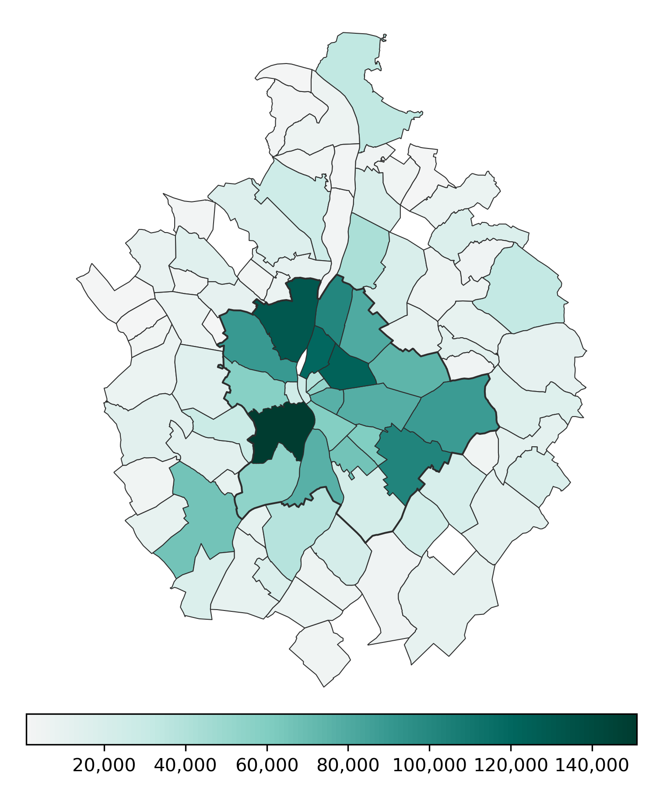
<figcaption><strong>(a)</strong> </figcaption>

<figcaption><strong>(b)</strong> </figcaption>
<figcaption><strong>Figure 6.2.:</strong> Comparing the ground truth [<a href="/docs/dissertation/bibliography#kshNT6B01" title="Központi Statisztikai Hivatal, “Calculated population data by settlement - Resident population in Hungary (2017 - 2020).” Available: http://statinfo.ksh.hu/Statinfo/QueryServlet?ha=NT6B01">142</a>] (<strong>a</strong>) and the estimated population based on mobile network data (<strong>b</strong>).</figcaption>
</figure>

Apart from this, the findings based on CDRs correlate with the statistical data; the Pearson's R is 0.9213 ($R^2$ is 0.9213RR), counting every SIM cards. Figure <a href="/docs/dissertation/commuting#fig:population_correlation">6.3a</a>, shows this as a regression plot. As described in Section <a href="/docs/dissertation/data_sources#sec:device_types">Device Types</a>, the obtained Call Detail Records contain information (TAC) about the devices that use the mobile network. Based on this information, more than 300000 SIM cards have been identified that do operate other types of devices like cellphones (e.g., 3G modem), indicating that they do not represent people. Figure <a href="/docs/dissertation/commuting#fig:population_correlation_without_nonphones">6.3b</a>, illustrates the correlation without these SIM cards. Although the population values are decreased, the correlation does not seem significantly affected: Pearson's R is 0.9213WithoutNonphones.

<figure id="fig:population_correlations">
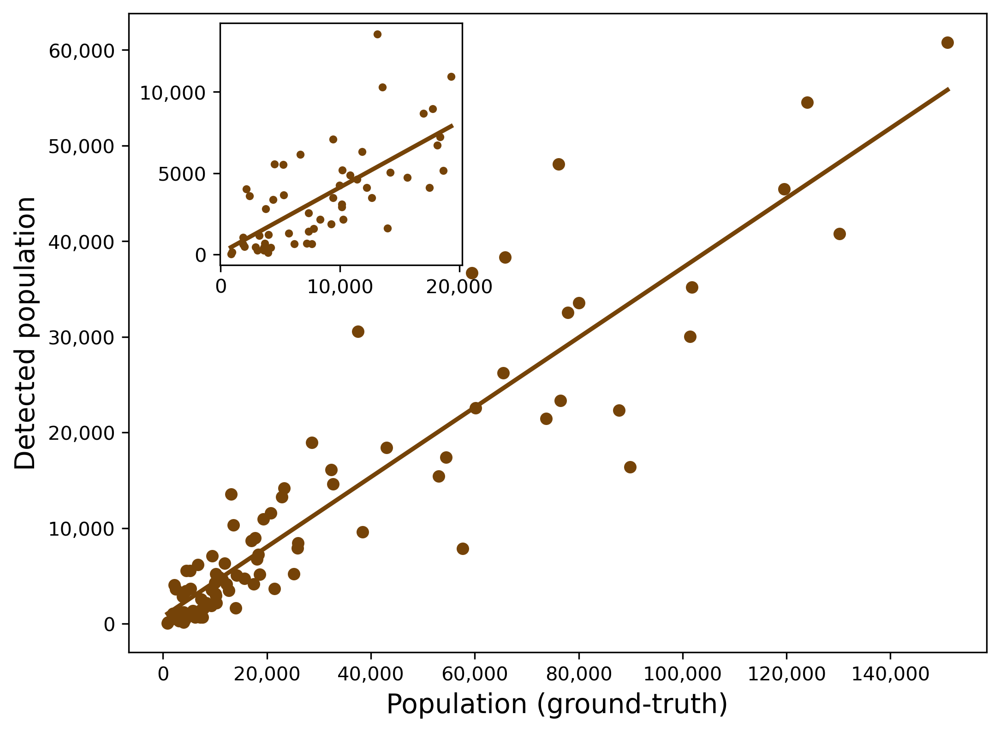
<figcaption><strong>(a)</strong> </figcaption>

<figcaption><strong>(b)</strong> </figcaption>
<figcaption><strong>Figure 6.3.:</strong> Correlation between the population of the agglomeration and the districts of Budapest based on Központi Statisztikai Hivatal, Hungarian Central Statistical Office and mobile network data. In left figure (<strong>a</strong>), all the Subscriber Identity Module card were used, in the right figure (<strong>v</strong>), Subscriber Identity Module card that certainly operate in non-phone devices are excluded.</figcaption>
</figure>

Numerically, the CDR data often shows significant mismatches, but they are not easy to objectively compare. The available mobile network data originated only from one operator, which had about 25% market share in the observation period [<a href="/docs/dissertation/bibliography#nmhh_mobile_market_report" title="National Media and Infocommunications Authority, Hungary, “A Nemzeti Média- és Hírközlési Hatóság mobilpiaci jelentése 2015. IV. – 2019. II. negyedév,” National Media and Infocommunications Authority, 23-25. Ostrom u., Budapest 1015, Hungary, Dec. 2019. Available: http://nmhh.hu/document/208458/NMHH_mobilpiaci_jelentes_2015Q42019Q2.pdf">109</a>]. This market share is about the subscriptions, not the number of unique people. Furthermore, it also has to be noted that this ratio represents a nationwide value. As spatially more detailed market share is not available, it has to be supposed that Vodafone Hungary had the same market share in every subregion to make this comparison. Although this is unlikely, one-fourth of the population values can be used as a rule of thumb.

### Work Locations

Along with the home locations, the workplaces are the most important element of the mobility and commuting analysis. During the COVID-19 pandemic, this has changed. As part of the social distancing directive, to slow down the spread of the disease, working from home has come to the fore. Presumably, the prevalence of home-office will be higher than before the pandemic, as both the employers and the employees got used to this situation, but many scopes of activities will still require a work location, so the importance of this topic will remain the same. However, as the data sources used in this work predates the pandemic, this question could only be answered in another work.

The workplaces have been determined, defined as the most frequent place where a subscriber appears during work hours. See Section <a href="/docs/dissertation/data_processing_framework#sec:work_home">Home and Work Locations</a> for the details. For example, querying the work locations of the inhabitants of an area, a settlement can be the initial step of the commuting analysis. Figure <a href="/docs/dissertation/commuting#fig:dwellers_workplace">6.5</a> shows the typical workplaces of three selected settlements and one district of Budapest, using Gaussian kernel density plots, in two different versions: with (left column) and without (right column) those subscribers who work in their home settlement. When the local workers are included, the darkest areas are the selected area itself, as many people work in the vicinity of their homes.

### Connectivity

As the origin and the destination of the commuting are determined, it is possible to build a network, for example, considering the districts of Budapest nodes that are connected by the commuters. Figure <a href="/docs/dissertation/commuting#fig:district_connectivity">6.4</a> shows the connections between the districts of Budapest. The Buda districts are placed to the left, whereas Pest districts are to the right, and the colors of the nodes match with the district groups in Figure <a href="/docs/dissertation/data_sources#fig:district_groups">3.15a</a>. The edges represent commuters between districts, removing self-links, and the weight of the edges denotes the number of commuters. The weight is expressed by colors, using darker colors for the stronger edges. The weakest links ($w < 250$) are omitted to improve visibility.

Extending this topic to the level of the agglomeration, or the country, could be another research direction: for example, to analyze the in-commuting and out-commuting. Pálóczi's work [<a href="/docs/dissertation/bibliography#paloczi2016researching" title="G. Pálóczi, “Researching commuting to work using the methods of complex network analysis,” Regional Statistics, vol. 6, no. 1, pp. 3–22, 2016.">143</a>] could serve as a census-based reference.

<figure id="fig:district_connectivity">

<figcaption><strong>Figure 6.4.:</strong> Connectivity between Budapest districts, using the home and work locations. A link originates from the home district to the work district, excluding the ones who where lives. The weak links are omitted to improve visibility. The district nodes are colored by the district groups.</figcaption>
</figure>

<figure id="fig:dwellers_workplace">

<figcaption><strong>(a)</strong> Ecser</figcaption>

<figcaption><strong>(b)</strong> Ecser, without local workers</figcaption>
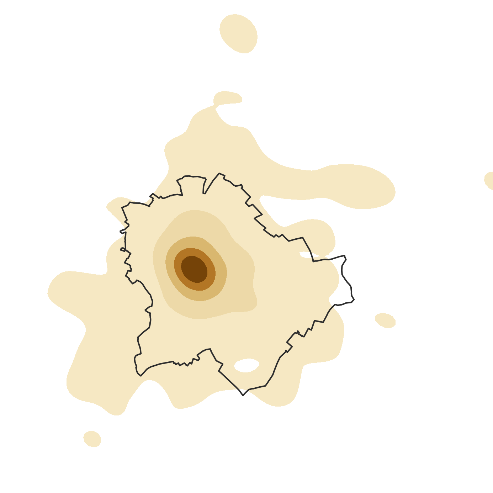
<figcaption><strong>(c)</strong> District 5</figcaption>
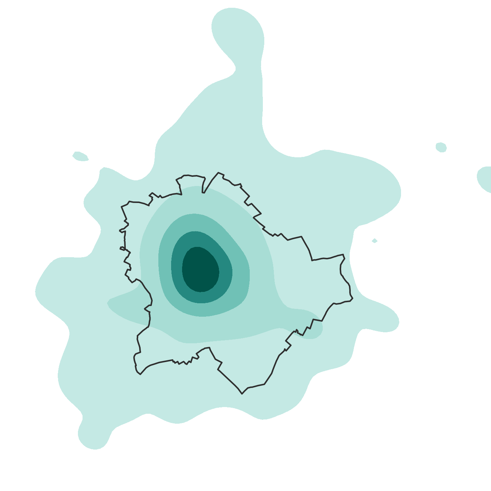
<figcaption><strong>(d)</strong> District 5, without local workers</figcaption>

<figcaption><strong>(e)</strong> Budaörs</figcaption>
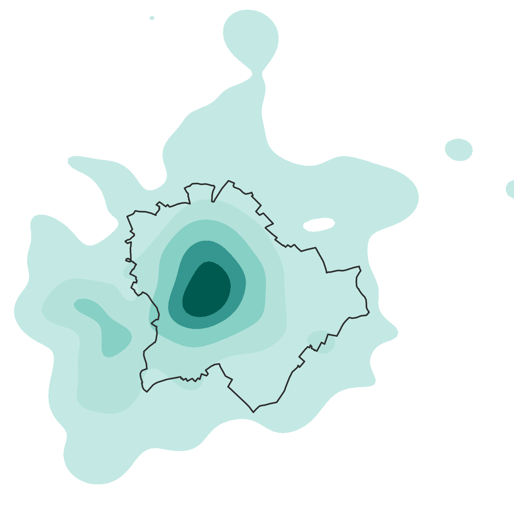
<figcaption><strong>(f)</strong> Budaörs, without local workers</figcaption>

<figcaption><strong>(g)</strong> Dunakeszi</figcaption>

<figcaption><strong>(h)</strong> Dunakeszi, without local workers</figcaption>
<figcaption><strong>Figure 6.5.:</strong> Using kernel density plots (with Gaussian kernel) to display the typical working locations for three selected settlements and a district of Budapest, with (<strong>a</strong>, <strong>c</strong>, <strong>e</strong>, <strong>g</strong>) and without (<strong>b</strong>, <strong>d</strong>, <strong>f</strong>, <strong>h</strong>) local workers.</figcaption>
</figure>

## Validation by Census

In order to verify the reliability and accuracy of the method proposed for the home and work location estimation, a comparative study is performed on the mobile network data and the information processed from the census. In Hungary, a census is obtained every ten years and a micro-census with a 10% corpus at halftime. The last census was performed in 2011, while the last micro-census was in 2016. [^2] Based on these surveys, commuting to Budapest (and generally in Hungary) is analyzed in studies like [<a href="/docs/dissertation/bibliography#kiss2015ingazas" title="A. Kiss and Z. Matyusz, “Az ingázás, mint forgalomkeltő tényező,” Munkaügyi szemle, vol. 59, no. 5, pp. 20–34, 2015.">13</a>, <a href="/docs/dissertation/bibliography#lakatos2016munkaero" title="M. Lakatos and G. Kapitány, “Daily Mobility of Labour Force (Commuting) and Travel in Budapest and in the Metropolitan Agglomeration Based  on Data of the Population Census. Part II,” Területi Statisztika, vol. 56, no. 2, pp. 209–239, 2016, doi: 10.15196/TS560206.">145</a>, <a href="/docs/dissertation/bibliography#paloczi2016researching" title="G. Pálóczi, “Researching commuting to work using the methods of complex network analysis,” Regional Statistics, vol. 6, no. 1, pp. 3–22, 2016.">143</a>, <a href="/docs/dissertation/bibliography#koltai2020ingazas" title="L. Koltai and A. Varró, “Ingázás a budapesti agglomerációban,” Új munkaügyi szemle, vol. 1, no. 3, pp. 26–37, 2020, Available: https://f.metropolitan.hu/upload/08df3e44257cfad7eb7c29983c72b975243a5ca0.pdf">146</a>]. These studies are used as the reference for comparing the results.

Figure <a href="/docs/dissertation/commuting#fig:commuting_combined">6.6</a> shows the comparison between the CDR and the census-based [<a href="/docs/dissertation/bibliography#koltai2020ingazas" title="L. Koltai and A. Varró, “Ingázás a budapesti agglomerációban,” Új munkaügyi szemle, vol. 1, no. 3, pp. 26–37, 2020, Available: https://f.metropolitan.hu/upload/08df3e44257cfad7eb7c29983c72b975243a5ca0.pdf">146</a>] traveling ratios of the commuters by the districts of Budapest and the home location category. People who work in Budapest are represented, and the home location can be (i) the same district where one works, (ii) another district of Budapest, (iii) the agglomeration, and (iv) other settlements outside the agglomeration.

<figure id="fig:commuting_combined">

<figcaption><strong>(a)</strong> </figcaption>

<figcaption><strong>(b)</strong> </figcaption>
<figcaption><strong>Figure 6.6.:</strong> Comparison between the census based (<strong>a</strong>) [<a href="/docs/dissertation/bibliography#koltai2020ingazas" title="L. Koltai and A. Varró, “Ingázás a budapesti agglomerációban,” Új munkaügyi szemle, vol. 1, no. 3, pp. 26–37, 2020, Available: https://f.metropolitan.hu/upload/08df3e44257cfad7eb7c29983c72b975243a5ca0.pdf">146, Figure 1</a>] and the Call Detail Record (<strong>b</strong>) commuting ratios to the districts of Budapest, from the same district, other parts of Budapest, the agglomeration or out of the agglomeration.</figcaption>
</figure>

Good agreement mostly within Budapest has been found on the proportions of the commuters. The most significant difference can be seen with the "outside agglomeration" category. This deviation, however, originated from the content of the data source, as the mobile network data used in this study covers mainly the area of Budapest and its close vicinity. It also contains phone activities from the surrounding county, but by moving away from Budapest, the available data decreases.

The fraction of workers who have their homes in the same district is very close to the census data in the outer districts (15--23) but generally overestimated in the core districts (1, 5--9) and the inner districts (2--4, 10--14). The workers from other district groups show the best match to the census data (where the CDR should have the best quality), while the agglomeration is somewhat overestimated in many districts.

## The Agglomeration {#sec:agglomeration}

In [<a href="/docs/dissertation/bibliography#lakatos2016munkaero" title="M. Lakatos and G. Kapitány, “Daily Mobility of Labour Force (Commuting) and Travel in Budapest and in the Metropolitan Agglomeration Based  on Data of the Population Census. Part II,” Területi Statisztika, vol. 56, no. 2, pp. 209–239, 2016, doi: 10.15196/TS560206.">145</a>], there is a more detailed analysis regarding the commuting from the agglomeration that is divided into six sectors, and the commuting was examined by origin (home sector, occasionally by towns) and destination (district group of Budapest).

Figure <a href="/docs/dissertation/commuting#fig:commuting_from_agglomeration">6.7</a> shows the commuters' distribution in the districts of Budapest, from the six sectors of the agglomeration, based on the CDR evaluation. In representation, Figures <a href="/docs/dissertation/commuting#fig:northern_sector">6.7a</a>--<a href="/docs/dissertation/commuting#fig:north_western_sector">6.7f</a> are analogous to [<a href="/docs/dissertation/bibliography#lakatos2016munkaero" title="M. Lakatos and G. Kapitány, “Daily Mobility of Labour Force (Commuting) and Travel in Budapest and in the Metropolitan Agglomeration Based  on Data of the Population Census. Part II,” Területi Statisztika, vol. 56, no. 2, pp. 209–239, 2016, doi: 10.15196/TS560206.">145</a>], and show to which districts the inhabitants commute from the given sector of the agglomeration.

<figure id="fig:commuting_from_agglomeration">
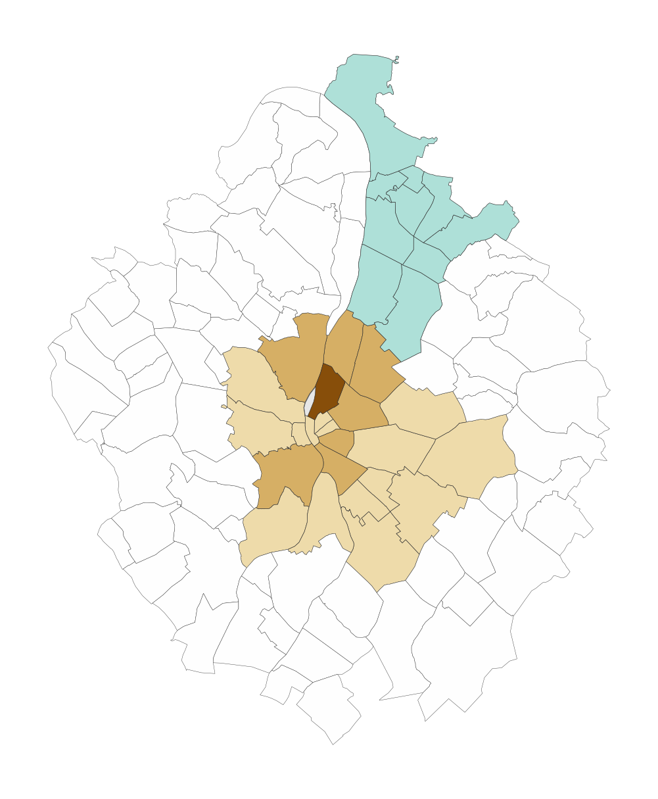
<figcaption><strong>(a)</strong> Northern Sector</figcaption>

<figcaption><strong>(b)</strong> Eastern Sector</figcaption>
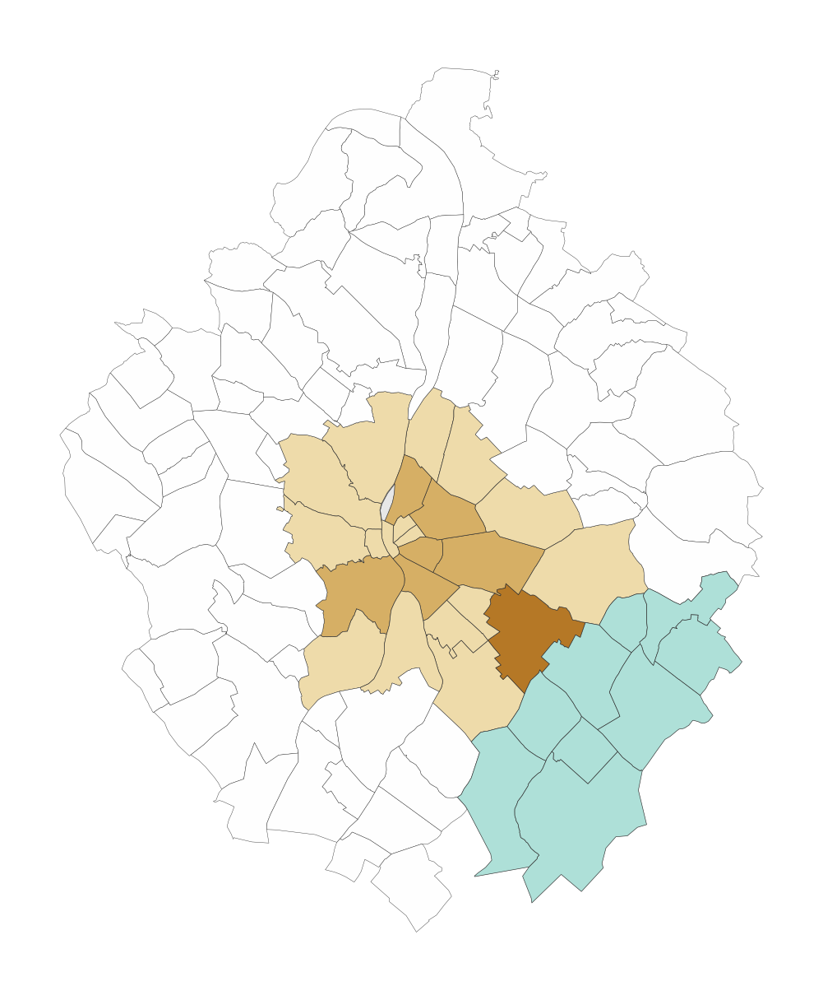
<figcaption><strong>(c)</strong> Southeastern Sector</figcaption>

<figcaption><strong>(d)</strong> Southern Sector</figcaption>
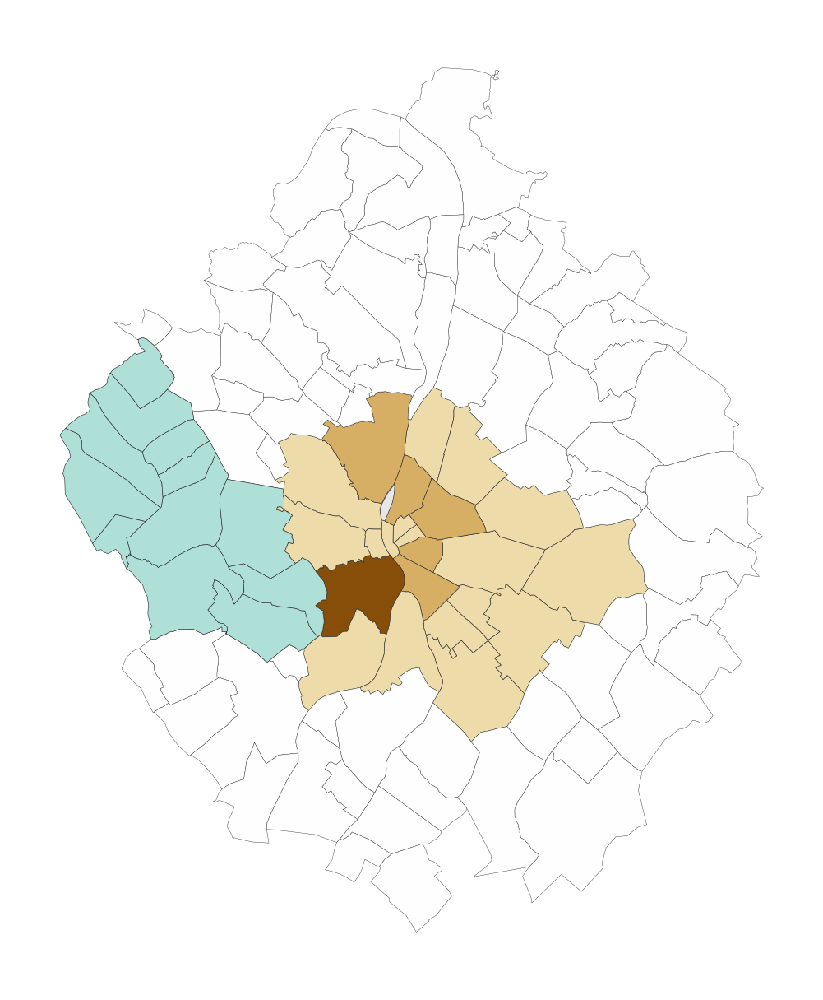
<figcaption><strong>(e)</strong> Western Sector</figcaption>

<figcaption><strong>(f)</strong> Northwestern Sector</figcaption>
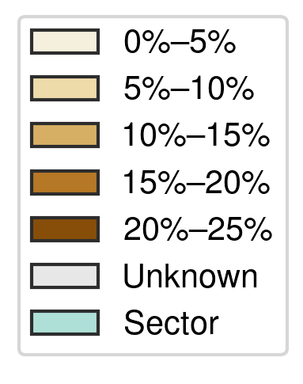
<figcaption><strong>(g)</strong> </figcaption>
<figcaption><strong>Figure 6.7.:</strong> Commuting from the six sectors of the agglomeration, based on Call Detail Record evaluation.</figcaption>
</figure>

 []{#fig:sectors_legend label="fig:sectors_legend"}

Lakatos and Kapitány analyzed the commuting tendencies of some settlements to the districts of Budapest between censuses: 1990, 2001, and 2011 [<a href="/docs/dissertation/bibliography#lakatos2016munkaero" title="M. Lakatos and G. Kapitány, “Daily Mobility of Labour Force (Commuting) and Travel in Budapest and in the Metropolitan Agglomeration Based  on Data of the Population Census. Part II,” Területi Statisztika, vol. 56, no. 2, pp. 209–239, 2016, doi: 10.15196/TS560206.">145</a>]. The same analysis has been made using CDR processing, and six settlements of the 13 thoroughly analyzed of [<a href="/docs/dissertation/bibliography#lakatos2016munkaero" title="M. Lakatos and G. Kapitány, “Daily Mobility of Labour Force (Commuting) and Travel in Budapest and in the Metropolitan Agglomeration Based  on Data of the Population Census. Part II,” Területi Statisztika, vol. 56, no. 2, pp. 209–239, 2016, doi: 10.15196/TS560206.">145</a>] are presented in this study. The results are summarized in Figure <a href="/docs/dissertation/commuting#fig:commuting_from_cities">6.8</a>, compared with the censuses. It contains a settlement from every sector of the agglomeration, so it also serves as a more focused analysis of Figure <a href="/docs/dissertation/commuting#fig:commuting_from_agglomeration">6.7</a>. The location of the settlements, in relation to Budapest, is also displayed on small maps to give context to the findings. For example, from towns west to the capital, the most common commuting targets are the Buda-side and the inner districts, for example. Moreover, in many cases, the mobile network based findings, which are six years older than the last census, indicate a clear continuation of the previous tendency.

In the case of Budaörs (Figure <a href="/docs/dissertation/commuting#fig:budaors_to_bp_districts">6.8a</a>), albeit North Pest, outer Eastern Pest, and South Pest are not significant commuting destinations, census data show an increasing tendency, which is confirmed by the mobile network data. The CDR based results of South Buda and Inner Pest also fit the trend, but in an opposite tendency. The most considerable discrepancy lies in the cases of North Buda and the inner Eastern Pest district groups. The Pearson correlation coefficient, regarding all the six district groups, between the census 2011 and the mobile network data is 0.8976.

Dunakeszi (Figure <a href="/docs/dissertation/commuting#fig:dunakeszi_to_bp_districts">6.8b</a>) is east of the River Danube and north of Budapest, which implies the dominance of North Pest as the commuting destination, although its importance has been decreasing over the last few decades, as well as Inner Pest. While South Buda, South Pest, and the outer Eastern Pest have an increasing tendency, the inner Eastern Pest and North Buda do not show such clear tendencies. The correlation coefficient (Pearson's R) between the census (2011) and the CDR based results is 0.9416.

Vecsés is in the southeastern sector of the agglomeration, from where the majority of the commuters work in the inner and outer Eastern Pest, Inner Pest, and South Pest regions. North Pest and Buda was not a notable destination for the commuters, but the results show increasing trends (Figure <a href="/docs/dissertation/commuting#fig:vecses_to_bp_districts">6.8c</a>). The correlation coefficient, in the case of Vecsés, is 0.924.

Dunaharaszti is in the Southern sector of the agglomeration and east of the Danube. Consequently, the main destination of the commuters was South Pest. Besides that, Inner Pest received considerable in-commuters, but its importance seems to be decreasing. The rest of the district groups had roughly the same trends (Figure <a href="/docs/dissertation/commuting#fig:dunaharaszti_to_bp_districts">6.8d</a>). Dunaharaszti has the strongest correlation out of the examined settlements: Pearson's R is 0.971.

Érd has the largest population (65857 in 2017 [<a href="/docs/dissertation/bibliography#kshNT6B01" title="Központi Statisztikai Hivatal, “Calculated population data by settlement - Resident population in Hungary (2017 - 2020).” Available: http://statinfo.ksh.hu/Statinfo/QueryServlet?ha=NT6B01">142</a>]) in the agglomeration and also in the Southern sector. The detected commuting ratios fit into the trends of the last three censuses, although Eastern and South Pest seem overestimated, and North Buda underestimated by the mobile network data based approach (Figure <a href="/docs/dissertation/commuting#fig:erd_to_bp_districts">6.8e</a>). The correlation with the ground-truth is 0.8488 (Pearson's R).

In the case of Szentendre (Figure <a href="/docs/dissertation/commuting#fig:szentendre_to_bp_districts">6.8f</a>), the mobile network based results might show the most significant discrepancy. Still, the correlation coefficient (Pearson's R) is 0.9127. As located in the Northwestern sector, west of the Danube, the most obvious destination for commuting is North Buda. According to census data, it had the most in-commuters, even with a slightly increasing tendency. However, the CDR based results underestimate it, whereas Eastern and South Pest seem overestimated. The result of Inner Pest lags behind the census the latest census data, but that fits into the trend.

These detailed results demonstrate the applicability of the CDR processing for commuting analysis. It would be interesting to compare these results with the next census. That would reveal how precisely these findings fit into the trend of the changing commuting customs of the population of the agglomeration.

<figure id="fig:commuting_from_cities">

<figcaption><strong>(a)</strong> Budaörs</figcaption>
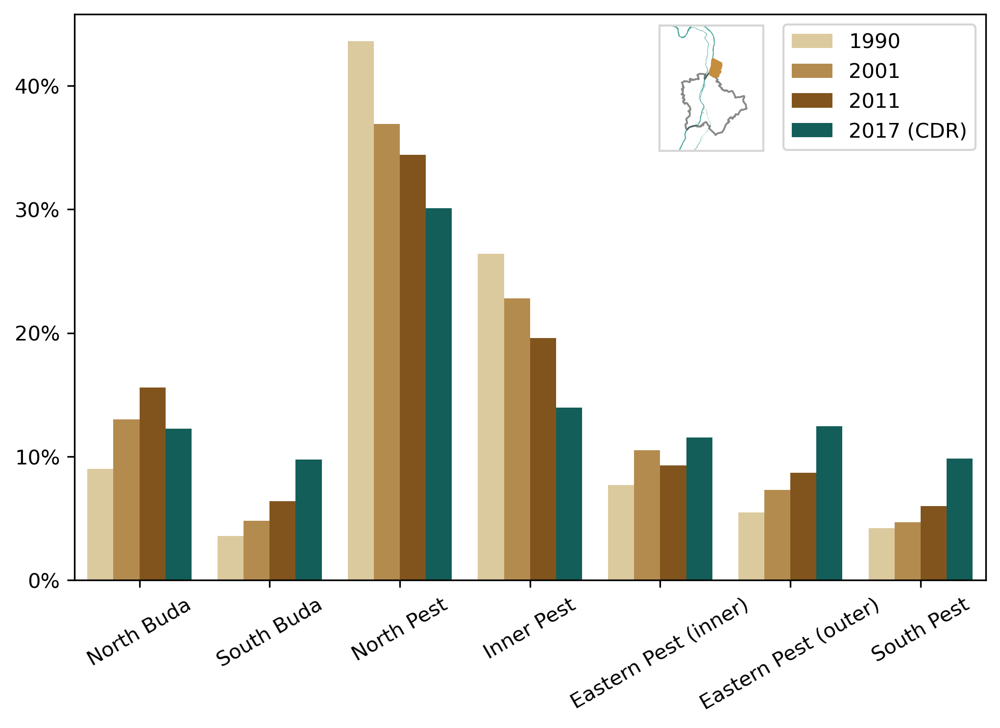
<figcaption><strong>(b)</strong> Dunakeszi</figcaption>

<figcaption><strong>(c)</strong> Vecsés</figcaption>
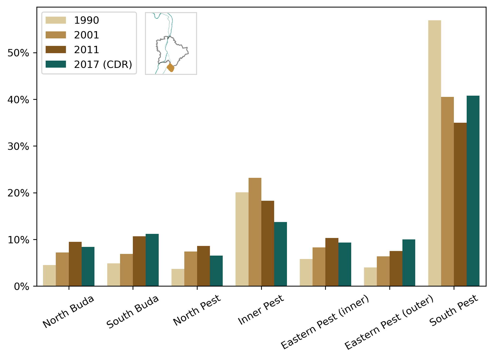
<figcaption><strong>(d)</strong> Dunaharaszti</figcaption>
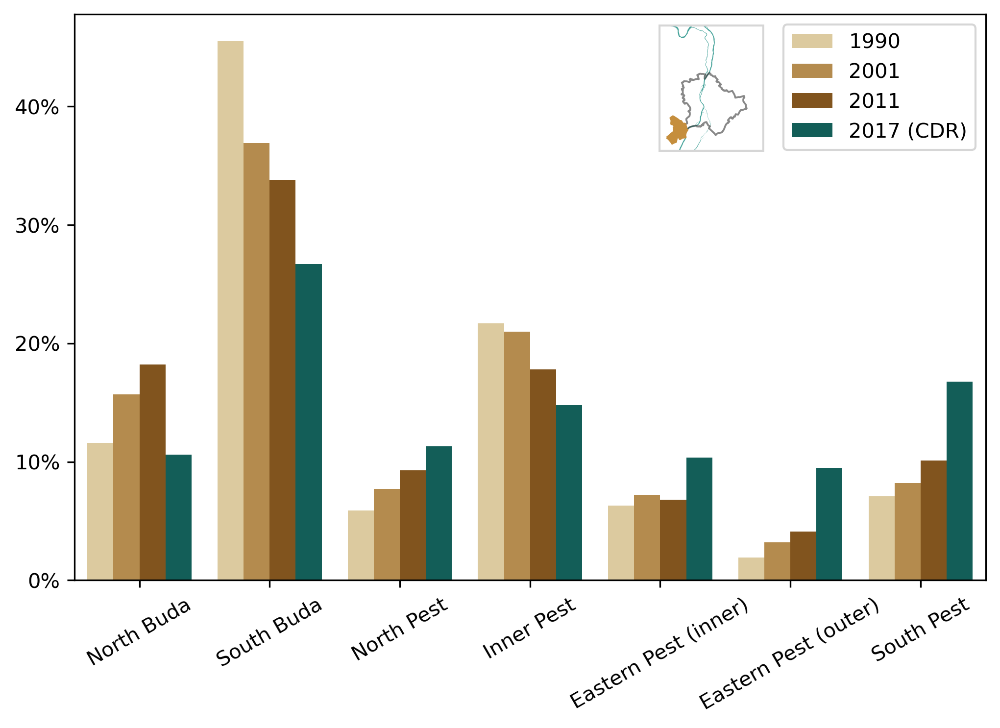
<figcaption><strong>(e)</strong> Érd</figcaption>

<figcaption><strong>(f)</strong> Szentendre</figcaption>
<figcaption><strong>Figure 6.8.:</strong> Commuting to the seven districts groups of Budapest from selected settlements of the agglomeration, comparing census (1990, 2001 and 2011) and mobile network data. Next to the legends, the location of the settlements in question is displayed in a map.</figcaption>
</figure>

## Demography {#sec:demography}

As the available mobile network data contains information about the age and the gender of the subscribers --- in the case of the 66.17% and 70.76% of the subscriptions, respectively --- the commuting trends can be studied by age-groups.

Koltai and Varró provide reference data for this analysis [<a href="/docs/dissertation/bibliography#koltai2020ingazas" title="L. Koltai and A. Varró, “Ingázás a budapesti agglomerációban,” Új munkaügyi szemle, vol. 1, no. 3, pp. 26–37, 2020, Available: https://f.metropolitan.hu/upload/08df3e44257cfad7eb7c29983c72b975243a5ca0.pdf">146</a>]. Figure <a href="/docs/dissertation/commuting#fig:r2t1_census">6.9a</a> shows the distribution of the commuters by age categories and the sector as the home location. Only those commuters were examined who work in Budapest.

It is not clear from the paper what is the upper limit of the "60+" age category. The people who usually go to work are assumed to be younger than 65 years old (the current retirement age in Hungary), although people can work over 65. In the CDR based figure (Figure <a href="/docs/dissertation/commuting#fig:r2t1_cdr">6.9b</a>), the 60+ means over 60 and less than 100. However, there are not many subscribers over 70, only 2.48% of SIM card owned by people older than 70 years. Furthermore, it has to be noted that the age information belongs to the owner of the subscription, not necessarily to the actual user of the phone.

Comparing data obtained by the micro-census and the cellular information, good agreements (Pearson's R is 0.8977) have been found on the trends and measures of the distribution of the commuters by age categories. The most significant difference between the census and the CDR based data are within the "60+" and the "50--59" categories. The number of people in their fifties seems underrepresented by the CDR data, while the "60+" category is overrepresented, that might be caused by the different interpretation of the upper limit. On the other hand, the values are very similar in the other categories. Based on the similarity of the results (Figure <a href="/docs/dissertation/commuting#fig:commuting_to_bp_by_agegroups">6.9</a>), it is confirmed that mobile network data can be a reliable method for commuting analysis even regarding the demographic features.

<figure id="fig:commuting_to_bp_by_agegroups">
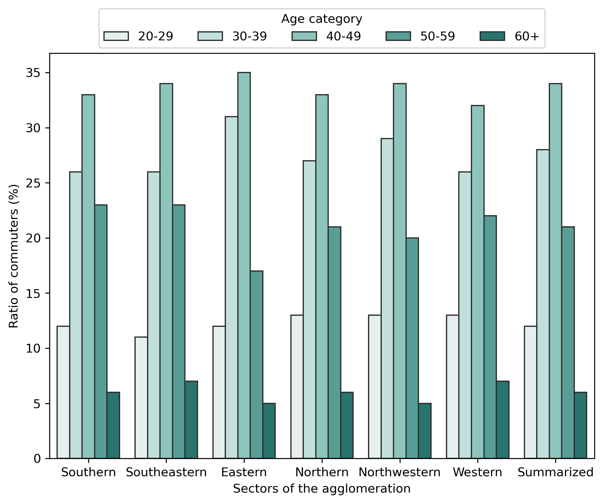
<figcaption><strong>(a)</strong> </figcaption>
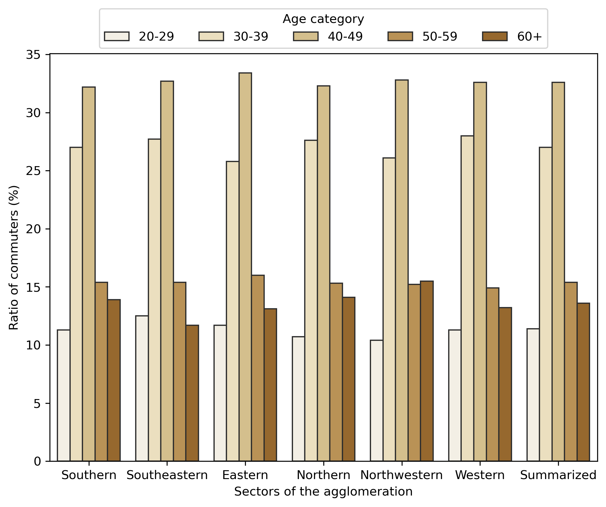
<figcaption><strong>(b)</strong> </figcaption>
<figcaption><strong>Figure 6.9.:</strong> Distribution of the commuters by age categories and the sectors of the agglomeration (%). Comparison between micro-census data [<a href="/docs/dissertation/bibliography#koltai2020ingazas" title="L. Koltai and A. Varró, “Ingázás a budapesti agglomerációban,” Új munkaügyi szemle, vol. 1, no. 3, pp. 26–37, 2020, Available: https://f.metropolitan.hu/upload/08df3e44257cfad7eb7c29983c72b975243a5ca0.pdf">146, Table 1</a>] (<strong>a</strong>), and mobile network data (<strong>b</strong>).</figcaption>
</figure>

## Describing Mobility {#sec:mobility}

Up to this section, the mobility is described by only the home and work locations, and the commuting between these two locations was in focus. However, mobility is a much broader concept. It should contain all the subscribers' activities, not only the work-related ones. There are some widely used indicators in the literature (Section <a href="/docs/dissertation/literature_review#sec:mobility_indicators">Mobility Indicators</a>) to characterize the mobility.

These indicators --- namely Activity Location Number, Radius of Gyration, and Entropy --- have been calculated (Section <a href="/docs/dissertation/data_processing_framework#sec:calculating_indicators">Calculating Indicators</a>) for every subscriber in the data sets. It is important to note that the home-work (beeline) distance can also be a numeric indicator of commuting, but as the Radius of Gyration takes into consideration every location where a subscriber appeared, it can give more insight about the mobility.

The distribution of the distance between the home and work locations shows exponential characteristics Figure <a href="/docs/dissertation/commuting#fig:dist_histogram">6.12c</a>. The majority of the population investigated have chosen workplaces closer than 5 km, and a relatively small number of people need to travel more than 10 km to work.

The radius of gyration (Figure <a href="/docs/dissertation/commuting#fig:gyr_histogram">6.12a</a>) shows normal distribution. However, it is significantly skewed to the right (seems to be similar to the observations performed in Boston [<a href="/docs/dissertation/bibliography#xu2018human" title="Y. Xu, A. Belyi, I. Bojic, and C. Ratti, “Human mobility and socioeconomic status: Analysis of Singapore and Boston,” Computers, Environment and Urban Systems, vol. 72, pp. 51–67, 2018.">10</a>]). The majority of the inhabitants have a relatively small Radius of Gyration; on the other hand, some subscribers need to travel significant distances [<a href="/docs/dissertation/bibliography#song2010limits" title="C. Song, Z. Qu, N. Blumm, and A.-L. Barabási, “Limits of predictability in human mobility,” Science, vol. 327, no. 5968, pp. 1018–1021, 2010.">87</a>].

The Entropy also shows the normal distribution. The majority of Budapest's population visits plenty of locations (Entropy between 0.2 and 0.6), and besides a solid fraction of people who remain in their home's neighborhood (Entropy less than 0.2), there are only a few who visit many places in the city. This is in agreement with the findings of other studies [<a href="/docs/dissertation/bibliography#song2010limits" title="C. Song, Z. Qu, N. Blumm, and A.-L. Barabási, “Limits of predictability in human mobility,” Science, vol. 327, no. 5968, pp. 1018–1021, 2010.">87</a>, <a href="/docs/dissertation/bibliography#pappalardo2015returners" title="L. Pappalardo, F. Simini, S. Rinzivillo, D. Pedreschi, F. Giannotti, and A.-L. Barabási, “Returners and explorers dichotomy in human mobility,” Nature communications, vol. 6, p. 8166, 2015.">5</a>, <a href="/docs/dissertation/bibliography#xu2018human" title="Y. Xu, A. Belyi, I. Bojic, and C. Ratti, “Human mobility and socioeconomic status: Analysis of Singapore and Boston,” Computers, Environment and Urban Systems, vol. 72, pp. 51–67, 2018.">10</a>].

<figure id="fig:settlements_workday_gyration">
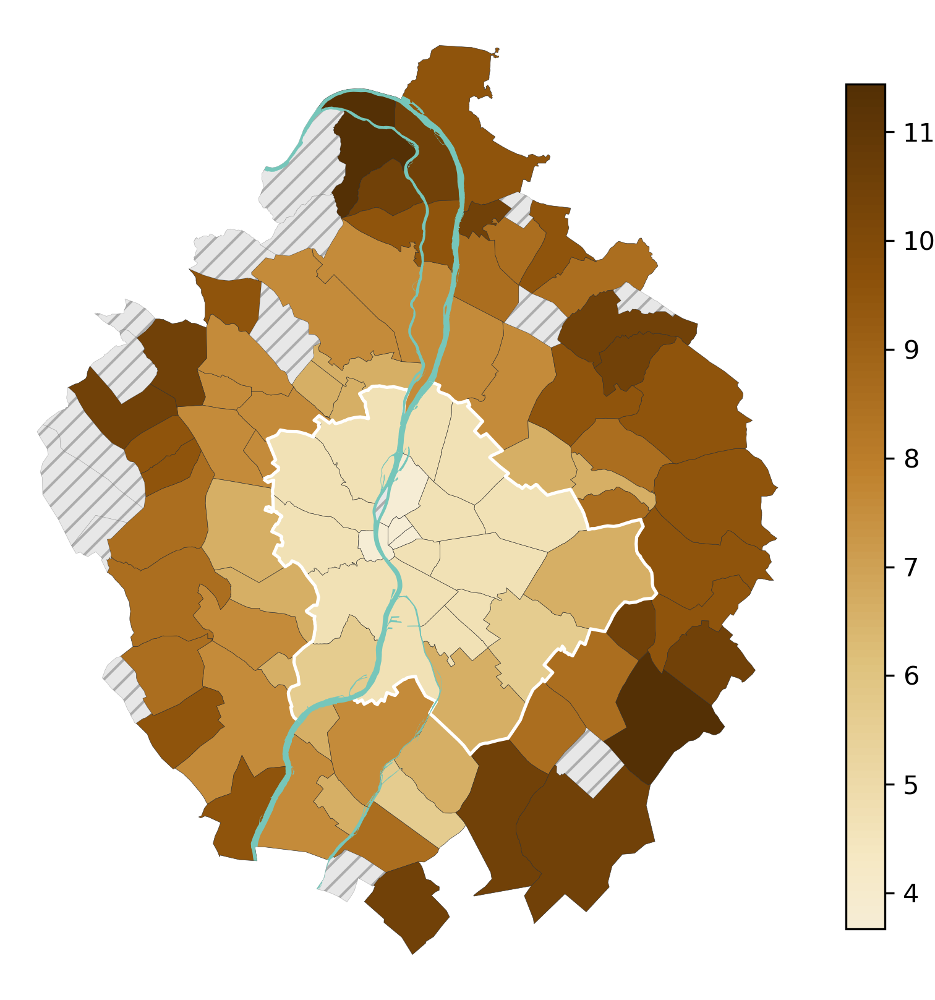
<figcaption><strong>Figure 6.10.:</strong> Budapest districts and the settlements of the agglomeration colored by the mean Radius of Gyration (km) for workdays. The tendency is that the farther someone lives from the city center, the more one travels. The white border denotes the administrative border of Budapest, and the Danube is displayed in green. Settlement without sufficient data is represented by gray.</figcaption>
</figure>

Figure <a href="/docs/dissertation/commuting#fig:settlements_workday_gyration">6.10</a> and <a href="/docs/dissertation/commuting#fig:gyration_map">6.11</a> show the average Radius of Gyration of the individuals whose home location is estimated to be in the given area. The former shows the Budapest districts and the settlements of the agglomeration, and the latter focuses on Budapest at a cell level, using Voronoi polygons as representation. The broad tendencies are the same: The farther one lives from the center, the more one travels, but the cell level map reveals some local city centers that make the image more nuanced. The impact of the local city centers on mobility trends could be a separate topic of investigation.

As the activity time series shows (Figure <a href="/docs/dissertation/data_sources#fig:vod201704_timeseries">3.3a</a>), the mobile network data has a daily periodicity. Besides, there are also fewer activities on holidays. The quantity is one thing, but the quality is another. People do not just use less the mobile network on holidays, but their behavior is quite different. As for one, most of them do not need to go to work, so the usual commuting-related mobility patterns are not applied. This appears in the daily aggregated mobility indicators (Figure <a href="/docs/dissertation/commuting#fig:daily">6.13</a>). People are active at a fewer number of locations (Figure <a href="/docs/dissertation/commuting#fig:nal_daily">6.13c</a>), which might be caused that they stay at home to rest, which is also supported by the entropy results (Figure <a href="/docs/dissertation/commuting#fig:ent_daily">6.13b</a>).

The activities of the people during working days are significantly higher than on the weekends. In addition to, higher values of Gyration Radius, Entropy, and the number of active locations have been recorded on Fridays, which implies that the last working day of the week has a sort of privileged role (Figure <a href="/docs/dissertation/commuting#fig:daily">6.13</a>). On the weekends, more activities and more vibrant travels can be observed on Saturdays, and many of the dwellers rest on Sundays.

## Limitations {#sec:limitations}

The evaluation and the validation have been performed based on the results of other studies that analyzed commuting based on census data. With direct access to the statistical data from KSH and other sources, more and finer aspects of the validation could be performed.

## Conclusion

In this chapter, the evaluation of the subscribers' home and work locations are presented, and the results were compared to the ground truth. Though the detected population numerically differs from the actual population, the distribution across the settlements shows a strong correlation. It can be explained by the fact that the CDRs were obtained from only one mobile network operator.

Based on the home and workplace detection, it was demonstrated that mobile network data could be an effective solution for commuting analysis. The findings are presented in a form as close to the results of other studies that examined commuting in the agglomeration of Budapest as possible to aid the comparison.

It was examined to which district people commute from the sectors of the agglomeration. In the case of some selected settlements, the destination districts of the commuters are also presented in contrast to the last three censuses. It was found that mobile network based results fit into the three-decade tendencies. The commuters were also analyzed by age groups, which also agree with the census-based studies.

These results confirm that mobile network data is capable of commuting analysis. Using activity records from all the operators of a country, a more precise and representative analysis could be performed. Given the fact that mobile networks are available in the most populated areas, mobile network data should be standardized for statistical and sociological usage while respecting privacy and personal data.

<figure id="fig:gyration_map">
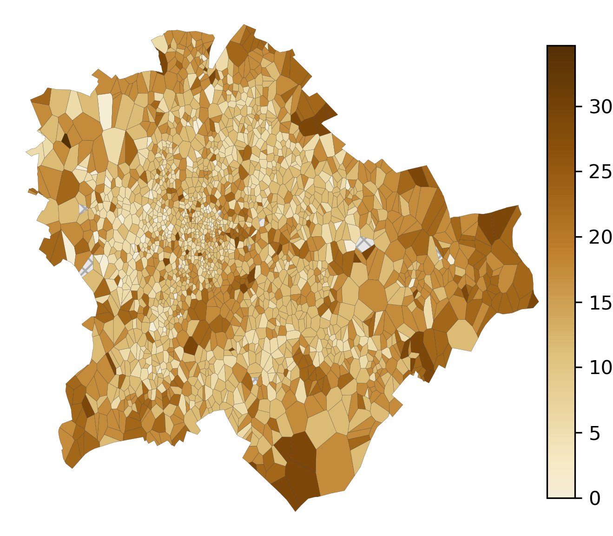
<figcaption><strong>Figure 6.11.:</strong> Cell voronoi polygons colored by Radius of Gyration (km), dark green polygons represent cell without enough data.</figcaption>
</figure>

<figure id="fig:daily">
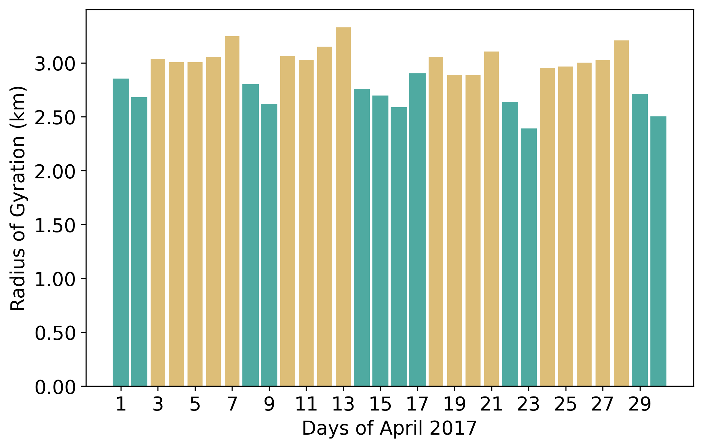
<figcaption><strong>(a)</strong> Radius of Gyration</figcaption>

<figcaption><strong>(b)</strong> Entropy</figcaption>

<figcaption><strong>(c)</strong> Number of Activity Locations</figcaption>
<figcaption><strong>Figure 6.13.:</strong> The differences between workdays (light brown) and holidays (green) are clear. Orange columns represent the holidays, April 14, 2017, was Good Friday and April, 17 2017, was Easter Monday that are holidays in Hungary.</figcaption>
</figure>

[^1]: In respect of Hungary, at least.

[^2]: The next census should have been performed in 2021, but it was postponed due to the COVID-19 pandemic.
