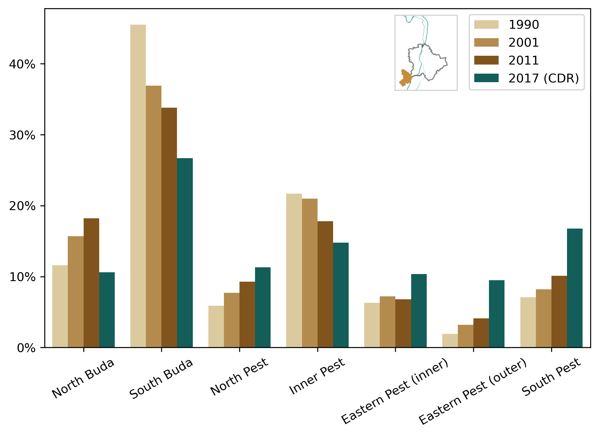
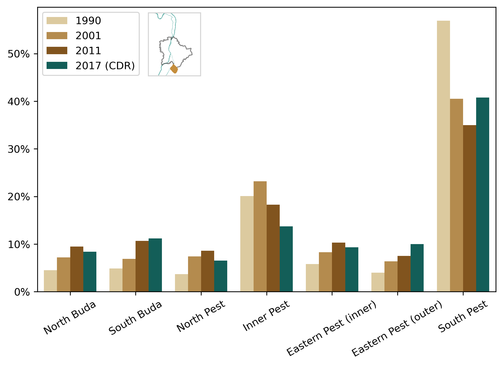
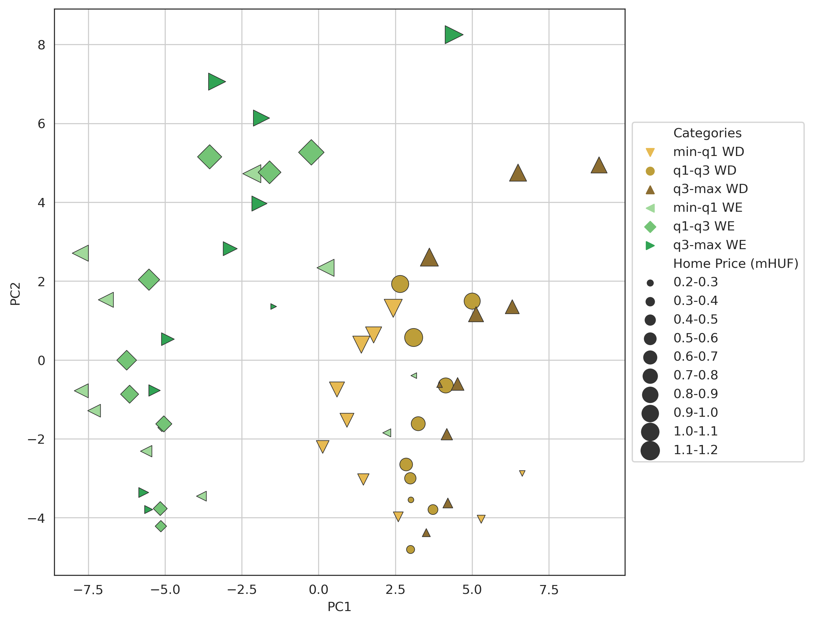
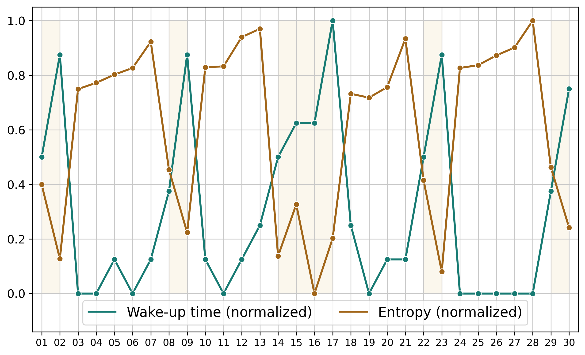

After describing the utilized data sources of my research (Chapter <a href="/docs/data_sources">Data Sources</a>) and briefly introducing my data processing framework (Chapter <a href="/docs/data_processing_framework">Data Processing Framework</a>), I demonstrated its social sensing capabilities with two case studies in Chapter <a href="/docs/social_sensing">Social Sensing</a>. I showed that mobile phone network activity precisely shadows the behavior of football fans or attendees of a mass protest, so capable of social sensing. The first presents the football fan's behavior during and after the Hungarian matches of the Euro 2016 championship. The joy --- felt after the Hungarian goals --- is manifested in the data as sudden activity peaks.

The spontaneous festival after the "Hungary vs. Portugal" match and the welcoming event at the Heroes' Square is comparable to mass protests from a data perspective. Just like the second case study, which presents the protest for the Central European University and against the modification of the Hungarian higher education law. During these events, the mobile network activity was significantly higher than the average in affected areas, clearly representing the people who participated.

In Chapter <a href="/docs/commuting">Commuting</a>, the commuting customs of the population have been extensively investigated using Call Detail Records. First, I presented the results of my home and workplace estimation solution, then the commuting trends between these locations. To aid the comparison, I presented these results in a form as close as possible to other studies' results, focusing on commuting in Hungary and the Budapest agglomeration. The examinations show that commuting analysis can be automatized using mobile network data. It could provide a fast, cost-effective, and relatively punctual method of commuting analysis and a powerful tool for the sociologists interested in commuting.

In Chapter <a href="/docs/awakening_city">Awakening City</a>, I introduced "wake-up time" as an indicator to describe the behavior of a group of subscribers. This new indicator can describe when a group of subscribers starts to use the mobile network in the morning. Due to the sporadic nature of the mobile network data, the subscribers were aggregated for this analysis by home and work locations.

With wake-up time and its counterpart, called "bedtime", the beginning, the ending, and the length of the working hours were also estimated. Tendencies between the starting and the ending time of the working hours at the work locations were also presented. This indicator was used to classify the groups of subscribers (inhabitant-based approach) and the parts of Budapest (area-based approach); thus, city parts can also be characterized by chronotypes. It was demonstrated by real-life examples such as the opening hours of the malls in Budapest or the late activity fall of the party district.

Wake-up time as a proposed indicator was compared to common indicators, such as Radius of Gyration or Entropy, and a clear negative correlation was found. On workdays, both Radius of Gyration and Entropy values were higher, while the wake-up times were lower. On holidays, it is quite the contrary. The correlation between bedtime, the counterpart of the wake-up time, and the mobility metrics were not that strong but still considerable.

The day length, calculated as a difference between bedtime and wake-up time, was constant between the workdays and holidays: the start and the end of the day were also shifted. On the other hand, the day length reflected the seasonal differences between the two data sets: it was found that the days are longer from the perspective of a mobile phone network when there is more daylight. The longer days are the reason for the delayed activity fall, as the wake-up times were marginally affected by the earlier sunrise.

Using socioeconomic classes (Chapter <a href="/docs/socioeconomic_status">Socioeconomic Status</a>) derived from housing prices at the home location, mobile phone prices, and the age of the cell phone, the correlation between the wake-up time and the socioeconomic status was also identified. The subscribers living in less expensive apartments get up earlier, and this tendency holds true in respect of the mobile phone prices: subscribers who own more expensive cell phones tend to get up later.

These results may help to analyze further the city structures by identifying "early bird" or "night owl" areas and possible connections between them. City parts with early morning or late night activities may require different public transport services, for example, and can aid the transportation infrastructure planning. Business development could also benefit from the detailed insight of the neighborhood chronotypes, especially with the associated information on the home locations and the socioeconomic status of the subscribers.

The socioeconomic aspect of these findings can also contribute to a better understanding of the social structure of urban environments. In this regard, further studies need to be made, possibly with detailed census data, to evaluate the commuting and working habits of the different socioeconomic classes.

In Chapter <a href="/docs/socioeconomic_status">Socioeconomic Status</a>, I presented the utilization of housing prices and phone prices as socioeconomic indicators, and I introduced an analytical method to express the correlation between the Social Economic Status (SES) and the mobility patterns of the subscribers.

The Radius of Gyration, Entropy, and Euclidean distance between home and work locations has been derived from the mobile phone network data and used as mobility indicators to characterize the travel patterns of subscribers. The property price of homes has been applied to represent their socioeconomic status. I performed a data fusion method to quantify the SES of mobile phone users at an aggregate level.

By investigating the relationships between SES and three mobility indicators, I found that the wealth level in Budapest has a certain influence on travel customs. The real estate price of home sites does not have a remarkable effect on the number of visited places (Entropy) and Gyration, which suggests that the travel diversity of the inhabitants is not strongly dependent on their socioeconomic status.

On the other hand, the mean distance between home and work locations was significantly correlated to property values. The people living in cheaper regions have to take longer routes to their work sites. This relationship can be explained by the less expensive districts located at the perimeter of the city, while most of the work locations are in the wealthier regions. Analyzing the residents' real estate values at home and work locations, I found a strong positive relationship. Living in a high-priced neighborhood in Budapest requires working in more expensive regions and vice versa.

The Principal Component Analysis revealed similarities and differences in movement behavior of residents living in different price level categories. The correlations of mobility customs and SES found could be used efficiently for supporting the activities of public transportation, real estate developments, and retail.

I also evaluated the connection of movement behavior and SES by performing Principal Component Analysis (PCA). The results showed that the first two components could be sufficient to distinguish the workday and weekend mobility patterns, and the home location's estate price categories. The mobile phone network data can also be used to analyze commuting, similar to census data, even though its spatial resolution is not as accurate. The commuting trends between the given sectors of the agglomeration and the district groups of Budapest match enough to say that Call Detail Records can be a cheaper and temporally more accurate solution for commuting analysis and possibly other kinds of sociological studies.

This research focused on identifying hidden or unclear links between human mobility and socioeconomic status. To that end, this work has been successful. The approach and the framework developed herein can be applied to various locations. The findings can be used to understand more precisely and efficiently the conditions and circumstances, of day-to-day life, for people living in our modern urban environments.

I also demonstrated that mobile phone price is an expressive socioeconomic indicator. It can cluster the areas of a city and distinguish the subscribers by mobility customs. On the other hand, it does not seem to affect the interest in football.

The mobile network data and the cellphone specification databases have been fused. The data fusion also allowed me to remove a considerable number of SIM cards from the examination that certainly operates in other devices than mobile phones. Although there are some still unidentified Type Allocation Codes in the data set, this way, the activity records involved in this study have a significantly higher possibility of being used by an actual person during the events.

## Practical Applicability

Sociological studies are usually performed based on censuses or direct questionnaires. An application of this research would be to support these studies using the anonymized mobile network data as a frequent, countrywide, and cost-effective alternative. Naturally, this application would require legal regulation, as a cooperation with the mobile operators and the Central Statistical Office.

These results may help to analyze further the city structures by identifying "early bird" or "night owl" areas and possible connections between them. City parts with early morning or late night activities may require different public transport services, for example, and can aid the transportation infrastructure planning. Business development could also benefit from the detailed insight of the neighborhood chronotypes, especially with the associated information on the home locations and the socioeconomic status of the subscribers. The socioeconomic findings of this research can also contribute to a better understanding of the social structure of urban and rural environments if the analyses are performed at the country level.

## New Scientific Results {#sec:theses}

### Thesis 1: New Method for Evaluation of the Commuting based on Mobile Network Data {#thesis-1-new-method-for-evaluation-of-the-commuting-based-on-mobile-network-data .unnumbered}

*I have designed a method to describe the commuting patterns of the population quantitatively. The method is based on the statistical detection of the home and work locations using anonymized mobile network data. I have validated the results by comparing them to census-based commuting analyses and found good agreement between the determined mobility patterns and census-based data.*

I have compared the detected population of the districts of Budapest and the settlements of the agglomeration with the population data of KSH [<a href="/docs/bibliography#kshNT6B01" title="Központi Statisztikai Hivatal, “Calculated population data by settlement - Resident population in Hungary (2017 - 2020).” Available: http://statinfo.ksh.hu/Statinfo/QueryServlet?ha=NT6B01">142</a>] and the correlation coefficient (Pearson's R) was 0.9213. The commuting from the sectors of the agglomeration to the districts of Budapest was also evaluated, based on [<a href="/docs/bibliography#lakatos2016munkaero" title="M. Lakatos and G. Kapitány, “Daily Mobility of Labour Force (Commuting) and Travel in Budapest and in the Metropolitan Agglomeration Based  on Data of the Population Census. Part II,” Területi Statisztika, vol. 56, no. 2, pp. 209–239, 2016, doi: 10.15196/TS560206.">145</a>]. Lakatos and Kapitány analyzed commuting directions in the case of 14 settlements. Using the census data, they determined to which district group the inhabitants of these settlements commute. I have replicated this analysis using mobile network data, and the correlation was between 0.8488 (Érd) and 0.971 (Dunaharaszti). Figure <a href="/docs/conclusions#fig:t1_selected_city_commuting_correlation">9.1</a>, summarizes the correlation coefficients of this analysis. Figure <a href="/docs/conclusions#fig:t1_erd_and_dunaharaszti">9.2</a>, shows the detailed results of Érd and Dunaharaszti along with the results of [<a href="/docs/bibliography#lakatos2016munkaero" title="M. Lakatos and G. Kapitány, “Daily Mobility of Labour Force (Commuting) and Travel in Budapest and in the Metropolitan Agglomeration Based  on Data of the Population Census. Part II,” Területi Statisztika, vol. 56, no. 2, pp. 209–239, 2016, doi: 10.15196/TS560206.">145</a>]. As can be seen, the results fit into the trends of the last three censuses.

<figure id="fig:t1_selected_city_commuting_correlation">

<figcaption><strong>Figure 9.1.:</strong> Correlation coefficients (Pearson's R) of commuting distribution with [<a href="/docs/bibliography#lakatos2016munkaero" title="M. Lakatos and G. Kapitány, “Daily Mobility of Labour Force (Commuting) and Travel in Budapest and in the Metropolitan Agglomeration Based  on Data of the Population Census. Part II,” Területi Statisztika, vol. 56, no. 2, pp. 209–239, 2016, doi: 10.15196/TS560206.">145</a>].</figcaption>
</figure>

<figure id="fig:t1_erd_and_dunaharaszti">

<figcaption><strong>(a)</strong> </figcaption>

<figcaption><strong>(b)</strong> </figcaption>
<figcaption><strong>Figure 9.2.:</strong> Commuting to the seven districts groups of Budapest from Érd (<strong>a</strong>) and Dunaharaszti (<strong>b</strong>), comparing census (1990, 2001 and 2011) and mobile network data.     % Next to the legends, the location of the settlements in question is displayed in a map.     </figcaption>
</figure>

Koltai and Varró analyzed the commuters' composition based on the age from the sectors of the agglomeration to the district groups of Budapest [<a href="/docs/bibliography#koltai2020ingazas" title="L. Koltai and A. Varró, “Ingázás a budapesti agglomerációban,” Új munkaügyi szemle, vol. 1, no. 3, pp. 26–37, 2020, Available: https://f.metropolitan.hu/upload/08df3e44257cfad7eb7c29983c72b975243a5ca0.pdf">146</a>]. The results were compared to theirs, and a strong correlation was found in this regard as well: Pearson's R was 0.8977.

My publication pertaining to this thesis: [<a href="/docs/bibliography#pinter2021evaluating" title="G. Pintér and I. Felde, “Evaluating the Effect of the Financial Status to the Mobility Customs,” ISPRS International Journal of Geo-Information, vol. 10, no. 5, p. 328, 2021, doi: 10.3390/ijgi10050328.">149</a>].

### Thesis 2: Correlation between Home and Workplace Price-levels {#thesis-2-correlation-between-home-and-workplace-price-levels .unnumbered}

*Using anonymous mobile network data, I have demonstrated that people living in a less expensive neighborhood usually work in a less expensive area, based on housing prices of the home and the work locations. It has also been presented that people, who live in a more expensive neighborhood, tend to work in a more expensive area.*

Figure <a href="/docs/conclusions#fig:t2_work_home_pricecat">9.3a</a> shows a moderate correlation between the home-work distance and the price level of the home location. Figure <a href="/docs/conclusions#fig:t2_work_price">9.3b</a> illustrates the correlation between the price level of the home and the work location, supporting the thesis.

<figure id="fig:t2">

<figcaption><strong>(a)</strong> </figcaption>

<figcaption><strong>(b)</strong> </figcaption>
<figcaption><strong>Figure 9.3.:</strong> Home-work distances (<strong>a</strong>) and the workplace housing prices in contrast to the housing prices of the workers' home locations (<strong>b</strong>).</figcaption>
</figure>

My publications pertaining to this thesis: [<a href="/docs/bibliography#pinter2021evaluating" title="G. Pintér and I. Felde, “Evaluating the Effect of the Financial Status to the Mobility Customs,” ISPRS International Journal of Geo-Information, vol. 10, no. 5, p. 328, 2021, doi: 10.3390/ijgi10050328.">149</a>].

### Thesis 3: New Indicators for Characterizing Mobility Customs {#thesis-3-new-indicators-for-characterizing-mobility-customs .unnumbered}

*I have introduced new indicators for quantitative evaluation of wake-up time and bedtime in an urban environment. The wake-up and bedtime conditions were determined by the rate of mobile network activity in the morning and evening hours. Two subscriber aggregation methods (area and inhabitant-based) have been developed to determine the wake-up characteristics of a geographical area or a group of subscribers.*

In the area-based approach, the activity records are aggregated that take place in a given cell, regardless of which SIM cards produce them. In the inhabitant-based approach, activity records produced by the inhabitants of the given cell were considered, regardless of where the activity occurred.

Bedtime, the counterpart of this indicator, describes when a group of people cease to use the mobile network in the evenings. The day length can be estimated using the wake-up and bedtime, as this indicator correlates with the astronomical day lengths. The Sun went under at 19:33 on the 15th of April 2017, and at 20:42 on the 15th of June 2016, which is a 69-minute difference. The average workday bedtime values are 19:43 and 20:47, respectively. Moreover, the length of the working hour can also be estimated using the inhabitant-based approach.

My publications pertaining to this thesis: [<a href="/docs/bibliography#pinter2019evaluation" title="G. H. Pintér and I. Felde, “Evaluation of urban daily routines by using Mobile Phone Indicators,” in 2019 IEEE 13th International Symposium on Applied Computational Intelligence and Informatics (SACI), 2019, pp. 314–319. doi: 10.1109/SACI46893.2019.9111495.">153</a>, <a href="/docs/bibliography#pinter2022awakening" title="G. H. Pintér and I. Felde, “Awakening City: Traces of the Circadian Rhythm within the Mobile Phone Network Data,” Information, vol. 13, no. 3, p. 114, 2022, doi: 10.3390/info13030114.">123</a>].

### Thesis 4: New method to Analyze the Correlation of Mobility and Socioeconomic Status {#thesis-4-new-method-to-analyze-the-correlation-of-mobility-and-socioeconomic-status .unnumbered}

*I have designed a method using Principal Component Analysis to evaluate socioeconomic status depending on the indicators of human mobility. Housing prices have been used to characterize the socioeconomic status of the population. I have found differences in the mobility customs within the different socioeconomic classes, so that the socioeconomic status can be inferred from the mobility.*

Figure [1.6](#fig:t:pca){reference-type="ref" reference="fig:t:pca"}, shows the first two components of an unsupervised PCA analysis. The brown colors represent the workdays, the green ones the holidays, and they form two separate clusters. Marker size represents the housing price at the home location. While there is a marked tendency along the PC2 axis as the markers increase, the PC1 axis separates the estate price of the workplaces.

<figure id="fig:t:pca">

<figcaption><strong>Figure 9.4.:</strong> Scatter plot of the 2-component Principal Component Analysis. Marker size indicates the home price category, the type denotes work price category and the color refers to Weekdays or Weekends.</figcaption>
</figure>

My publication pertaining to this thesis: [<a href="/docs/bibliography#pinter2021evaluating" title="G. Pintér and I. Felde, “Evaluating the Effect of the Financial Status to the Mobility Customs,” ISPRS International Journal of Geo-Information, vol. 10, no. 5, p. 328, 2021, doi: 10.3390/ijgi10050328.">149</a>]

### Thesis 5: Introduction of Cellphone Price as Socioeconomic Status Indicator {#thesis-5-introduction-of-cellphone-price-as-socioeconomic-status-indicator .unnumbered}

*I have fused cellphone prices and release dates with the mobile network data to analyze the mobility customs in contrast to the price and the age of the subscribers' cellphone. I found that the cellphone price and age are eligible to characterize a subscriber's socioeconomic status.*

Figure [1.7](#fig:t:vod201606_age_pp_pca){reference-type="ref" reference="fig:t:vod201606_age_pp_pca"} does not only show that the phone price forms clusters but also reveals the differences between workdays and holidays in the mobility, which is the most notable in the case of the subscribers with the least expensive cellphones.

<figure id="fig:t:vod201606_age_pp_pca">

<figcaption><strong>Figure 9.5.:</strong> Scatter plot of the 2-component Principal Component Analysis. Marker size indicates subscriber age category,     the color represents the phone price category and the workdays and holidays are distinguished by the marker type.</figcaption>
</figure>

My publication pertaining to this thesis: [<a href="/docs/bibliography#pinter2021analyzing" title="G. H. Pintér and I. Felde, “Analyzing the Behavior and Financial Status of Soccer Fans from a Mobile Phone Network Perspective: Euro 2016, a Case Study,” Information, vol. 12, no. 11, p. 468, 2021, doi: 10.3390/info12110468.">150</a>].

### Thesis 6: The Relation of Wake-up Time and Socioeconomic Status {#thesis-6-the-relation-of-wake-up-time-and-socioeconomic-status .unnumbered}

*I demonstrated a relationship between the wake-up time and the mobility customs, as well as the socioeconomic status. The subscribers living in less expensive apartments get up earlier than those who live in pricier neighborhoods. The same tendency holds regarding mobile phone prices: subscribers who own more expensive cellphones tend to get up later.*

Figure [\[fig:t:wakeup_vs_mobility\]](#fig:t:wakeup_vs_mobility){reference-type="ref" reference="fig:t:wakeup_vs_mobility"} shows the daily wake-up times in contrast to daily mobility indicators. A strong negative correlation was found, especially in the case of Entropy.

Figure [1.10](#fig:t:by_housing_prices){reference-type="ref" reference="fig:t:by_housing_prices"} and [1.11](#fig:t:by_phone_prices){reference-type="ref" reference="fig:t:by_phone_prices"}, illustrate the wake-up time distribution by housing price and phone price categories, respectively. Although there is an increasing tendency in both cases, the connection between the housing price and the wake-up time is stronger.

<figure id="fig:t:wakeup_vs_mobility">

<figcaption><strong>(a)</strong> </figcaption>

<figcaption><strong>(b)</strong> </figcaption>
<figcaption><strong>Figure 9.6.:</strong> Normalized, inhabitant-based wake-up times in contrast of the normalized daily Entropy (<strong>a</strong>) and Radius of Gyration (<strong>b</strong>). Pearson's Rs are \num{\DailyEntWuPearsonR} and \num{\DailyGyrWuPearsonR}, respectively.</figcaption>
</figure>

<figure id="fig:t:wakeup_vs_ses">

<figcaption><strong>(a)</strong> </figcaption>

<figcaption><strong>(b)</strong> </figcaption>
<figcaption><strong>Figure 9.7.:</strong> Wake-up time distribution by housing price (<strong>a</strong>) and phone price (<strong>b</strong>) categories, with medians denoted by dotted vertical lines.</figcaption>
</figure>

My publication pertaining to this thesis: [<a href="/docs/bibliography#pinter2022awakening" title="G. H. Pintér and I. Felde, “Awakening City: Traces of the Circadian Rhythm within the Mobile Phone Network Data,” Information, vol. 13, no. 3, p. 114, 2022, doi: 10.3390/info13030114.">123</a>].
