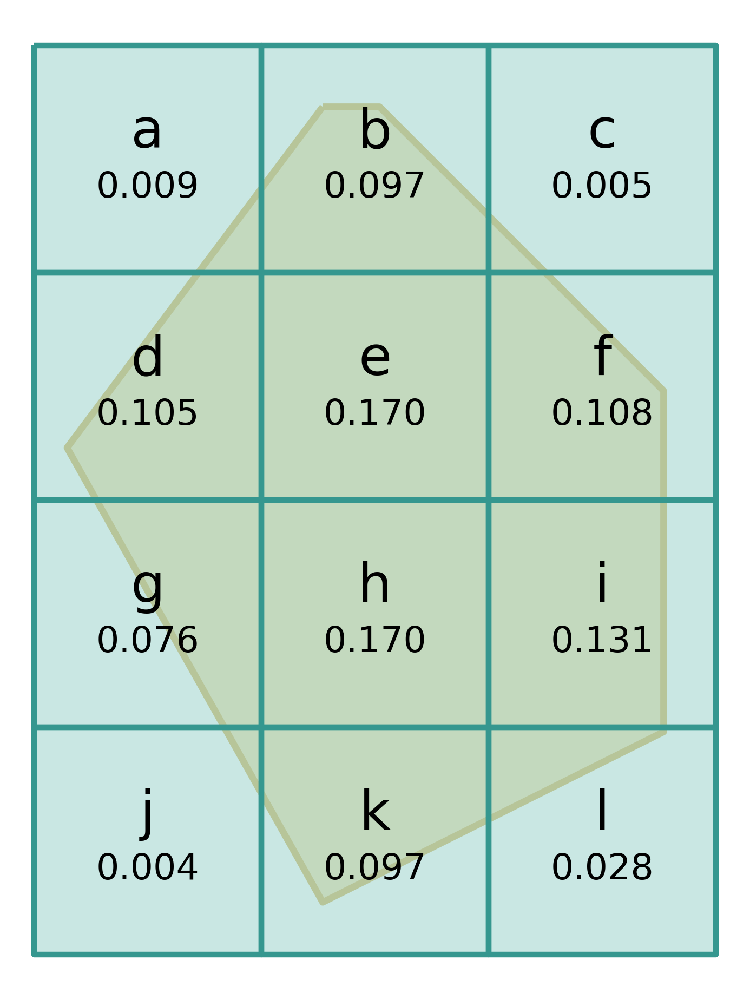
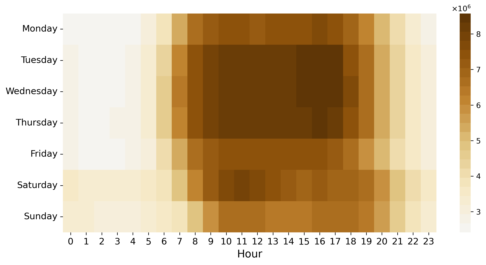

A computational framework has been developed to process the CDR data, including preprocessing, cleaning, home and work location estimation, or calculating the mobility indicators (like Radius of Gyration and Entropy). This simplified process can be seen in Figure <a href="/docs/framework#fig:process">4.1</a> and will be discussed further in this chapter.

<figure id="fig:process">

<figcaption><strong>Figure 4.1.:</strong> The simplified processing the Mobile Phone data along with the Cell information and the Estate Price data used to determine the financial status of the subscribers.</figcaption>
</figure>

## Software Environment {#sec:software_environment}

I only used open-source software to build the data processing and visualization environment. The framework that practically is a set of scripts is primarily written in Python, using the following packages: Pandas, GeoPandas (Pandas for geospatial data) for the data manipulation, Matplotlib and Seaborn for plotting, NumPy, SciPy, Skikit-learn for numeric and scientific methods, NetworkX for graph/network analysis, OSMnx for downloading streets (and other objects) from OpenStreetMap as a NetworkX graph, just to mention the essential packages I have been relying on during my work.

For tasks, when the processing speed of the interpreted Python became a bottleneck, I have written small, task-specific programs in Go (in the beginning) or Nim (later). Small stream-processing tools have been written, using compiled languages, that read a large CSV file line by line, perform some operation on the records and write the result directly to the disc or accumulate in the memory. It worked well for these tasks because the activity records are independent of each other.

Otherwise, the usual procedure was to group the records by the SIM card ID and process a given subscriber's data on a single thread (for example, to calculate a mobility metric). Multiple subscribers' data was processed parallelly to speed up the computation.

All the CDR data is stored in a PostgreSQL database with an enabled PostGIS extension to add support for geospatial operations within the database. Spatial filtering can be faster this way, and only the minimum amount of records needs to be loaded into a (Geo)Pandas (Geo)DataFrame.

### Visualization {#sec:framework_visualization}

The visualization is a crucial step. Not just when the results are presented but during the analysis as well. One could argue that it is even more crucial to have a fast and reliable way to visualize the results during data analysis. Besides the descriptive statistics, the spatial distributions are also essential to validate a result.

Both Pandas and GeoPandas have APIs to plot (Geo)DataFrames using Matplotlib to have a quick view of the data, which can provide very fast feedback, but sometimes a more interactive tool is required. QGIS is an open-source Geographic Information System that can provide this. QGIS is an excellent software with an enormous number of features. I only used a small subset of its capabilities, usually just to visualize a GeoDataFrame dump or a GeoJSON with some linked data from a CSV or directly from the database.

## Data Preparation {#sec:data_preparation}

As the received data had a wide format (see Figure <a href="/docs/framework#fig:raw_data">4.2</a>), they were normalized before importing into the database. The CDR table only contains the SIM ID, the timestamp, and the cell ID. a table has been introduced to store the SIM related properties (like subscription type, customer type, age, gender) and another to store the cell properties (cell centroid and base station coordinates).

Order numbers were used for SIM IDs in order of appearance instead of the long hash values to save disk space. The longitude and latitude values, provided in EPSG:4326 projection (also known as WGS84) were rounded to 6 decimals because further decimals have no practical meaning in CDR positioning [^1]. The received data uses property labels like "MALE", "FEMALE" to indicate gender, "CONSUMER", "BUSINESS" for customer type, "PREPAID", "POSTPAID" for subscription type and the "UNKNOWN" string is used to denote unknown values. Again, these strings were shortened, and the unknown values were represented with the proper "NULL" value to save disc space.

### Normalization {#sec:normalization}

The single table, received data has been normalized, and three new tables were formed (see Figure <a href="/docs/framework#fig:er">4.3</a>): i) cell, containing a cell ID and the coordinates of the cell centroid, ii) a device table, containing the device/SIM ID and information about the subscriber (age, sex), the subscription (consumer or business, prepaid or postpaid), and the Type Allocation Code (TAC) that can be used to identify the device where the SIM card is operating, iii) the CDR table, that serves as a link table to map a subscriber to a geographic location in a given time, (iv) TACs are loaded to another table after the dominant devices had been determined for the SIM cards, and (v), indexes were built for all the tables.

<figure id="fig:er">

<figcaption><strong>Figure 4.3.:</strong> Normalized data</figcaption>
</figure>

## Cell-Map Mapping {#sec:cellmap_mapping}

In most cases, the operator provided only the base stations' coordinates. Therefore, it is common practice [<a href="/docs/bibliography#pappalardo2016analytical" title="L. Pappalardo, M. Vanhoof, L. Gabrielli, Z. Smoreda, D. Pedreschi, and F. Giannotti, “An analytical framework to nowcast well-being using mobile phone data,” International Journal of Data Science and Analytics, vol. 2, no. 1-2, pp. 75–92, 2016.">18</a>, <a href="/docs/bibliography#csaji2013exploring" title="B. C. Csáji et al., “Exploring the mobility of mobile phone users,” Physica A: statistical mechanics and its applications, vol. 392, no. 6, pp. 1459–1473, 2013.">49</a>, <a href="/docs/bibliography#vanhoof2018comparing" title="M. Vanhoof, W. Schoors, A. Van Rompaey, T. Ploetz, and Z. Smoreda, “Comparing regional patterns of individual movement using corrected mobility entropy,” Journal of Urban Technology, vol. 25, no. 2, pp. 27–61, 2018.">124</a>, <a href="/docs/bibliography#candia2008uncovering" title="J. Candia, M. C. González, P. Wang, T. Schoenharl, G. Madey, and A.-L. Barabási, “Uncovering individual and collective human dynamics from mobile phone records,” Journal of physics A: mathematical and theoretical, vol. 41, no. 22, p. 224015, 2008.">125</a>, <a href="/docs/bibliography#novovic2020uncovering" title="O. Novović, S. Brdar, M. Mesaroš, V. Crnojević, and A. N. Papadopoulos, “Uncovering the Relationship between Human Connectivity Dynamics and Land Use,” ISPRS International Journal of Geo-Information, vol. 9, no. 3, p. 140, 2020.">126</a>] at CDR processing to use the base stations to map Call Detail Records to geographic locations and use Voronoi tessellation to estimate the covered area of the base station.

Vodafone Hungary provided the base station coordinates and the (estimated) cell centroids for the cells. With this, the position of the SIM cards is known with a finer granularity as if only the base station locations were known, as a base station can serve several cells.

The close cells within 100 m are merged using the DBSCAN algorithm of the Scikit-learn [<a href="/docs/bibliography#scikit-learn" title="F. Pedregosa et al., “Scikit-learn: Machine Learning in Python,” Journal of Machine Learning Research, vol. 12, pp. 2825–2830, 2011.">127</a>] Python package using the cell activity as weight, and the Voronoi tessellation is applied for merged cell centroids, similarly, as in [<a href="/docs/bibliography#fiadino2017call" title="P. Fiadino, V. Ponce-Lopez, J. Antonio, M. Torrent-Moreno, and A. D’Alconzo, “Call Detail Records for Human Mobility Studies: Taking Stock of the Situation in the’ Always Connected Era,’” in Proceedings of the Workshop on Big Data Analytics and Machine Learning for Data Communication Networks, 2017, pp. 43–48.">51</a>].

It is possible to represent the merged cell by an imaginary cell centroid that could be the center of mass of the merged points, but I wanted to use an existing cell (centroid), the medoid, to represent the cluster. The number of the activity records of the cells was applied as a weight for the DBSCAN algorithm. This way, the most active or the most significant cell was chosen to represent multiple cells of an area.

After merging the cells, the 5412 cells were reduced to 3634. The merge affects mostly Budapest downtown since more mobile phone cells are applied in densely populated areas.

<figure id="fig:reconstructed_cells">

<figcaption><strong>Figure 4.4.:</strong> Reconstructed cells.</figcaption>
</figure>

When mapping data with exact GPS coordinates to the cells, the Voronoi polygons were used to determine in which cell the given point belongs. As shown in Section <a href="/docs/literature_review#sec:gis">Visualization</a>, this method has some drawbacks, but without exact cell geometries, this is the only available solution. The estate price data (see Section <a href="/docs/data_sources#sec:estate_price">Estate Price Data</a>) were mapped to cells via these Voronoi polygons. When there were no property price data in a cell, the average price of the underlying administrative area was used (e.g., suburb, district, or settlement).

Gábor Bognár, a colleague of mine, tried to reconstruct the cell geometries from the received information, but his work resulted in unrealistic coverage (Figure <a href="/docs/framework#fig:reconstructed_cells">4.4</a>). He suspected that the data was erroneous in respect of the geometries.

## Rasterization of Locations {#sec:rasterize_locations}

With an accurate geographic data source like GPS traces, it can be more natural to map locations to a spatial grid. With CDR data, the geographic locations are bound to the cell or a base station coordinates, and Voronoi tessellation is often applied, but what about the rasterization?

The problem is that it is not possible to know where a subscriber is within the cell. So, the maximal available accuracy is the cell. A finer resolution spatial raster can work well with point coordinates that can be classified to the rasters, but in the case of CDR, the classification can be only achieved with probabilities.

<figure id="fig:raster">

<figcaption><strong>Figure 4.5.:</strong> Rasterization example with the coverage ratios.</figcaption>
</figure>

The intersection ratio with the cell polygons is calculated for every element of the grid (see Figure <a href="/docs/framework#fig:raster">4.5</a>) that also serves as a probability of being in a given raster when the subscriber is in a given cell. Theoretically, this probability could be improved by removing rasters where people usually cannot be present. Using the example of Figure <a href="/docs/framework#fig:area_cells">4.7a</a>, there are several cells that cover the river. When the subscriber is in one of those cells, they must be on the riverbank since being on a ship is usually not probable. OSM could provide landscape data for removing these rasters, but this functionality was not implemented in this framework.

When the probabilities are determined, I applied the Jefferson apportionment method (also known as the D'Hondt method or Hagenbach-Bischoff method) from the Python package, "voting", to distribute the subscribers of the cell between the rasters, using the probabilities as weight. It is feasible when only cardinality matters. For example, when one wants to plot a heatmap, but as the distribution cannot pay regard to the properties of the subscribers, it cannot be stated that subscribers in a given raster have certain mobility habits. On a cell level, this kind of statement can be made.

In [<a href="/docs/bibliography#galiana2018understanding" title="L. Galiana, B. Sakarovitch, and Z. Smoreda, “Understanding socio-spatial segregation in French cities with mobile phone data,” Unpublished manuscript, 2018.">128</a>], Galiana et al. also map Voronoi polygons to the grid but use a different approach for distributing subscribers between rasters.

## Selecting an Area {#sec:selecting_an_area}

<figure id="fig:ceudemo_observation_area">

<figcaption><strong>Figure 4.6.:</strong> Observation area from the Central European University demonstration case study (Section~\ref{sec:ceudemo}).</figcaption>
</figure>

In order to select an area for further investigation, a polygon has to be defined. The [geojson.io](geojson.io){.uri} provides an easy-to-use tool to define polygons over the map that can be downloaded in multiple GIS formats, such as GeoJSON or Well-known text (WKT). Figure <a href="/docs/framework#fig:ceudemo_observation_area">4.6</a>, shows the observation area from the Central European University (CEU) demonstration case study (Section <a href="/docs/social_sensing#sec:ceudemo">Those Who Stood with CEU</a>). It contains three different areas: (i) one from the Castle Garden to the Chain Bridge at the Buda side of the river, (ii) one in the middle from the bridge to the Kossuth Lajos square, covering the CEU buildings, and (iii) the parliament and the Kossuth Lajos square on the top of the map (Figure <a href="/docs/social_sensing#fig:ceudemo_locations">5.8</a> highlights these buildings).

The affected cells can be easily selected, using a polygon (or polygons) to define the observation area. The cells are represented with Voronoi polygons (Section <a href="/docs/data_processing_framework#sec:cellmap_mapping">Cell-Map Mapping</a>) and the relevant cell selection can be performed in two ways: (i) selecting the cells Voronoi polygon intersects the selector polygon (Figure <a href="/docs/framework#fig:area_cells">4.7a</a> and <a href="/docs/framework#fig:area_relevant_cells">4.7b</a>), or (ii) selecting the cells which centroids intersect with the polygon (Figure <a href="/docs/framework#fig:area_centroids">4.7c</a> and <a href="/docs/framework#fig:area_relevant_cells_by_centroid">4.7d</a>). The former method returns more cells, which can be more favorable in some cases, for example, when the target area is relatively small compared to the neighboring Voronoi polygons.

 

 

## Home and Work Locations {#sec:work_home}

Most of the inhabitants in cities spend a significant time of a day at two locations: their homes and workplaces. In order to find the relationship between these most important locations and Social Economic Status (SES), first, the positions of these locations have to be determined. There are a few approaches used to find home locations via mobile phone data analysis [<a href="/docs/bibliography#ahas2010using" title="R. Ahas, S. Silm, O. Järv, E. Saluveer, and M. Tiru, “Using mobile positioning data to model locations meaningful to users of mobile phones,” Journal of urban technology, vol. 17, no. 1, pp. 3–27, 2010.">129</a>, <a href="/docs/bibliography#bojic2015choosing" title="I. Bojic, E. Massaro, A. Belyi, S. Sobolevsky, and C. Ratti, “Choosing the right home location definition method for the given dataset,” in International Conference on Social Informatics, 2015, pp. 194–208.">130</a>, <a href="/docs/bibliography#xu2015understanding" title="Y. Xu, S.-L. Shaw, Z. Zhao, L. Yin, Z. Fang, and Q. Li, “Understanding aggregate human mobility patterns using passive mobile phone location data: a home-based approach,” Transportation, vol. 42, no. 4, pp. 625–646, 2015.">58</a>].

The work location was determined as the most frequent cell where a device was present during working hours on workdays. Working hours were considered from 09:00 to 16:00. The home location was calculated as the most frequent cell where a device was present during the evening and the night on workdays (from 22:00 to 06:00) and all day on holidays. Although people do not always stay at home on the weekends, it is assumed that most of the activity is still generated from their home locations.

Most of the mobile phone activity occurs in the daytime (see Figure <a href="/docs/framework#fig:vod201704_day_hour_activity">4.8</a>), which is associated with work activities. This may cause the home location determination to be inaccurate or even impossible for some devices.

This method assumes that everyone works during the daytime and rests in the evening. Although in 2017, 6.2% of the employed persons regularly worked at night in Hungary [<a href="/docs/bibliography#eurostat_night_workers" title="Eurostat, “Employed persons working at nights as a percentage of the total employment, by sex, age and professional status.” 2020. Available: https://appsso.eurostat.ec.europa.eu/nui/show.do?dataset=lfsa_ewpnig&lang=en">131</a>], the current version of the algorithm does not try to deal with the night-workers. Some of them might be identified as regular workers, but their work and home locations are mixed.

<figure id="fig:vod201704_day_hour_activity">

<figcaption><strong>Figure 4.8.:</strong> The mobile phone activity distribution by days of week and hours based on the 2017 data set. Mondays and Fridays are not so bright as the other workdays, probably because of Easter Monday and Good Friday that are holidays in Hungary.</figcaption>
</figure>

## Selecting Active SIMs {#sec:selecting_active_sims}

As showed in Chapter <a href="/docs/data_sources">Data Sources</a>, most of the SIM cards have very little activity records (Figure <a href="/docs/data_sources#fig:vod201704_activity_categories">3.1</a>), that is not enough to provide adequate information about the subscribers' mobility customs. Thus, only those SIMs are considered active enough that had activity for at least 20 days, the average weekday activity is at least 40 records, and at least 20 on weekends. Additionally, the average activity of the SIM cannot be more than 1000 to filter out those SIM cards that possibly did not operate in a cell phone, but in a 3G modem, for example.

Note that activity can be either voice call, text message, or data transfer, also both incoming or outgoing. Hence, they cannot be distinguished in the dataset.

## Calculating Indicators {#sec:calculating_indicators}

During my research, the Scikit-mobility [<a href="/docs/bibliography#pappalardo_luca_2019_5979518" title="L. Pappalardo, F. Simini, G. Barlacchi, and R. Pellungrini, “scikit-mobility.” Zenodo, Jul. 2019. doi: 10.5281/zenodo.5979518.">132</a>] Python package has been published that is capable of calculating well-known mobility indicators, such as Radius of Gyration or Entropy. However, by the time this was published, my own implementation was complete, tested, and well-optimized (within reasons), so I kept using my own software stack.

As mentioned before, the data was stored in a PostgreSQL database, but the query engine of PostgreSQL was also utilized during the computation. Python is excellent for data science, as an interactive shell (also called read--eval--print loop, or REPL) provides a convenient environment for data analysis. However, the execution speed is not among the strong points of the interpreted languages. Considering that most of CDR processing happens at the subscriber level, and the subscribers are independent of each other, it seemed the best solution to partition the processing by subscribers. Then, the activity records of a single subscriber can be processed in a single thread even with a relatively slow interpreted language.

The *Pool* object, from the *multiprocessing* package, provides a convenient tool to parallelize the execution. A SIM ID is associated with a worker that executes a query to filter its activity records. Naturally, the query can contain spatial or temporal constraints as well. The database engine can efficiently select the activity records of a SIM card, utilizing the available many-core environment [^2]. Then, the indicators were calculated per SIM card, and the partial results were collected and saved. The analysis and the visualization did not require considerable computing power and thus were often performed on a laptop.

[^1]: The sixth decimal represents about 0.111 meter at the Equator. As the CDRs roughly provides a house-block level accuracy in downtown, the sixth decimal is more than enough in this use-case.

[^2]: Lenovo x3650 M5 server, with 1024 GB of RAM, and two 18-core CPUs with HT, resulting in 72 logical cores. The nickname of this server was "naggykuttya" ("biggdogg").
