In this chapter, the data sets used in this research are described. The "April 2017" (Section <a href="/docs/data_sources#sec:vod201704">Vodafone April 2017</a>) and the "June 2016" (Section <a href="/docs/data_sources#sec:vod201606">Vodafone June 2016</a>) CDR data sets are described, along with other sources like the estate price data (Section <a href="/docs/data_sources#sec:estate_price">Estate Price Data</a>). Unless otherwise indicated, the CDR data denotes the "April 2017" data set through this work.

## Vodafone April 2017 {#sec:vod201704}

The CDR data were collected from Budapest, the capital of Hungary, and the surrounding county. Vodafone Hungary is one of the three mobile phone operators providing services in Hungary. The market share of the three big operators in Hungary has not changed significantly in the last few years. Vodafone Hungary had 25.5% in 2017 Q2 nationwide[<a href="/docs/bibliography#nmhh_mobile_market_report" title="National Media and Infocommunications Authority, Hungary, “A Nemzeti Média- és Hírközlési Hatóság mobilpiaci jelentése 2015. IV. – 2019. II. negyedév,” National Media and Infocommunications Authority, 23-25. Ostrom u., Budapest 1015, Hungary, Dec. 2019. Available: http://nmhh.hu/document/208458/NMHH_mobilpiaci_jelentes_2015Q42019Q2.pdf">109</a>].

The communication between a cellular device and the mobile phone network can be divided into two categories: i) An administrative communication maintaining the connection with the service, for example, registration of the cell-switching, can be called passive communication. ii) When the device actively uses the network for voice calls, messages, or data transfer, that can be called active communication. The available data contains only active communication, which is sparser, so it cannot be used to track continuous movements.

The raw CDR data contains a long alphanumeric hash to identify the Subscriber Identity Module (SIM), a timestamp that was truncated to 10 seconds, and an ID of the cell, thus, a subscriber can be mapped to a geographic location in a given time. These are extended customer type (business, consumer), the subscription type (prepaid, postpaid), the age and gender of the subscriber, and the Type Allocation Code (TAC) of the device. The TAC is the first eight digits of the International Mobile Equipment Identity (IMEI) number that refers to the manufacturer, and the model of the device wherein the SIM card is active. These values are also present in every record, so, for example, the device changes can be tracked as well.

As for the cells, a separate table was provided with a cell ID, the geographic location of the cell centroid, the area of the cell, and the distance between the centroid and the base station. These values are an estimation based on a momentary state, especially with the UMTS (3G) cells due to their breathing mechanism, which can change the geographic size of the serving area for load balancing. The heavily loaded cells shrink, and the neighboring ones grow to compensate[<a href="/docs/bibliography#al2003performance" title="M. M. Al-Akaidi and H. Ali, “Performance analysis of antenna sectorisation in cell breathing,” 2003.">110</a>].

The rationale for this "wide" format may be that the subscriber data and the device can be changed within the observation period. This occurs about 3000 times during the observation period. The owner of the subscription can change its details and, of course, change the device if they bought a new mobile phone, for example. Subscriber and customer type were provided for every SIM, but age and gender were missing in many cases, presumably due to the privacy options requested by the subscriber.

The records include neither the type of the activity (voice call, message, data transfer) nor the direction (incoming, outgoing), and there was no data provided by the operator to resolve the TACs to manufacturer and model.

The "April 2017" CDR data set includes mobile phone network activity of the Vodafone users from Budapest (and the surrounding areas) in April 2017. This contains 955035169 activity records, from 1629275 SIM cards. Figure <a href="/docs/data_sources#fig:vod201704_activity_categories">3.1</a>, shows the activity distribution between the activity categories of the SIM cards. Only 17.67% of all the SIM cards that have more than 1000 activity records provide the majority (75.48%) of the mobile phone activity during the observation period. Figure <a href="/docs/data_sources#fig:vod201704_activity_by_days">3.2</a>, shows the distribution of the SIM cards by the number of active days. Only about one-third (33.23%) of the SIM cards have activity on at least 21 different days. Despite the relatively large number of SIM cards present in the data set, most of them are not active enough to provide enough information about their mobility habits. For the exact selection criteria, see Section <a href="/docs/data_processing_framework#sec:selecting_active_sims">Selecting Active SIMs</a>.

<figure id="fig:vod201704_activity_categories">
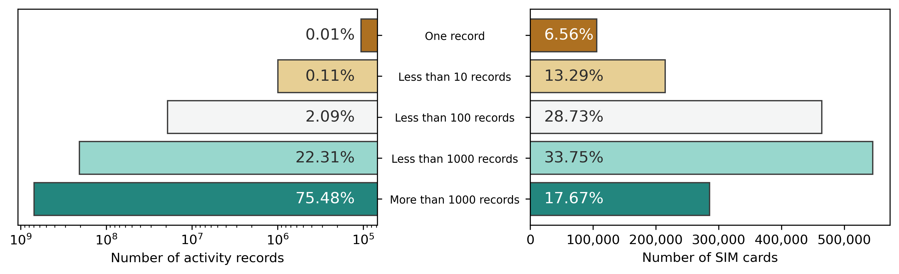
<figcaption><strong>Figure 3.1.:</strong> Subscriber Identity Module cards in the 2017-04 data set categorized by the number of activity records.     The Subscriber Identity Module cards with more than 1000 activity records (17.67% of the Subscriber Identity Module cards) provide the majority (75.48%) of the activity.</figcaption>
</figure>

<figure id="fig:vod201704_activity_by_days">

<figcaption><strong>Figure 3.2.:</strong> Subscriber Identity Module card distribution in the 2017-04 data set by the number of active days, in contrast of the number of records generated per category.</figcaption>
</figure>

Figure <a href="/docs/data_sources#fig:vod201704_timeseries">3.3a</a>, displays the mobile phone activity as a time series for the "April 2017" dataset. It is quite regular, considering the 4-day weekend in the middle of the month due to Easter [^1]. Figure <a href="/docs/data_sources#fig:fourier">3.3b</a> shows its Fourier decomposition to highlight the seasonality of the data. As expected, this 30-day dataset has a 24-hour periodicity.

<figure id="fig:vod201704_seasonality">

<figcaption><strong>(a)</strong> Mobile phone activity through the ``April 2017'' dataset.</figcaption>
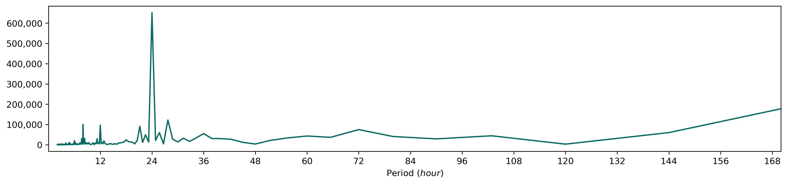
<figcaption><strong>(b)</strong> Fourier decomposition.</figcaption>
<figcaption><strong>Figure 3.3.:</strong> The mobile phone network activity (<strong>a</strong>) during the observation period of April 2017, and its Fourier decomposition (<strong>b</strong>).</figcaption>
</figure>

### Missing Properties

The subscriber type and subscription type were provided for all the SIM cards, whereas age and gender were frequently missing. For a group of SIM cards, some of these values have changed during the data set. These changes could be realistic as the subscription type, the subscriber (the ownership), or the subscription plan can be changed at will. Sometimes, the change affects the age or the sex as they become unknown or known when they were unknown before.

Let us take that someone changed their subscription plan, which is treated as a new contract between the subscriber and the operator, and this might have affected the personal data usability for marketing purposes. Either, someone just revoked that permission. Nevertheless, this affects about 2000 SIM cards out of about 1.6 million. In these cases, all the subscriber properties were set to unknown without trying to decide which value should be used.

### Outliers

The age property contains some unrealistic values, like a more than 210 years old subscriber, and there were quite a few 115 years old subscribers. It is assumed that these values might be administrative errors. The number of at least 90-year-old people was 2926, and out of that, 554 were between 90 and 100, according to the data, which is unlikely. For comparison, 59470 over 90 years old people lived in Hungary in 2017 KSH[<a href="/docs/bibliography#ksh22.1.1.3" title="K. S. Hivatal, “22.1.1.3. Népesség korév és nem szerint, január 1.” Available: https://www.ksh.hu/stadat_files/nep/hu/nep0003.html">111</a>], which is 0.6% of the population.

## Vodafone June 2016 {#sec:vod201606}

Although this data set predates the formerly introduced one, I consider it secondary, as almost all of my work was performed on the "Vodafone April 2017" data set (Section <a href="/docs/data_sources#sec:vod201704">Vodafone April 2017</a>). It is more recent and better in data quality. The collaboration between Vodafone Hungary and Óbuda University was an iterative process. Based on our remarks, they improved the provided data in a format and --- if it was possible --- in quality.

This section follows the structure of the previous one, describing the "Vodafone June 2016" data set.

The observation area of the CDR data was Budapest, the capital of Hungary, and the surrounding county. In 2016 Q2, the nationwide market share if Vodafone Hungary was 25.3% [<a href="/docs/bibliography#nmhh_mobile_market_report" title="National Media and Infocommunications Authority, Hungary, “A Nemzeti Média- és Hírközlési Hatóság mobilpiaci jelentése 2015. IV. – 2019. II. negyedév,” National Media and Infocommunications Authority, 23-25. Ostrom u., Budapest 1015, Hungary, Dec. 2019. Available: http://nmhh.hu/document/208458/NMHH_mobilpiaci_jelentes_2015Q42019Q2.pdf">109</a>], the data format is similar as described in Section <a href="/docs/data_sources#sec:vod201704">Vodafone April 2017</a>. This data set contains 2291246932 records from 2063005 unique SIM cards. It is more than twice as many records for a practically same time interval and more than 26.6% increase regarding the unique SIM card number.

Although this data also covers one month, June, instead of April. It is a later period of the year that has some consequences: June, like an early summer month, is warmer with longer days, and there are usually more tourists in Budapest. Also, the school semesters end in June, which might be some impact on the mobility trends, and the 2016 UEFA European Football Championship took place during this observation period (for the Euro 2016 case study, see Section <a href="/docs/social_sensing#sec:euro_2016">Euro 2016</a>).

The main drawback of this data set is a large number of missing cell coordinates and possibly dirty data as regards the third Sunday of the month. Out of the 7239 cell IDs that appear in the data set, only 6268 has known geographic coordinates. 22.5% of the records (515583442) take place in unknown locations, which makes this data set highly unreliable when it comes to mobility analysis.

<figure id="fig:disappearing_cells">

<figcaption><strong>Figure 3.4.:</strong> Number of cells stopping to operate per day of June 2016</figcaption>
</figure>

Moreover, 419 cells ceased to operate (did not have any activity) before the end of the month. Figure <a href="/docs/data_sources#fig:disappearing_cells">3.4</a> shows the distribution of these cells during the month [^2]. According to my knowledge, operators regularly adjust the network, including installing new cells and shutting down others. The problem is that the cell map does not associate temporal information with the geographic locations, so these changes are not represented. The numerous cells without geographic location might be the replacement cells of the removed ones or just temporary cells.

For example, Óbuda Island is a recreational area with marginal mobile phone activity during most of the year. But, it gives place the Sziget Festival, that had approximately 441000 visitors in 2015, with a daily capacity of at most 90000 visitors [<a href="/docs/bibliography#bbj2015sziget" title="K. Christian, “Sziget Festival sees record attendance of 441,000.” Available: https://bbj.hu/budapest/culture/awards/sziget-festival-sees-record-attendance-of-441-000">112</a>]. For this event, the operators install temporary cells to serve the massively increased demand of the mobile phone network capacity.

Figure <a href="/docs/data_sources#fig:vod201606_timeseries">3.5</a>, displays the mobile phone activity as a time series for the "June 2016" dataset. Unlike Figure <a href="/docs/data_sources#fig:vod201704_timeseries">3.3a</a>, it shows some considerable irregularities. Anomaly 1 was caused by the missing activity records on June 1, 2016. The data set contains about 16.5 million records for that day, which is only 18.5% of an average weekday. Interestingly, the obtained records are distributed across the whole day from numerous cells. So, it is not like a portion of cells or a period of the day was omitted. The majority of the assumed records are missing without apparent reason. Anomaly 2 is quite the opposite. June 12 contains an inexplicable activity surplus and is detailed later in this section. Anomaly 3, 5, 6 and 8 in Figure <a href="/docs/data_sources#fig:vod201704_timeseries">3.3a</a> are covered in Section <a href="/docs/social_sensing#sec:euro_2016">Euro 2016</a>. However, the reason for the sudden negative peaks denoted by numbers 7 and 9 is unknown. Just as in the case of anomaly 4.

<figure id="fig:vod201606_timeseries">

<figcaption><strong>Figure 3.5.:</strong> Mobile phone activity through the ``June 2016'' dataset, with several anomalies.</figcaption>
</figure>

<figure id="fig:vod201606_sundays">

<figcaption><strong>Figure 3.6.:</strong> Hourly aggregated activity on Sundays</figcaption>
</figure>

Figure <a href="/docs/data_sources#fig:vod201606_sundays">3.6</a> shows the hourly aggregated activity on Sundays of June 2016. All four days have the same tendency. Between the last two Sundays of the month, there was hardly any difference. One notable difference is around 20:00, which may be explained in Section <a href="/docs/social_sensing#sec:hungary_vs_belgium">Hungary vs. Belgium</a>. On June 5, the activity levels are notably higher during the daytime, but this is within reason. However, on June 12, the activity was abnormally intense, almost twice as much as it would be expected, even during nighttime. I have no information about any events or circumstances that could have normally caused this activity surplus on June 12, 2016. It was not concentrated on a definite time interval or area of the city. At first, it could seem as if the records of that day had been duplicated, but there is no direct evidence of it in the data. As the surplus is unexplainable, I consider it a sign of dirty data.

<figure id="fig:vod201606_sim_activity">
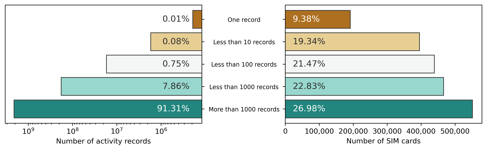
<figcaption><strong>Figure 3.7.:</strong> Subscriber Identity Module cards in the 2016-06 data set categorized by the number of activity records.     The Subscriber Identity Module cards with more than 1000 activity records (26.98% of the Subscriber Identity Module cards) provide the majority (91.31%) of the activity.</figcaption>
</figure>

Apart from the issues, the same descriptive analysis has been performed as on the "Vodafone April 2017" data set. Figure <a href="/docs/data_sources#fig:vod201606_sim_activity">3.7</a>, shows the activity distribution between the activity categories of the SIM cards. The dominance of the last category, the SIM cards with more than 1000 activity records, is even more significant. This almost 27% of the SIM cards produce the more the 91% of the activity.

Figure <a href="/docs/data_sources#fig:vod201606_activity_by_days">3.8</a>, shows the SIM card distribution by the number of active days. Only the 34.59% of the SIM cards have activity on at least 21 different days. The ratio of the short-term (less than a week) present SIM cards is larger (more than 50%) than in the "Vodafone April 2017" data set. There are 241824 SIM cards (11.72%) that appeared at least two days, but the difference between the first and the last activity is not more the seven days. High levels of tourism are usual during this part of the year.

<figure id="fig:vod201606_activity_by_days">
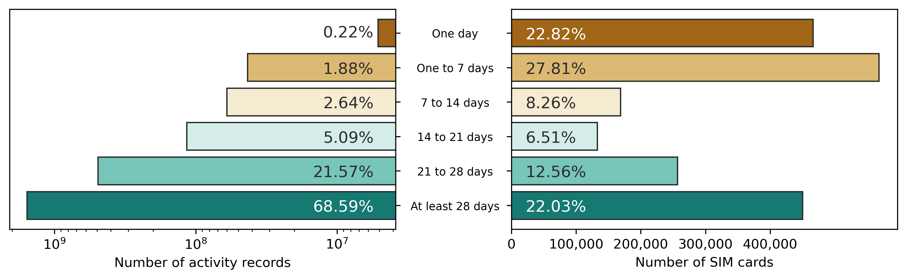
<figcaption><strong>Figure 3.8.:</strong> Subscriber Identity Module card distribution in the 2016-06 data set by the number of active days, in contrast of the number of records generated per category.</figcaption>
</figure>

The subscriber property changes affected this data set as well. About 3000 SIM cards were affected out of about 2 million. Some very old subscribers are also present in this data set.

## Device Types {#sec:device_types}

Both CDR dataset contains Type Allocation Codes, that the first eight digits of the International Mobile Equipment Identity (IMEI) number, allocated by the GSM Association and uniquely identifies the mobile phone model, and every GSM capable device.

The TACs are provided for every record because a subscriber can change their device at any time. Naturally, most of the subscribers (95.71% in June 2016, and 95.8% in April 2017) used only one device during the whole observation period, but there were some subscribers, maybe mobile phone repair shops, who used multiple devices (see Figure <a href="/docs/data_sources#fig:num_of_diff_tac">3.9</a>). As a part of the data cleaning, the wide-format has been normalized. The CDR table contains only the SIM ID, the timestamp, and the cell ID. A table is formed from the subscriber and the subscription details, and another table tracking the subscribers' device changes.

<figure id="fig:num_of_diff_tac">
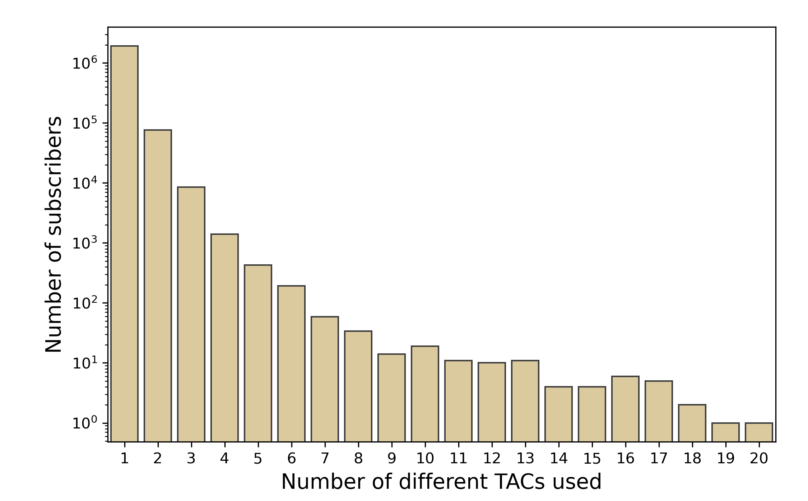
<figcaption><strong>(a)</strong> June 2016</figcaption>

<figcaption><strong>(b)</strong> April 2017</figcaption>
<figcaption><strong>Figure 3.9.:</strong> The number of different Type Allocation Codes used by the subscribers.</figcaption>
</figure>

### Resolving Type Allocation Codes {#sec:resolving_tac}

To the best of my knowledge, there is no publicly available TAC database to resolve the TACs to manufacturer and model, although some vendors (e.g., Apple, Nokia) publish the TACs of their products. The exact model of the phone is required to know how recent and expensive a mobile phone is. Although this is not even enough to determine how much the cell phone cost for the subscriber as they could have bought it on sale or discount via the operator in exchange for signing an x-year contract. Still, the consumer price should designate the order of magnitude of the phone price.

The dataset of TACs provided by *51Degrees* has been used, representing the model information with three columns: "HardwareVendor", "HardwareFamily" and "HardwareModel". The company mostly deals with smartphones that can browse the web, so the data set usually does not cover feature phones and other GSM-capable devices. Release date and inflated price columns were also included, but these were usually not known, making the data unsuitable to use on its own.

Although it cannot be separated by type, the CDR data contains not only call and text message records but data transfer as well. Furthermore, some SIM cards do not operate in phones but in other -- often immobile -- devices like a 3G router or a modem. 51Degrees managed to annotate several TACs as a modem or other not phone devices, which was extended by manual search on the most frequent TACs. There were 324793 SIM cards that used only one device during the observation period and operated in a non-phone device.

### Fusing Databases {#sec:fusing_databases}

For a more extensive mobile phone price database, a scarped GSMArena database [<a href="/docs/bibliography#mohit_gsmarena" title="M. Sainani, “GSMArena Mobile Phone Devices.” Available: https://www.kaggle.com/msainani/gsmarena-mobile-devices">113</a>] has been used. GSMArena[^3] has a large and respectable database, that is also used in other studies [<a href="/docs/bibliography#reddi2018two" title="V. J. Reddi, H. Yoon, and A. Knies, “Two billion devices and counting,” IEEE Micro, vol. 38, no. 1, pp. 6–21, 2018.">114</a>, <a href="/docs/bibliography#zehtab2021multimodal" title="A. Zehtab-Salmasi, A.-R. Feizi-Derakhshi, N. Nikzad-Khasmakhi, M. Asgari-Chenaghlu, and S. Nabipour, “Multimodal price prediction,” Annals of Data Science, pp. 1–17, 2021.">115</a>]. The concatenation of the brand and model fields of the GSMArena database could serve as an identifier for the database fusion. 51Degrees stores the hardware vendor, family, and model, where the hardware family often contains a marketing name (e.g., \[Apple, iPhone 7, A1778\]). As these fields were not always properly distinguished, their concatenation may contain duplications (e.g., \[Microsoft, Nokia Lumia 820, Lumia 820\]). So, for the 51Degrees records, three identifiers were built using the concatenation of fields (i) vendor + family, (ii) vendor + model, and (iii) vendor + family + model, and all the three versions were matched against the GSMArena records.

Another step of the data cleaning is to correct the name changes. For example, BlackBerries were manufactured by RIM (e.g., \[RIM, BlackBerry Bold 9700, RCM71UW\]), but later, the company name was changed to BlackBerry, and the database records are not always consistent in this matter. The same situation occurs due to the Nokia acquisition by Microsoft.

The simple string equality cannot be used due to writing distinction to match these composite identifiers, so the Fuzzy String match is applied using the FuzzyWuzzy 0.18 Python package, which uses Levenshtein Distance to calculate the differences between strings. This method was applied for all the three identifiers from the 51Degrees data set, and the duplicated matches (e.g., when the family and the model are the same) were removed. Mapping the GSMArena database to the 51Degrees adds phone price and release date information to the TACs, which can be merged with the CDRs.

From the GSMArena data, two indicators have been extracted: (i) the price of the phone (in EUR) and (ii) the relative age of the phone (in months). The phone price was left intact without taking into consideration the depreciation, and the relative age of the phone was calculated as the difference between the date of the CDR data set and the release date of the phone.

Figure <a href="/docs/data_sources#fig:phone_price_and_age_hist">3.10</a> shows the distribution of the phone prices and relative ages within the April 2017 data set. The relative age has a nice distribution, showing that most cellphones are 1 to 3 years old. There were some new and very old phones still in use. The cellphone price distribution follows the relative ages. However, the number of expensive phones seems to be unrealistically low [^4], so analysis has been performed on an expensive and well-known brand, the iPhone.

<figure id="fig:phone_price_and_age_hist">
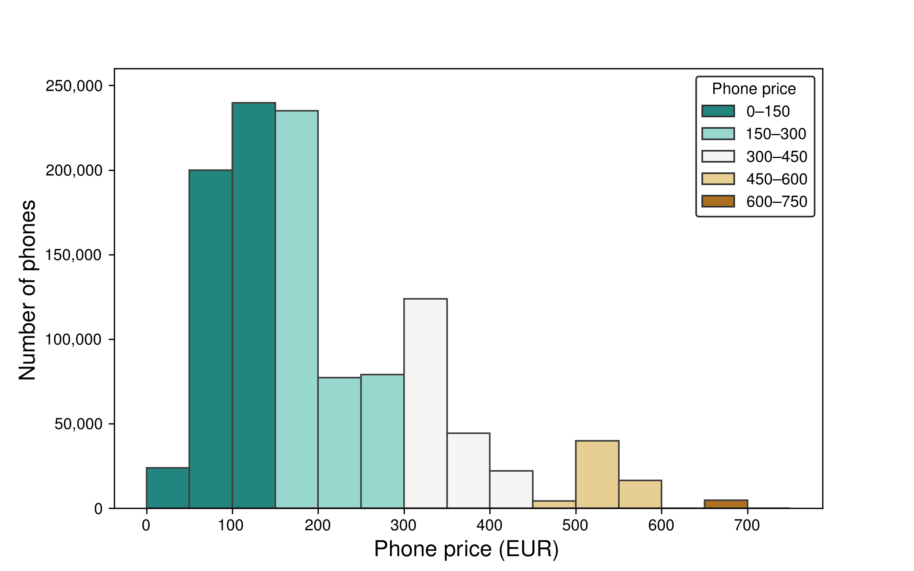
<figcaption><strong>(a)</strong> </figcaption>
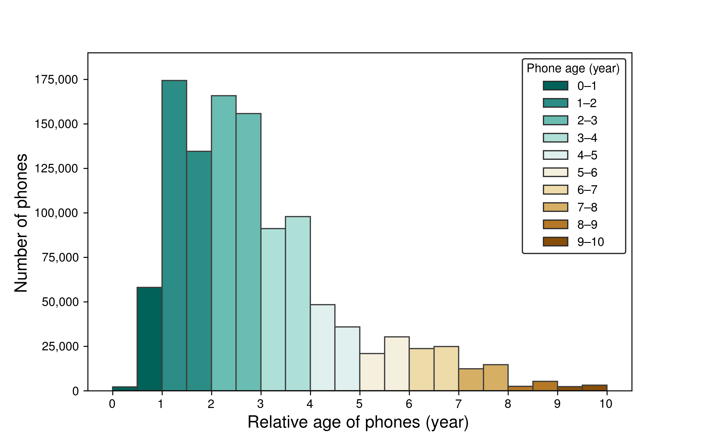
<figcaption><strong>(b)</strong> </figcaption>
<figcaption><strong>Figure 3.10.:</strong> Distribution of the mobile phone prices (<strong>a</strong>), and the mobile phone relative ages (<strong>b</strong>).</figcaption>
</figure>

### iPhones {#sec:iphone}

<figure id="fig:iphones">
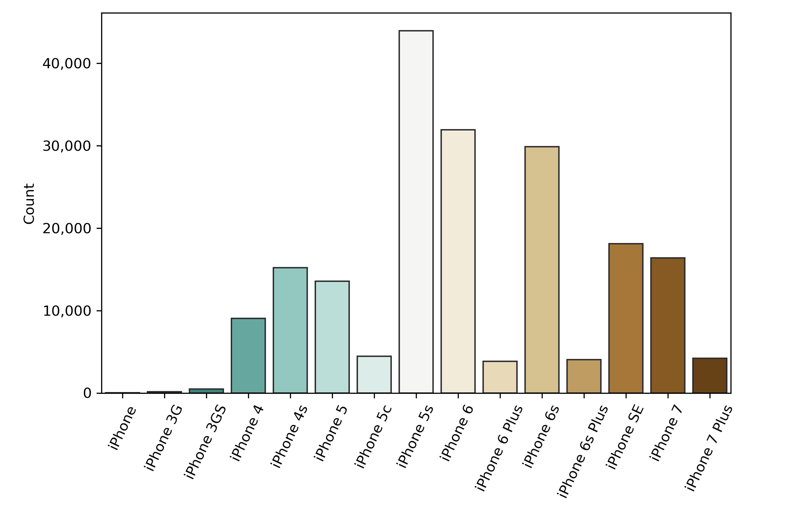
<figcaption><strong>(a)</strong> Model distribution</figcaption>
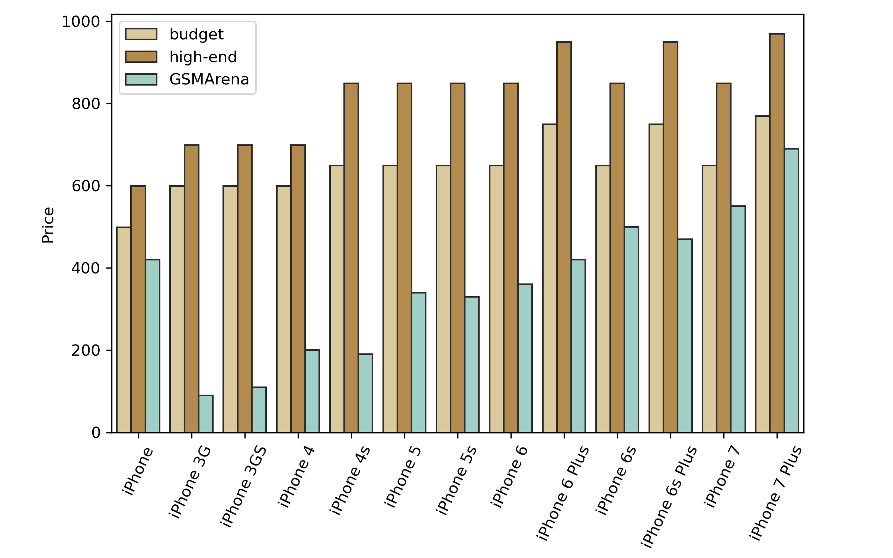
<figcaption><strong>(b)</strong> Price comparison</figcaption>
<figcaption><strong>Figure 3.11.:</strong>      Based on the ``April 2017'' dataset, the different iPhone models in use are also displayed (<strong>a</strong>), and comparing Apple iPhone prices [<a href="/docs/bibliography#protalinski2017iphone" title="E. Protalinski, “iPhone prices from the original to iPhone X.” Sep. 12, 2017. Available: https://venturebeat.com/2017/09/12/iphone-prices-from-the-original-to-iphone-x/">117</a>] with the GSMArena-based source [<a href="/docs/bibliography#mohit_gsmarena" title="M. Sainani, “GSMArena Mobile Phone Devices.” Available: https://www.kaggle.com/msainani/gsmarena-mobile-devices">113</a>] (<strong>b</strong>).     Versions with the lowest amount of storage denoted by ``budget'', and versions with the most expensive versions categorized as ``high-end''.     </figcaption>
</figure>

As Apple iPhones are considered a status symbol [<a href="/docs/bibliography#dissanayake2015role" title="R. Dissanayake and T. Amarasuriya, “Role of brand identity in developing global brands: A literature based review on case comparison between Apple iPhone vs Samsung smartphone brands,” Research journal of business and management, vol. 2, no. 3, pp. 430–440, 2015.">116</a>], it makes them suitable to validate the phone price database [<a href="/docs/bibliography#mohit_gsmarena" title="M. Sainani, “GSMArena Mobile Phone Devices.” Available: https://www.kaggle.com/msainani/gsmarena-mobile-devices">113</a>]. Figure <a href="/docs/data_sources#fig:iphone_usage">3.11a</a> shows the number of subscribers that exclusively use the certain iPhone models in the "April 2017" dataset. Using TAC values, it is not possible to distinguish the iPhone models based on specifications like storage. However, it is clear that the most expensive models ("Plus" versions) do not have a significant user base, in contrast with some older models like iPhone 4 and iPhone 5 series.

The launch prices of the iPhone models, released until April 2017, are obtained from [<a href="/docs/bibliography#protalinski2017iphone" title="E. Protalinski, “iPhone prices from the original to iPhone X.” Sep. 12, 2017. Available: https://venturebeat.com/2017/09/12/iphone-prices-from-the-original-to-iphone-x/">117</a>]. Figure <a href="/docs/data_sources#fig:iphone_prices">3.11b</a>, compares the two sources. As there are different versions of a certain model, a "budget" (with the lowest amount of storage) and a "high-end" (the most expensive) version are also displayed. Although GSMArena price property is supposed to be a launch price, Figure <a href="/docs/data_sources#fig:iphone_prices">3.11b</a> clearly shows that they are much lower than the original prices. Moreover, the older the phone is, the lower the available prices are, except for the first iPhone. Note that GSMArena prices are in EUR, whereas the ground truth prices are in USD, which cannot cause the difference. The results of this analysis imply that the phone prices might have depreciated.

## Estate Price Data {#sec:estate_price}

Property estate price data was provided by the *ingatlan.com* estate selling website. The data contains slightly more than 60 thousand estate locations, floor spaces, and selling prices from the advertisements. The prices may not be the actual value that the buyer paid, but even if there was some bargaining, the order of magnitude should be reasonably accurate.

<figure id="fig:price_points">

<figcaption><strong>Figure 3.12.:</strong> Spatial distribution of the normalized real estate prices (million Hungarian forint).</figcaption>
</figure>

The data is from 2018, not from the same year as the CDR data. However, the price differences between the areas of Budapest have not changed significantly during those years, so it should be adequate to describe the average estate price of an area. The price of one square meter was calculated from the floor space and the selling price. In this way, the price level of two different estates in two very different parts of the city can be compared.

The data source contains slightly more than 85 thousand estate locations with floor spaces and selling prices. Figure <a href="/docs/data_sources#fig:price_histogram">3.13</a>, shows its distribution. Figure <a href="/docs/data_sources#fig:price_points">3.12</a> shows the estate advertisements over Pest county, and the administrative border of Budapest is also displayed. The more expensive estate advertisements are represented both by color and larger markers.

<figure id="fig:price_histogram">
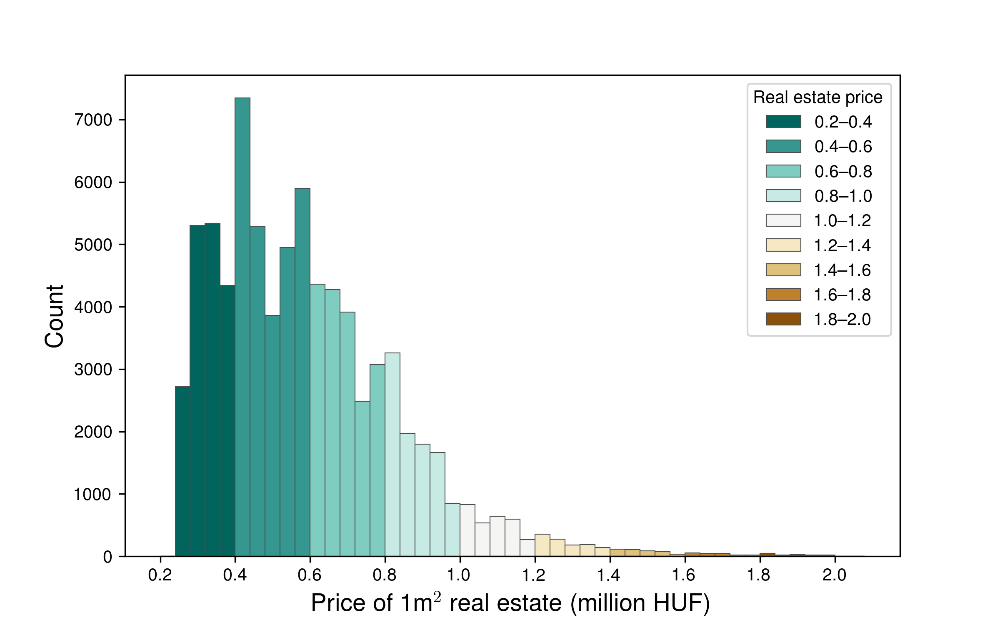
<figcaption><strong>Figure 3.13.:</strong> Real estate price histogram from the <em>ingatlan.com</em> data source.</figcaption>
</figure>

Although 70.78% of the data points are within Budapest, there are some areas without property price samples, even in Budapest. Indicators are often aggregated by cells (Section <a href="/docs/data_processing_framework#sec:cellmap_mapping">Cell-Map Mapping</a>), so it is crucial to know the average property price for an area covered by the given cell. Besides the cell-level aggregation, the property prices were aggregated on the suburb and district or settlement level. Budapest has more than 200 suburbs of varying sizes, and the average property price of the suburbs are also determined. When a cell does not have a property price sample (or not enough), the average property price of the underlying suburb was used.

For every cell Voronoi polygons, it was determined how large part of the cell overlaps with the suburbs. The average property price of a cell is the weighted mean of the suburb property prices of the overlapping suburbs. This method significantly reduced the number of cells without estate price data and compensated for the extreme differences between the neighboring cells that might come from the advertisements. Figure <a href="/docs/data_sources#fig:cell_price_map">3.14</a> shows the result of the mean housing prices by the cell polygons.

<figure id="fig:cell_price_map">
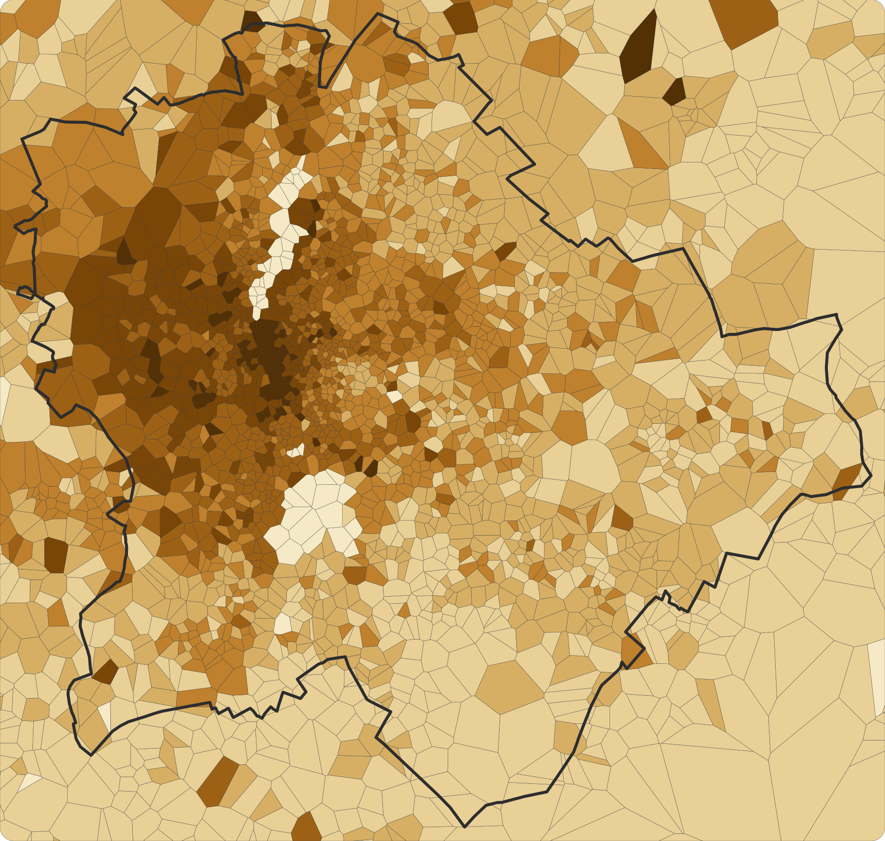
<figcaption><strong>Figure 3.14.:</strong> Average real estate price per cell polygons from the <em>ingatlan.com</em> data source.</figcaption>
</figure>

## OpenStreetMap {#sec:osm}

OpenStreetMap (OSM) provides community-built map data about administrative boundaries (e.g., county, county, city, district), roads, railways, stations, and Points of Interest (e.g., museums, cafés) all over the world. I predominantly use OSM map data to visualize the mobile phone data in a spatial context.

Budapest is divided into 23 districts and more than 200 suburbs. Moreover, KSH groups the districts into three city parts (Figure <a href="/docs/data_sources#fig:city_parts">3.15b</a>) and seven district groups (Figure <a href="/docs/data_sources#fig:district_groups">3.15a</a>) as well. The agglomeration is divided into six sectors (Figure <a href="/docs/data_sources#fig:sectors">3.15c</a>). The administrative borders of these settlements, including the districts and suburbs of Budapest, are derived from OSM. Historically, District 21 (Csepel) is not part of either Buda or Pest, as it is located on the northern end of Csepel Island. Still, statistics used to classify as a Pest-side district (e.g. [<a href="/docs/bibliography#ksh2018budapest" title="Központi Statisztikai Hivatal, Budapest – Gazdaság és társadalom. Keleti Károly utca 5–7., 1024 Budapest, Hungary: Központi Statisztikai Hivatal, 2018.">118</a>]).

Administratively, Margaret Island was part of the 13th district. Since July 2013, it has been directly under the control of the city, being a part of Budapest without belonging to any districts. However, some maps in this work still denote it as a part of District 13. Practically, the whole island is a recreational area covered with landscape parks.

<figure id="fig:bp_areas">

<figcaption><strong>(a)</strong> District groups</figcaption>

<figcaption><strong>(b)</strong> City parts</figcaption>
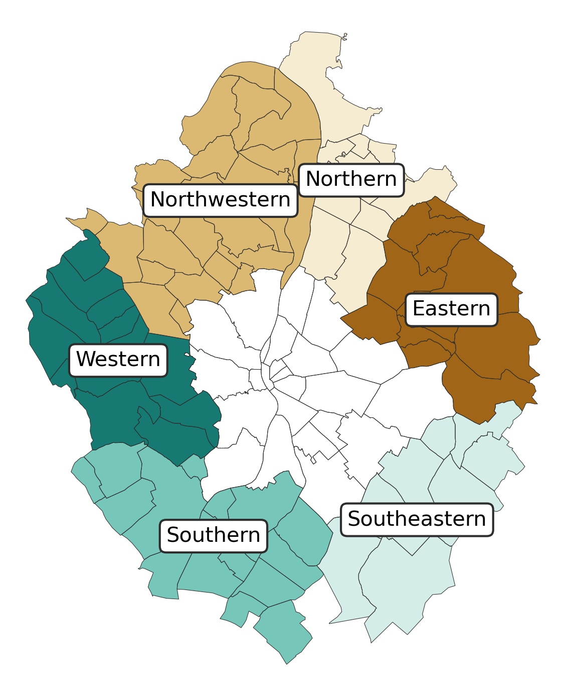
<figcaption><strong>(c)</strong> Sectors of the Budapest agglomeration</figcaption>
<figcaption><strong>Figure 3.15.:</strong> District groups (<strong>a</strong>) and city parts (<strong>b</strong>) of Budapest, and the sectors of the Budapest agglomeration (<strong>c</strong>).</figcaption>
</figure>

## Other Data Sources {#sec:other_data_sources}

### Statistical Data {#statistical-data .unnumbered}

As a validation for the results (e.g., estimated population), statistical data is obtained from the Hungarian Central Statistical Office (KSH), using its interface of the spreadsheet sets, called *STADAT* [<a href="/docs/bibliography#stadat" title="Hungarian Central Statistical Office, “Summary Tables (STADAT).” Available: https://www.ksh.hu/stadat_eng">119</a>].

### Astronomical Data {#astronomical-data .unnumbered}

Also, as a validation, astronomical information (sunrise and sunset) has been obtained, for Budapest, from Visual Crossing, which collects global weather data [<a href="/docs/bibliography#visualcrossing" title="V. C. Corporation, “Visual Crossing Weather (2016-2017).” 2021. Available: https://www.visualcrossing.com/">120</a>]. This data was applied in Section <a href="/docs/awakening_city#sec:day_length">The Length of the Day</a> to compare with the calculated day lengths.

### Twitter {#twitter .unnumbered}

In Section [\[sec:IstandwithCEU\]](#sec:IstandwithCEU){reference-type="ref" reference="sec:IstandwithCEU"}, Twitter data is utilized that was obtained via its academic research access program [<a href="/docs/bibliography#twitter_academic" title="Twitter, “Twitter API for Academic Research.” Available: https://developer.twitter.com/en/products/twitter-api/academic-research">121</a>], which provides access for non-commercial research purposes. To download historical tweets based on hashtags, the *twarc* software was used [<a href="/docs/bibliography#ed_summers_2022_6327291" title="E. Summers et al., “DocNow/twarc: v2.9.5.” Zenodo, Mar. 2022. doi: 10.5281/zenodo.6327291.">122</a>].

[^1]: From 2017, Good Friday is also a holiday in Hungary.

[^2]: This phenomenon also affects the "April 2017" data set, but not to this extent, and almost every cell has a valid location, even if the adjustments are not documented in the received cell-map.

[^3]: <https://www.gsmarena.com/>

[^4]: This was realized by an anonymous reviewer of my paper [<a href="/docs/bibliography#pinter2022awakening" title="G. H. Pintér and I. Felde, “Awakening City: Traces of the Circadian Rhythm within the Mobile Phone Network Data,” Information, vol. 13, no. 3, p. 114, 2022, doi: 10.3390/info13030114.">123</a>].
