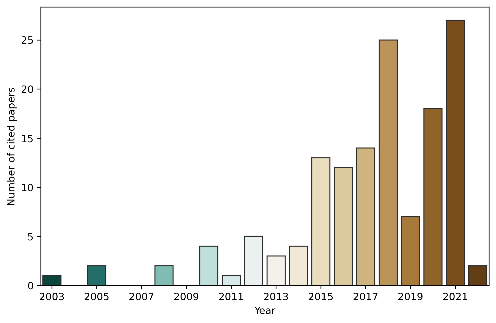

Understanding human movements and recognizing behavior patterns that occur during daily life in urban areas requires a systematic analysis of that human mobility. The evaluation of human travel is based on observations on the individual and group levels. In the last decades, several novel datasets, based on vehicular GPS and cellular network records or social media information, became available, which provided more accurate and sophisticated characterization of people's movements. This chapter provides a brief introduction to this field. Figure <a href="/docs/literature_review#fig:citations">2.1</a>, shows the distribution of the referenced papers from the last two decades.

<figure id="fig:citations">

<figcaption><strong>Figure 2.1.:</strong> Reference distribution of this work, from the last two decades.</figcaption>
</figure>

## Mobile Network Data {#sec:mobile_network_data}

The mobile phone network, during its operation, constantly communicates with the cell phones. This communication can be divided into two categories: (i) the passive, cell-switching communication that keeps the cell phones ready to use the mobile phone network at any time, and (ii) the active, billed usage of the mobile phone network, including phone calls, text messages or mobile internet usage. The Call Detail Records (CDR) collect the latter, containing information about the subscriber, the time of the activity, and the place (via the cell), where the activity occurred.

Strictly speaking, Call Detail Record (CDR) contains only call information, and the expression eXtended Detail Record (XDR) is used to denote other types of billed communication (i.e., mobile internet traffic). As CDRs are generated only when a user makes or receives a call, its temporal resolution is low. In that sense, XDRs has a higher resolution since it is a mixture of human- and device-triggered communication [<a href="/docs/bibliography#pappalardo2021evaluation" title="L. Pappalardo, L. Ferres, M. Sacasa, C. Cattuto, and L. Bravo, “Evaluation of home detection algorithms on mobile phone data using individual-level ground truth,” EPJ data science, vol. 10, no. 1, p. 29, 2021.">16</a>]. An application can request data transfer without human interaction, downloading e-mails, for example. Note that, within this work, the expression CDR is also used to denote XDR, as the obtained data does not contain any information regarding the activity type (see Chapter <a href="/docs/data_sources">Data Sources</a> for details).

The so-called passive communication (also referred to as Control Plane Record (CPR)) is network-triggered at cell-switching, or, for example, when the network status of the cellphone is monitored [<a href="/docs/bibliography#pappalardo2021evaluation" title="L. Pappalardo, L. Ferres, M. Sacasa, C. Cattuto, and L. Bravo, “Evaluation of home detection algorithms on mobile phone data using individual-level ground truth,” EPJ data science, vol. 10, no. 1, p. 29, 2021.">16</a>]. Both the active and the passive communication have the same geographical resolution, as associated with the same base stations or cells that are supposed to be more or less constant. However, the temporal granularity of the passive communication can be significantly finer.

## Mobility Indicators {#sec:mobility_indicators}

There are some indicators that are widely used in the literature to characterize human mobility, like Radius of Gyration, Entropy, or the distance between Home and the Work locations (Section <a href="/docs/data_processing_framework#sec:work_home">Home and Work Locations</a>). These indicators are determined for every subscriber.

### Radius of Gyration {#sec:gyration}

The Radius of Gyration [<a href="/docs/bibliography#gonzalez2008understanding" title="M. C. Gonzalez, C. A. Hidalgo, and A.-L. Barabasi, “Understanding individual human mobility patterns,” nature, vol. 453, no. 7196, p. 779, 2008.">17</a>] defines a circle where an individual can usually be found. It was originally defined in (<a href="#eq__gyration">1</a>), where $L$ is the set of locations visited by the individual, $r_{cm}$ is the center of mass of these locations, and $N$ is the total number of visits of time spent at these locations. The $r_i$ is the coordinate of location $i$, and $n_i$ is the number of visits or the time spent at location $i$ [<a href="/docs/bibliography#pappalardo2015returners" title="L. Pappalardo, F. Simini, S. Rinzivillo, D. Pedreschi, F. Giannotti, and A.-L. Barabási, “Returners and explorers dichotomy in human mobility,” Nature communications, vol. 6, p. 8166, 2015.">5</a>]. <a id="eq__gyration">$$\tag{1}
    r_g = \sqrt{\frac{1}{N} \sum_{i \in L}{n_i (r_i - r_{cm})^2}}$$

### K-Radius of Gyration {#sec:k_gyration}

The K-radius of Gyration is calculated using only the $k$ most frequent locations of the individual [<a href="/docs/bibliography#pappalardo2015returners" title="L. Pappalardo, F. Simini, S. Rinzivillo, D. Pedreschi, F. Giannotti, and A.-L. Barabási, “Returners and explorers dichotomy in human mobility,” Nature communications, vol. 6, p. 8166, 2015.">5</a>], defined by (<a href="#eq__k_gyration">2</a>). Pappalardo et al, used this approach to classify individuals by their mobility customs. Two classes named "Returners" and "Explorers" have been defined by the value of gyration. Returners are who spend most of their time between the $k$ most frequent locations ($r_g^{(2)} > r_g / 2$), in contrast to the explorers whose activity area cannot be described with the $k$ most frequent locations ($r_g^{(2)} < r_g / 2$) [<a href="/docs/bibliography#xu2018human" title="Y. Xu, A. Belyi, I. Bojic, and C. Ratti, “Human mobility and socioeconomic status: Analysis of Singapore and Boston,” Computers, Environment and Urban Systems, vol. 72, pp. 51–67, 2018.">10</a>]. <a id="eq__k_gyration">$$\tag{2}
    r_g^{(k)} = \sqrt{\frac{1}{N_k} \sum_{i = 1}^{k}{n_i (r_i - r_{cm}^{(k)})^2}}$$

### Number of Activity Locations {#sec:number_of_activity_locations}

The number of activity locations (<a href="#eq__number_of_activity_locations">3</a>) is simply the number of the visited cells during an observation period, defined by Xu et al. in [<a href="/docs/bibliography#xu2018human" title="Y. Xu, A. Belyi, I. Bojic, and C. Ratti, “Human mobility and socioeconomic status: Analysis of Singapore and Boston,” Computers, Environment and Urban Systems, vol. 72, pp. 51–67, 2018.">10</a>].

<a id="eq__number_of_activity_locations">$$\tag{3}
    A = \left|(s_1, s_2, ..., s_n)\right|$$

### Mobility Entropy {#sec:entropy}

The mobility entropy (or mobility diversity) of the visited locations characterizes the diversity of the individual's movements, defined as Equation (<a href="#eq__entropy">4</a>), where $L$ is the set of locations visited by the individual, $l$ represents a single location, $p(l)$ is the probability of an individual being active at a location $l$ and $N$ is the total number of activities for an individual [<a href="/docs/bibliography#pappalardo2016analytical" title="L. Pappalardo, M. Vanhoof, L. Gabrielli, Z. Smoreda, D. Pedreschi, and F. Giannotti, “An analytical framework to nowcast well-being using mobile phone data,” International Journal of Data Science and Analytics, vol. 2, no. 1-2, pp. 75–92, 2016.">18</a>, <a href="/docs/bibliography#cottineau2019mobile" title="C. Cottineau and M. Vanhoof, “Mobile phone indicators and their relation to the socioeconomic organisation of cities,” ISPRS International Journal of Geo-Information, vol. 8, no. 1, p. 19, 2019.">19</a>]. <a id="eq__entropy">$$\tag{4}
    MD = - \frac{\sum_{l \in L}{p(l) \log p(l)}}{\log N}$$

The generalization of the Mobility Entropy is the term, Travel Diversity [<a href="/docs/bibliography#xu2018human" title="Y. Xu, A. Belyi, I. Bojic, and C. Ratti, “Human mobility and socioeconomic status: Analysis of Singapore and Boston,” Computers, Environment and Urban Systems, vol. 72, pp. 51–67, 2018.">10</a>]. Instead of the diversity of the locations, it determines the diversity of the travels between consecutive locations. It can be calculated to $k$-length transitions, where $k=1$ gives back the location entropy. It is possible to consider the transitions with or without direction, contingent on whether the difference between $L_1 \rightarrow L_2$ and $L_2 \rightarrow L_1$ is important or not.

## Social Sensing {#sec:social_sensing}

CDR processing is often applied for large social event detection, such as football matches [<a href="/docs/bibliography#traag2011social" title="V. A. Traag, A. Browet, F. Calabrese, and F. Morlot, “Social event detection in massive mobile phone data using probabilistic location inference,” in 2011 IEEE Third International Conference on Privacy, Security, Risk and Trust and 2011 IEEE Third International Conference on Social Computing, 2011, pp. 625–628.">20</a>, <a href="/docs/bibliography#xavier2012analyzing" title="F. H. Z. Xavier, L. M. Silveira, J. M. de Almeida, A. Ziviani, C. H. S. Malab, and H. T. Marques-Neto, “Analyzing the workload dynamics of a mobile phone network in large scale events,” in Proceedings of the first workshop on urban networking, 2012, pp. 37–42.">21</a>, <a href="/docs/bibliography#mamei2016estimating" title="M. Mamei and M. Colonna, “Estimating attendance from cellular network data,” International Journal of Geographical Information Science, vol. 30, no. 7, pp. 1281–1301, 2016.">22</a>, <a href="/docs/bibliography#furletti2017discovering" title="B. Furletti, R. Trasarti, P. Cintia, and L. Gabrielli, “Discovering and understanding city events with big data: the case of rome,” Information, vol. 8, no. 3, p. 74, 2017.">23</a>, <a href="/docs/bibliography#kondor2017prediction" title="D. Kondor, S. Grauwin, Z. Kallus, I. Gódor, S. Sobolevsky, and C. Ratti, “Prediction limits of mobile phone activity modelling,” Royal Society open science, vol. 4, no. 2, p. 160900, 2017.">24</a>], concerts [<a href="/docs/bibliography#marques2018understanding" title="H. T. Marques-Neto et al., “Understanding human mobility and workload dynamics due to different large-scale events using mobile phone data,” Journal of Network and Systems Management, vol. 26, no. 4, pp. 1079–1100, 2018.">25</a>], sociopolitical events [<a href="/docs/bibliography#furletti2017discovering" title="B. Furletti, R. Trasarti, P. Cintia, and L. Gabrielli, “Discovering and understanding city events with big data: the case of rome,” Information, vol. 8, no. 3, p. 74, 2017.">23</a>, <a href="/docs/bibliography#hiir2020impact" title="H. Hiir, R. Sharma, A. Aasa, and E. Saluveer, “Impact of Natural and Social Events on Mobile Call Data Records – An Estonian Case Study,” in Complex Networks and Their Applications VIII, Cham, 2020, pp. 415–426.">26</a>] or mass protests [<a href="/docs/bibliography#rotman2020using" title="A. Rotman and M. Shalev, “Using Location Data from Mobile Phones to Study Participation in Mass Protests,” Sociological Methods & Research, p. 0049124120914926, 2020.">27</a>]. When thousands of people are in the same place at the same time, they generate a significant "anomaly" in the data, whereas small groups usually do not stand out from the "noise". This is especially true when the passive, transparent communication between the mobile phone device and the cell is not included in the data, but only the active communication (voice calls, text messages, and data transfer) is recorded.

Wirz et al. estimated the crowd density during Lord Mayor's Show 2011 in London [<a href="/docs/bibliography#wirz2013probing" title="M. Wirz, T. Franke, D. Roggen, E. Mitleton-Kelly, P. Lukowicz, and G. Tröster, “Probing crowd density through smartphones in city-scale mass gatherings,” EPJ Data Science, vol. 2, no. 1, pp. 1–24, 2013.">28</a>]. In [<a href="/docs/bibliography#traag2011social" title="V. A. Traag, A. Browet, F. Calabrese, and F. Morlot, “Social event detection in massive mobile phone data using probabilistic location inference,” in 2011 IEEE Third International Conference on Privacy, Security, Risk and Trust and 2011 IEEE Third International Conference on Social Computing, 2011, pp. 625–628.">20</a>, <a href="/docs/bibliography#mamei2016estimating" title="M. Mamei and M. Colonna, “Estimating attendance from cellular network data,” International Journal of Geographical Information Science, vol. 30, no. 7, pp. 1281–1301, 2016.">22</a>, <a href="/docs/bibliography#xavier2012analyzing" title="F. H. Z. Xavier, L. M. Silveira, J. M. de Almeida, A. Ziviani, C. H. S. Malab, and H. T. Marques-Neto, “Analyzing the workload dynamics of a mobile phone network in large scale events,” in Proceedings of the first workshop on urban networking, 2012, pp. 37–42.">21</a>] and [<a href="/docs/bibliography#hiir2020impact" title="H. Hiir, R. Sharma, A. Aasa, and E. Saluveer, “Impact of Natural and Social Events on Mobile Call Data Records – An Estonian Case Study,” in Complex Networks and Their Applications VIII, Cham, 2020, pp. 415–426.">26</a>], the authors examined the location of stadiums, where the football matches took place. Traag et al. [<a href="/docs/bibliography#traag2011social" title="V. A. Traag, A. Browet, F. Calabrese, and F. Morlot, “Social event detection in massive mobile phone data using probabilistic location inference,” in 2011 IEEE Third International Conference on Privacy, Security, Risk and Trust and 2011 IEEE Third International Conference on Social Computing, 2011, pp. 625–628.">20</a>] and Hiir et al. [<a href="/docs/bibliography#hiir2020impact" title="H. Hiir, R. Sharma, A. Aasa, and E. Saluveer, “Impact of Natural and Social Events on Mobile Call Data Records – An Estonian Case Study,” in Complex Networks and Their Applications VIII, Cham, 2020, pp. 415–426.">26</a>] also found that the mobile phone activity of the attendees decreased significantly. Xavier et al. compared the reported number of attendees of these events with the detected ones. Furletti et al. also analyzed sociopolitical events, football matches, and concerts in Rome [<a href="/docs/bibliography#furletti2017discovering" title="B. Furletti, R. Trasarti, P. Cintia, and L. Gabrielli, “Discovering and understanding city events with big data: the case of rome,” Information, vol. 8, no. 3, p. 74, 2017.">23</a>]. Barnett et al. analyzed the attendees of Kumbh Mela, a 3-month-long Hindu festival [<a href="/docs/bibliography#barnett2016social" title="I. Barnett, T. Khanna, and J.-P. Onnela, “Social and spatial clustering of people at humanity’s largest gathering,” PloS one, vol. 11, no. 6, p. e0156794, 2016.">29</a>]. Tourism is also studied via mobile network data; Xu et al. followed traveler groups within South Korean cities [<a href="/docs/bibliography#xu2021towards" title="Y. Xu, J. Xue, S. Park, and Y. Yue, “Towards a multidimensional view of tourist mobility patterns in cities: A mobile phone data perspective,” Computers, Environment and urban systems, vol. 86, p. 101593, 2021.">30</a>] and international travelers all around the country [<a href="/docs/bibliography#xu2022understanding" title="Y. Xu, D. Zou, S. Park, Q. Li, S. Zhou, and X. Li, “Understanding the movement predictability of international travelers using a nationwide mobile phone dataset collected in South Korea,” Computers, Environment and Urban Systems, vol. 92, p. 101753, 2022.">31</a>].

Qian et al. found that tourists tend to rest near close to their destinations or in the city center, using Weibo (Chinese microblog app) and Flickr (international photo-sharing service) [<a href="/docs/bibliography#qian2021using" title="C. Qian, W. Li, Z. Duan, D. Yang, and B. Ran, “Using mobile phone data to determine spatial correlations between tourism facilities,” Journal of Transport Geography, vol. 92, p. 103018, 2021.">32</a>].

## COVID-19 {#sec:covid19}

The data used in this work predates the COVID-19 pandemic and solely focuses on the "normal" life of Budapest.

Epidemiology is used to be mentioned as a potential application of human mobility studies, with some applications like [<a href="/docs/bibliography#brdar2016unveiling" title="S. Brdar, K. Gavrić, D. Ćulibrk, and V. Crnojević, “Unveiling spatial epidemiology of HIV with mobile phone data,” Scientific reports, vol. 6, no. 1, pp. 1–13, 2016.">33</a>], but the COVID-19 pandemic prioritized its applications in Digital Epidemiology, as mobile phone network data can reflect the mobility changes caused by the imposed restrictions. The term "Digital Epidemiology" can be used when working with data that was not generated with the primary purpose of epidemiological studies [<a href="/docs/bibliography#salathe2018digital" title="M. Salathé, “Digital epidemiology: what is it, and where is it going?,” Life sciences, society and policy, vol. 14, no. 1, pp. 1–5, 2018.">34</a>], that had considerable applications even before the COVID-19 pandemic [<a href="/docs/bibliography#park2018digital" title="H.-A. Park, H. Jung, J. On, S. K. Park, and H. Kang, “Digital epidemiology: use of digital data collected for non-epidemiological purposes in epidemiological studies,” Healthcare informatics research, vol. 24, no. 4, p. 253, 2018.">35</a>]. Mobile network data is also utilized to analyze human mobility during the COVID-19 pandemic and the effectiveness of the restrictions.

Willberg et al. identified a significant decrease in the population presence in the largest cities of Finland after the lockdown compared to a usual week [<a href="/docs/bibliography#willberg2021escaping" title="E. Willberg, O. Järv, T. Väisänen, and T. Toivonen, “Escaping from cities during the covid-19 crisis: Using mobile phone data to trace mobility in finland,” ISPRS International Journal of Geo-Information, vol. 10, no. 2, p. 103, 2021.">36</a>]. Romanillos et al. reported similar results from the Madrid metropolitan area [<a href="/docs/bibliography#romanillos2021city" title="G. Romanillos et al., “The city turned off: Urban dynamics during the COVID-19 pandemic based on mobile phone data,” Applied Geography, vol. 134, p. 102524, 2021.">37</a>]. W. D. Lee et al. examined the effect of the SES on the mobility changes during the lockdown and found that the mobility of the wealthier subscribers decreased more significantly in England [<a href="/docs/bibliography#do2021association" title="W. Do Lee, M. Qian, and T. Schwanen, “The association between socioeconomic status and mobility reductions in the early stage of England’s COVID-19 epidemic,” Health & Place, p. 102563, 2021.">38</a>]. This is in good agreement with [<a href="/docs/bibliography#yechezkel2021human" title="M. Yechezkel, A. Weiss, I. Rejwan, E. Shahmoon, S. Ben-Gal, and D. Yamin, “Human mobility and poverty as key drivers of COVID-19 transmission and control,” BMC public health, vol. 21, no. 1, pp. 1–13, 2021.">39</a>], where Yechezkel et al. found that poorer regions of Israel showed lower and slower compliance with the mobility restrictions. Khataee et al. compared the effect of the social distancing in several countries, using mobility data from Apple phones [<a href="/docs/bibliography#khataee2021effects" title="H. Khataee, I. Scheuring, A. Czirok, and Z. Neufeld, “Effects of social distancing on the spreading of COVID-19 inferred from mobile phone data,” Scientific Reports, vol. 11, no. 1, pp. 1–9, 2021.">40</a>]. Bushman et al. [<a href="/docs/bibliography#bushman2020effectiveness" title="K. Bushman, K. Pelechrinis, and A. Labrinidis, “Effectiveness and compliance to social distancing during COVID-19,” arXiv preprint arXiv:2006.12720, 2020.">41</a>], Gao et al. [<a href="/docs/bibliography#gao2020association" title="S. Gao et al., “Association of mobile phone location data indications of travel and stay-at-home mandates with covid-19 infection rates in the us,” JAMA network open, vol. 3, no. 9, pp. e2020485–e2020485, 2020.">42</a>], Hu et al. [<a href="/docs/bibliography#hu2021big" title="S. Hu, C. Xiong, M. Yang, H. Younes, W. Luo, and L. Zhang, “A big-data driven approach to analyzing and modeling human mobility trend under non-pharmaceutical interventions during COVID-19 pandemic,” Transportation Research Part C: Emerging Technologies, vol. 124, p. 102955, 2021.">43</a>] and Tokey [<a href="/docs/bibliography#tokey2021spatial" title="A. I. Tokey, “Spatial association of mobility and COVID-19 infection rate in the USA: A county-level study using mobile phone location data,” Journal of Transport & Health, vol. 22, p. 101135, 2021.">44</a>] also analyzed effects of the stay-at-home distancing on the COVID-19 increase rate, in the US. Gao et al. found a negative correlation between stay-at-home distancing and COVID-19 increase rate [<a href="/docs/bibliography#gao2020association" title="S. Gao et al., “Association of mobile phone location data indications of travel and stay-at-home mandates with covid-19 infection rates in the us,” JAMA network open, vol. 3, no. 9, pp. e2020485–e2020485, 2020.">42</a>]. Lucchini et al. studied the mobility changes during the pandemic in four states of the USA [<a href="/docs/bibliography#lucchini2021living" title="L. Lucchini et al., “Living in a pandemic: changes in mobility routines, social activity and adherence to COVID-19 protective measures,” Scientific Reports, vol. 11, no. 1, pp. 1–12, 2021.">45</a>]. Bushman et al. analyzed the compliance to social distancing in the US using mobile phone data [<a href="/docs/bibliography#bushman2020effectiveness" title="K. Bushman, K. Pelechrinis, and A. Labrinidis, “Effectiveness and compliance to social distancing during COVID-19,” arXiv preprint arXiv:2006.12720, 2020.">41</a>]. Yabe et al. found that one week into the state of emergency, human mobility behavior decreased by around 50%, resulting in a 70% reduction of social contacts in Tokyo [<a href="/docs/bibliography#yabe2020non" title="T. Yabe, K. Tsubouchi, N. Fujiwara, T. Wada, Y. Sekimoto, and S. V. Ukkusuri, “Non-compulsory measures sufficiently reduced human mobility in Tokyo during the COVID-19 epidemic,” Scientific reports, vol. 10, no. 1, pp. 1–9, 2020.">46</a>]. This also confirms that mobile network data analysis is an efficient tool to monitor the effect of restrictions, just as Google Mobility data [<a href="/docs/bibliography#sadowski2021big" title="A. Sadowski, Z. Galar, R. Walasek, G. Zimon, and P. Engelseth, “Big data insight on global mobility during the Covid-19 pandemic lockdown,” Journal of big Data, vol. 8, no. 1, pp. 1–33, 2021.">47</a>].

Still, these analyses might not be common enough. Oliver et al. asked: "Why is the use of mobile phone data not widespread, or a standard, in tackling epidemics?" [<a href="/docs/bibliography#oliver2020mobile" title="N. Oliver et al., “Mobile phone data for informing public health actions across the COVID-19 pandemic life cycle.” American Association for the Advancement of Science, 2020.">48</a>]. This, however, is not within the scope of this study.

## Selecting the Subscribers

Csáji et al. took into account subscribers who had at least ten activities during the observation period (15 months) [<a href="/docs/bibliography#csaji2013exploring" title="B. C. Csáji et al., “Exploring the mobility of mobile phone users,” Physica A: statistical mechanics and its applications, vol. 392, no. 6, pp. 1459–1473, 2013.">49</a>]. Xu et al. chose to use those subscribers who had at least one activity record on at least half of the days during the observation period [<a href="/docs/bibliography#xu2018human" title="Y. Xu, A. Belyi, I. Bojic, and C. Ratti, “Human mobility and socioeconomic status: Analysis of Singapore and Boston,” Computers, Environment and Urban Systems, vol. 72, pp. 51–67, 2018.">10</a>]. Pappalardo et al. discarded the subscribers who had only one location, and the individuals have at least half as many calls as hours are in the data set. Furthermore, the abnormally active (more than 300 calls per day) SIM cards are excluded [<a href="/docs/bibliography#pappalardo2015returners" title="L. Pappalardo, F. Simini, S. Rinzivillo, D. Pedreschi, F. Giannotti, and A.-L. Barabási, “Returners and explorers dichotomy in human mobility,” Nature communications, vol. 6, p. 8166, 2015.">5</a>]. I selected the SIM cards that have activity for at least 20 days (out of 30), the daily mean activity number is at least 40 on workdays and at least 20 on weekends, but not more than 1000. The upper limit is especially important to remove SIM cards that possibly operate in mobile broadband modems, for example. More details in Section <a href="/docs/data_processing_framework#sec:selecting_active_sims">Selecting Active SIMs</a>. Filtering by activity is not necessarily sufficient to keep only individuals in the data set. Type Allocation Codes (TAC), on the other hand, can determine the type of the device and the exact model of a cell phone (Section <a href="/docs/data_sources#sec:device_types">Device Types</a>).

## Commuting

Identifying the home and work locations of a subscriber is a common and crucial part of the CDR processing, as a good portion of the people live their lives in an area that is determined by only their home and workplace [<a href="/docs/bibliography#pappalardo2015returners" title="L. Pappalardo, F. Simini, S. Rinzivillo, D. Pedreschi, F. Giannotti, and A.-L. Barabási, “Returners and explorers dichotomy in human mobility,” Nature communications, vol. 6, p. 8166, 2015.">5</a>, <a href="/docs/bibliography#jiang2017activity" title="S. Jiang, J. Ferreira, and M. C. Gonzalez, “Activity-based human mobility patterns inferred from mobile phone data: A case study of Singapore,” IEEE Transactions on Big Data, vol. 3, no. 2, pp. 208–219, 2017.">50</a>]. Since these locations fundamentally determine the people's mobility customs, the commuting trends can be analyzed between these locations. The commuting is studied within a city [<a href="/docs/bibliography#jiang2017activity" title="S. Jiang, J. Ferreira, and M. C. Gonzalez, “Activity-based human mobility patterns inferred from mobile phone data: A case study of Singapore,” IEEE Transactions on Big Data, vol. 3, no. 2, pp. 208–219, 2017.">50</a>, <a href="/docs/bibliography#fiadino2017call" title="P. Fiadino, V. Ponce-Lopez, J. Antonio, M. Torrent-Moreno, and A. D’Alconzo, “Call Detail Records for Human Mobility Studies: Taking Stock of the Situation in the’ Always Connected Era,’” in Proceedings of the Workshop on Big Data Analytics and Machine Learning for Data Communication Networks, 2017, pp. 43–48.">51</a>], or between cities [<a href="/docs/bibliography#zagatti2018trip" title="G. A. Zagatti et al., “A trip to work: Estimation of origin and destination of commuting patterns in the main metropolitan regions of Haiti using CDR,” Development Engineering, vol. 3, pp. 133–165, 2018.">52</a>, <a href="/docs/bibliography#mamei2019evaluating" title="M. Mamei, N. Bicocchi, M. Lippi, S. Mariani, and F. Zambonelli, “Evaluating origin–destination matrices obtained from CDR data,” Sensors, vol. 19, no. 20, p. 4470, 2019.">53</a>, <a href="/docs/bibliography#barbosa2021uncovering" title="H. Barbosa et al., “Uncovering the socioeconomic facets of human mobility,” Scientific reports, vol. 11, no. 1, pp. 1–13, 2021.">54</a>], and also examined by social network data, such as Twitter [<a href="/docs/bibliography#wang2018urban" title="Q. Wang, N. E. Phillips, M. L. Small, and R. J. Sampson, “Urban mobility and neighborhood isolation in America’s 50 largest cities,” Proceedings of the National Academy of Sciences, vol. 115, no. 30, pp. 7735–7740, 2018.">55</a>, <a href="/docs/bibliography#bokanyi2021universal" title="E. Bokányi, S. Juhász, M. Karsai, and B. Lengyel, “Universal patterns of long-distance commuting and social assortativity in cities,” Scientific reports, vol. 11, no. 1, pp. 1–10, 2021.">56</a>].

Csáji et al. determined the subscribers' most common locations, and based on weekly calling patterns, identified the home and work locations [<a href="/docs/bibliography#csaji2013exploring" title="B. C. Csáji et al., “Exploring the mobility of mobile phone users,” Physica A: statistical mechanics and its applications, vol. 392, no. 6, pp. 1459–1473, 2013.">49</a>]. Home locations showed a strong correlation with population statistics. Diao et al. applied a regression model to travel survey data to predict the activity type (e.g., home, work, or social) of the mobile phone location data by considering the temporal distributions of different activities [<a href="/docs/bibliography#diao2016inferring" title="M. Diao, Y. Zhu, J. Ferreira Jr, and C. Ratti, “Inferring individual daily activities from mobile phone traces: A Boston example,” Environment and Planning B: Planning and Design, vol. 43, no. 5, pp. 920–940, 2016.">57</a>]. Xu et al. determined the home locations and then applied a modified standard distance to measure the spread of each subscriber's activity space [<a href="/docs/bibliography#xu2015understanding" title="Y. Xu, S.-L. Shaw, Z. Zhao, L. Yin, Z. Fang, and Q. Li, “Understanding aggregate human mobility patterns using passive mobile phone location data: a home-based approach,” Transportation, vol. 42, no. 4, pp. 625–646, 2015.">58</a>]. Pappalardo et al. used the Radius of Gyration (Section <a href="/docs/literature_review#sec:mobility_indicators">Mobility Indicators</a>) to separate the subscribers based on their mobility customs and defined two classes: returners and explorers [<a href="/docs/bibliography#pappalardo2015returners" title="L. Pappalardo, F. Simini, S. Rinzivillo, D. Pedreschi, F. Giannotti, and A.-L. Barabási, “Returners and explorers dichotomy in human mobility,” Nature communications, vol. 6, p. 8166, 2015.">5</a>]. While in the case of returners, the radius of gyration is dominated by their movement between a few preferred locations, the explorers have a tendency to travel between a larger number of different locations. To demonstrate this dichotomy, they defined the k-radius of gyration, which refers to the gyration radius of the $k$ most frequent locations. The gyration radius of a two-returner is determined by the two most frequented locations, that is usually the home and work locations [<a href="/docs/bibliography#pappalardo2015returners" title="L. Pappalardo, F. Simini, S. Rinzivillo, D. Pedreschi, F. Giannotti, and A.-L. Barabási, “Returners and explorers dichotomy in human mobility,” Nature communications, vol. 6, p. 8166, 2015.">5</a>], so this method can also be used as a home detection algorithm. Pappalardo et al. [<a href="/docs/bibliography#pappalardo2021evaluation" title="L. Pappalardo, L. Ferres, M. Sacasa, C. Cattuto, and L. Bravo, “Evaluation of home detection algorithms on mobile phone data using individual-level ground truth,” EPJ data science, vol. 10, no. 1, p. 29, 2021.">16</a>] compared the estimated home locations of sixty-five subscribers with the known geographical coordinates of their residence location, using different types of mobile network data: CDR, eXtended Detail Record (XDR) and Control Plane Record (CPR). It has been found that XDRs should be preferred when performing home location detection.

Vanhoof et al. compared five different home detection algorithms (HDA), selecting the home cell by (i) the most activity, (ii) the most number of distinct days with phone activities, (iii) the most activities within a time interval (between 19:00 and 7:00), (iv) the most activities within a spatial perimeter, and (v) the combination of the temporal and spatial constraints [<a href="/docs/bibliography#vanhoof2018assessing" title="M. Vanhoof, F. Reis, T. Ploetz, and Z. Smoreda, “Assessing the Quality of Home Detection from Mobile Phone Data for Official Statistics,” Journal of official statistics, vol. 34, no. 4, pp. 935–960, 2018.">59</a>].

Jiang et al. identified daily activity patterns (motifs, Figure <a href="/docs/literature_review#fig:daily_motifs">2.2</a>), that can extend the home-work location based daily routine [<a href="/docs/bibliography#jiang2017activity" title="S. Jiang, J. Ferreira, and M. C. Gonzalez, “Activity-based human mobility patterns inferred from mobile phone data: A case study of Singapore,” IEEE Transactions on Big Data, vol. 3, no. 2, pp. 208–219, 2017.">50</a>], the home locations were validated with census and household travel survey results.

<figure id="fig:daily_motifs">

<figcaption><strong>Figure 2.2.:</strong> Daily motifs, based on [<a href="/docs/bibliography#jiang2017activity" title="S. Jiang, J. Ferreira, and M. C. Gonzalez, “Activity-based human mobility patterns inferred from mobile phone data: A case study of Singapore,” IEEE Transactions on Big Data, vol. 3, no. 2, pp. 208–219, 2017.">50</a>].</figcaption>
</figure>

Whereas Yin et al. separated the different types of activity (home, work, leisure, school) with chains of activity [<a href="/docs/bibliography#yin2021mining" title="L. Yin, N. Lin, and Z. Zhao, “Mining daily activity chains from large-scale mobile phone location data,” Cities, vol. 109, p. 103013, 2021.">60</a>], providing different approaches for a similar purpose. Mamei et al. computed origin-destination flows with road network mapping and also validated the home location estimation with census data [<a href="/docs/bibliography#mamei2019evaluating" title="M. Mamei, N. Bicocchi, M. Lippi, S. Mariani, and F. Zambonelli, “Evaluating origin–destination matrices obtained from CDR data,” Sensors, vol. 19, no. 20, p. 4470, 2019.">53</a>]. Zagatti et al. studied commuting in Haiti [<a href="/docs/bibliography#zagatti2018trip" title="G. A. Zagatti et al., “A trip to work: Estimation of origin and destination of commuting patterns in the main metropolitan regions of Haiti using CDR,” Development Engineering, vol. 3, pp. 133–165, 2018.">52</a>].

Dannemann et al. [<a href="/docs/bibliography#dannemann2018time" title="T. Dannemann, B. Sotomayor-Gómez, and H. Samaniego, “The time geography of segregation during working hours,” Royal Society open science, vol. 5, no. 10, p. 180749, 2018.">61</a>] partitioned the city of Santiago (Chile) into several communities and identified the socioeconomic composition of these communities based on the home-work trajectories.

### Connectivity {#connectivity .unnumbered}

Traveling within a city or across cities is not necessarily bound to the home or work locations. Understanding the travel customs concerning recreational activities or tourism, for example, is also an important aspect of urban mobility.

Trasarti et al. used sequential pattern mining for identifying activity patterns in the CDR data and identified interconnections at the urban and national level [<a href="/docs/bibliography#trasarti2015discovering" title="R. Trasarti et al., “Discovering urban and country dynamics from mobile phone data with spatial correlation patterns,” Telecommunications Policy, vol. 39, no. 3-4, pp. 347–362, 2015.">62</a>]. Lee et al. analyzed commuting across ten Korean cities and determined the attractiveness of the cities based on which city attracted more commuters [<a href="/docs/bibliography#lee2018urban" title="K.-S. Lee, S. Y. You, J. K. Eom, J. Song, and J. H. Min, “Urban spatiotemporal analysis using mobile phone data: Case study of medium-and large-sized Korean cities,” Habitat International, vol. 73, pp. 6–15, 2018.">63</a>]. Fiadino et al. identified clusters where the visitors of Barcelona concentrate their activities and connections between the districts of Barcelona [<a href="/docs/bibliography#fiadino2017call" title="P. Fiadino, V. Ponce-Lopez, J. Antonio, M. Torrent-Moreno, and A. D’Alconzo, “Call Detail Records for Human Mobility Studies: Taking Stock of the Situation in the’ Always Connected Era,’” in Proceedings of the Workshop on Big Data Analytics and Machine Learning for Data Communication Networks, 2017, pp. 43–48.">51</a>]. Using mobile network and POI data, Qian et al. determined that tourists tend to rest near sightseeing destinations and choose transportation hubs in the city center, furthermore connections between popular destinations were identified [<a href="/docs/bibliography#qian2021using" title="C. Qian, W. Li, Z. Duan, D. Yang, and B. Ran, “Using mobile phone data to determine spatial correlations between tourism facilities,” Journal of Transport Geography, vol. 92, p. 103018, 2021.">32</a>].

Ghahramani et al. investigated hotspots [<a href="/docs/bibliography#ghahramani2018mobile" title="M. Ghahramani, M. C. Zhou, and C. T. Hon, “Mobile phone data analysis: A spatial exploration toward hotspot detection,” IEEE Transactions on Automation Science and Engineering, vol. 16, no. 1, pp. 351–362, 2018.">64</a>] and interaction flows between the parts of Macau and found that people tend to communicate within their close-proximity communities [<a href="/docs/bibliography#ghahramani2018extracting" title="M. Ghahramani, M. C. Zhou, and C. T. Hon, “Extracting significant mobile phone interaction patterns based on community structures,” IEEE Transactions on Intelligent Transportation Systems, vol. 20, no. 3, pp. 1031–1041, 2018.">65</a>]. Fan et al. mapped the trajectories, extracted from CDRs to the road network, then the crowd flux was estimated [<a href="/docs/bibliography#fan2018estimation" title="Z. Fan et al., “Estimation of urban crowd flux based on mobile phone location data: A case study of Beijing, China,” Computers, Environment and Urban Systems, vol. 69, pp. 114–123, 2018.">66</a>]. Ni et al. extracted origin-destination information and confirmed positive connections between the population, key facilities (e.h., shopping malls or hospitals), transportation accessibility, and travel flows [<a href="/docs/bibliography#ni2018spatial" title="L. Ni, X. C. Wang, and X. M. Chen, “A spatial econometric model for travel flow analysis and real-world applications with massive mobile phone data,” Transportation research part C: emerging technologies, vol. 86, pp. 510–526, 2018.">67</a>].

## Gender Differences

Gauvin et al. revealed a gender gap in mobility, they found that women visit fewer locations than men, and spend their time less equally among those locations [<a href="/docs/bibliography#gauvin2020gender" title="L. Gauvin et al., “Gender gaps in urban mobility,” Humanities and Social Sciences Communications, vol. 7, no. 1, pp. 1–13, 2020.">68</a>]. Goel et al. evaluated gender segregation by the social network interactions of the mobile network data, and found that Estonian speakers more likely interact with other Estonian speakers of the same gender [<a href="/docs/bibliography#goel2021understanding" title="R. Goel, R. Sharma, and A. Aasa, “Understanding gender segregation through Call Data Records: An Estonian case study,” Plos one, vol. 16, no. 3, p. e0248212, 2021.">69</a>]. Al‐Zuabi et al. predicted the subscribers' age and gender based on mobile phone network activities [<a href="/docs/bibliography#al2019predicting" title="I. M. Al-Zuabi, A. Jafar, and K. Aljoumaa, “Predicting customer’s gender and age depending on mobile phone data,” Journal of Big Data, vol. 6, no. 1, pp. 1–16, 2019.">70</a>]. Besides these examples, the other studies also attend to gender differences, like [<a href="/docs/bibliography#aledavood2015daily" title="T. Aledavood et al., “Daily rhythms in mobile telephone communication,” PloS one, vol. 10, no. 9, p. e0138098, 2015.">71</a>, <a href="/docs/bibliography#roy2021morningness" title="C. Roy, D. Monsivais, K. Bhattacharya, R. I. M. Dunbar, and K. Kaski, “Morningness–eveningness assessment from mobile phone communication analysis,” Scientific Reports, vol. 11, no. 1, pp. 1–13, 2021.">72</a>].

## Socioeconomic Status {#sec:ses_literature}

The demographic metrics and Social Economic Status (SES) seem to have a significant relationship to individual travel behavior. Early studies aimed to investigate the correlation between the human travel characteristics and between SES [<a href="/docs/bibliography#hanson1981travel" title="S. Hanson and P. Hanson, “The travel-activity patterns of urban residents: dimensions and relationships to sociodemographic characteristics,” Economic geography, vol. 57, no. 4, pp. 332–347, 1981.">73</a>, <a href="/docs/bibliography#kwan1999gender" title="M.-P. Kwan, “Gender, the home-work link, and space-time patterns of nonemployment activities,” Economic geography, vol. 75, no. 4, pp. 370–394, 1999.">74</a>]. Utilizing mobility indicators, calculated from mobile network data, to infer SES is a current direction of mobility analysis, as the study of city structures (for example, Aung et al. classified land use types based on mobile network activity [<a href="/docs/bibliography#aung2019identification" title="T. AUNG, K. K. LWIN, Y. SEKIMOTO, and others, “Identification and Classification of Land Use Types in Yangon City by Using Mobile Call Detail Records (CDRs) Data,” Journal of the Eastern Asia Society for Transportation Studies, vol. 13, pp. 1114–1133, 2019.">75</a>], Furno et al. fused GPS traces and mobile phone data [<a href="/docs/bibliography#furno2017fusing" title="A. Furno, N.-E. El Faouzi, M. Fiore, and R. Stanica, “Fusing GPS probe and mobile phone data for enhanced land-use detection,” in 2017 5th IEEE International Conference on Models and Technologies for Intelligent Transportation Systems (MT-ITS), 2017, pp. 693–698.">8</a>]) led to the analyses of the socioeconomic structure of the population.

Cottineau and Vanhoof [<a href="/docs/bibliography#cottineau2019mobile" title="C. Cottineau and M. Vanhoof, “Mobile phone indicators and their relation to the socioeconomic organisation of cities,” ISPRS International Journal of Geo-Information, vol. 8, no. 1, p. 19, 2019.">19</a>] developed a model to explore the relationship between mobile phone data and traditional socioeconomic information from the national census in French cities. Mobile phone indicators were estimated from six months of Call Detail Records, while census and administrative data are used to characterize the socioeconomic organization of French cities. The findings show that some mobile phone indicators relate significantly to different socioeconomic organization of cities. Pokhriyal et al. [<a href="/docs/bibliography#pokhriyal2017combining" title="N. Pokhriyal and D. C. Jacques, “Combining disparate data sources for improved poverty prediction and mapping,” Proceedings of the National Academy of Sciences, vol. 114, no. 46, pp. E9783–E9792, 2017.">76</a>] used a computational framework to accurately predict the Global Multidimensional Poverty Index (MPI), in Senegal, based on environmental data and CDR. The methodology provides the accurate prediction of important dimensions of poverty: health, education, and standard of living. The estimations have been validated using deprivations calculated from the census.

Some investigations suggest that the mobile phone data can be used to predict individual SES [<a href="/docs/bibliography#blumenstock2015predicting" title="J. Blumenstock, G. Cadamuro, and R. On, “Predicting poverty and wealth from mobile phone metadata,” Science, vol. 350, no. 6264, pp. 1073–1076, 2015.">11</a>] or regional socioeconomic characteristics [<a href="/docs/bibliography#vscepanovic2015mobile" title="S. Šćepanović, I. Mishkovski, P. Hui, J. K. Nurminen, and A. Ylä-Jääski, “Mobile phone call data as a regional socio-economic proxy indicator,” PloS one, vol. 10, no. 4, 2015.">77</a>]. Xu et al. [<a href="/docs/bibliography#xu2018human" title="Y. Xu, A. Belyi, I. Bojic, and C. Ratti, “Human mobility and socioeconomic status: Analysis of Singapore and Boston,” Computers, Environment and Urban Systems, vol. 72, pp. 51–67, 2018.">10</a>] used an analytical framework on large-scale mobile phone and urban socioeconomic datasets to evaluate mobility patterns and SES. Six mobility indicators, housing prices, and income in Singapore and Boston have been used to analyze the socioeconomic classes. It was found that phone users who are generally wealthier tend to travel shorter distances in Singapore, but longer, in Boston. The research brought interesting findings but also showed that the relationship between mobility and socioeconomic status is worth investigating in other cities and countries as well.

Xu et al. [<a href="/docs/bibliography#xu2015understanding" title="Y. Xu, S.-L. Shaw, Z. Zhao, L. Yin, Z. Fang, and Q. Li, “Understanding aggregate human mobility patterns using passive mobile phone location data: a home-based approach,” Transportation, vol. 42, no. 4, pp. 625–646, 2015.">58</a>] investigated the people's daily activities in Shenzhen, China, and identified so-called "north--south" differences in human activity, which findings are in good agreement with the socioeconomic divide in the city. Zhao et al. proposed a semi-supervised hypergraph-based factor graph model to predict individual SES, using data of Shanghai [<a href="/docs/bibliography#zhao2020predicting" title="T. Zhao, H. Huang, X. Yao, X. Fu, and others, “Predicting individual socioeconomic status from mobile phone data: a semi-supervised hypergraph-based factor graph approach,” International Journal of Data Science and Analytics, vol. 9, no. 3, pp. 361–372, 2020.">78</a>].

Castillo et al. calculated Human Development Index for locally available data for Ecuador to describe the socioeconomic status and used in comparison to their mobile phone based approach [<a href="/docs/bibliography#castillo2018silence" title="G. Castillo, F. Layedra, M.-B. Guaranda, P. Lara, and C. Vaca, “The silence of the cantons: Estimating villages socioeconomic status through mobile phones data,” in 2018 International Conference on eDemocracy & eGovernment (ICEDEG), 2018, pp. 172–178.">79</a>]. Barbosa et al. found significant differences in the average travel distance between the low and high-income groups in Brazil [<a href="/docs/bibliography#barbosa2021uncovering" title="H. Barbosa et al., “Uncovering the socioeconomic facets of human mobility,” Scientific reports, vol. 11, no. 1, pp. 1–13, 2021.">54</a>].

The different social classes live in different parts of a city, but CDRs also have been used to analyze gender, and minority segregation [<a href="/docs/bibliography#goel2021understanding" title="R. Goel, R. Sharma, and A. Aasa, “Understanding gender segregation through Call Data Records: An Estonian case study,” Plos one, vol. 16, no. 3, p. e0248212, 2021.">69</a>]. Cottineau et al. [<a href="/docs/bibliography#cottineau2019mobile" title="C. Cottineau and M. Vanhoof, “Mobile phone indicators and their relation to the socioeconomic organisation of cities,” ISPRS International Journal of Geo-Information, vol. 8, no. 1, p. 19, 2019.">19</a>] explored the relationship between mobile phone data and traditional socioeconomic information from the national census in French cities. Barbosa et al. also found significant differences in the average travel distance between the low- and high income groups in Brazil [<a href="/docs/bibliography#barbosa2021uncovering" title="H. Barbosa et al., “Uncovering the socioeconomic facets of human mobility,” Scientific reports, vol. 11, no. 1, pp. 1–13, 2021.">54</a>].

Ucar et al. revealed a socioeconomic gap in mobile service consumption [<a href="/docs/bibliography#ucar2021news" title="I. Ucar, M. Gramaglia, M. Fiore, Z. Smoreda, and E. Moro, “News or social media? Socio-economic divide of mobile service consumption,” Journal of the Royal Society Interface, vol. 18, no. 185, p. 20210350, 2021.">80</a>]. Vilella et al. found that education and age play news media consumption patterns in Chile, using a dataset that provides information about the visited websites [<a href="/docs/bibliography#vilella2020news" title="S. Vilella, D. Paolotti, G. Ruffo, and L. Ferres, “News and the city: understanding online press consumption patterns through mobile data,” EPJ Data Science, vol. 9, no. 1, pp. 1–18, 2020.">81</a>].

While Blumenstock et al. used the call history as a factor of socioeconomic status [<a href="/docs/bibliography#blumenstock2015predicting" title="J. Blumenstock, G. Cadamuro, and R. On, “Predicting poverty and wealth from mobile phone metadata,” Science, vol. 350, no. 6264, pp. 1073–1076, 2015.">11</a>], Sultan et al. [<a href="/docs/bibliography#sultan2015mobile" title="S. F. Sultan, H. Humayun, U. Nadeem, Z. K. Bhatti, and S. Khan, “Mobile phone price as a proxy for socio-economic indicators,” in Proceedings of the Seventh International Conference on Information and Communication Technologies and Development, 2015, pp. 1–4.">12</a>] applied mobile phone prices as a socioeconomic indicator and identified areas where more expensive phones appear more often. However, only manually collected market prices were used. Beiró et al. examined the visitors of 16 malls in Santiago de Chile and found that people tend to choose a profile of malls more in line with their own socioeconomic status and the distance from their home [<a href="/docs/bibliography#beiro2018shopping" title="M. G. Beiró, L. Bravo, D. Caro, C. Cattuto, L. Ferres, and E. Graells-Garrido, “Shopping mall attraction and social mixing at a city scale,” EPJ Data Science, vol. 7, pp. 1–21, 2018.">82</a>].

Lenormand et al. utilized Entropy as a measure of attractiveness and socioeconomic complexity and found a positive and exponential relationship between income level and entropy, based on mobile network data at Rio de Janeiro Metropolitan Area [<a href="/docs/bibliography#lenormand2020entropy" title="M. Lenormand, H. Samaniego, J. C. Chaves, V. da Fonseca Vieira, M. A. H. B. da Silva, and A. G. Evsukoff, “Entropy as a measure of attractiveness and socioeconomic complexity in Rio de Janeiro metropolitan area,” Entropy, vol. 22, no. 3, p. 368, 2020.">83</a>]. Based on mobile network data, De Nadai et al. found that socioeconomic conditions, mobility, and physical characteristics of the neighborhood explain the emergence of crime [<a href="/docs/bibliography#de2020socio" title="M. De Nadai, Y. Xu, E. Letouzé, M. C. González, and B. Lepri, “Socio-economic, built environment, and mobility conditions associated with crime: a study of multiple cities,” Scientific reports, vol. 10, no. 1, pp. 1–12, 2020.">84</a>].

Leo et al. investigated socioeconomic correlations between mobile phone communication records and anonymous bank transaction history over eight months. The latter contains daily debit/credit card purchases, their monthly loan measures, billing postal code, age, and gender [<a href="/docs/bibliography#leo2016socioeconomic" title="Y. Leo, E. Fleury, J. I. Alvarez-Hamelin, C. Sarraute, and M. Karsai, “Socioeconomic correlations and stratification in social-communication networks,” Journal of The Royal Society Interface, vol. 13, no. 125, p. 20160598, 2016.">85</a>]. They demonstrated that people of the same socioeconomic class are better connected and live closer to each other within their own class.

## Sleep-wake cycle {#sec:sleep_wake_cycle}

The studies cited before mainly focus on the spatial distance between the home and work locations, as it is hard to estimate the travel time [<a href="/docs/bibliography#kung2014exploring" title="K. S. Kung, K. Greco, S. Sobolevsky, and C. Ratti, “Exploring universal patterns in human home-work commuting from mobile phone data,” PloS one, vol. 9, no. 6, p. e96180, 2014.">86</a>], using sporadic CDR data, though it has seasonal nature due to the human biorhythm. Moreover, human mobility is highly regular [<a href="/docs/bibliography#gonzalez2008understanding" title="M. C. Gonzalez, C. A. Hidalgo, and A.-L. Barabasi, “Understanding individual human mobility patterns,” nature, vol. 453, no. 7196, p. 779, 2008.">17</a>, <a href="/docs/bibliography#song2010limits" title="C. Song, Z. Qu, N. Blumm, and A.-L. Barabási, “Limits of predictability in human mobility,” Science, vol. 327, no. 5968, pp. 1018–1021, 2010.">87</a>], and the individual activity has a bursty characteristic [<a href="/docs/bibliography#barabasi2005origin" title="A.-L. Barabasi, “The origin of bursts and heavy tails in human dynamics,” Nature, vol. 435, no. 7039, pp. 207–211, 2005.">88</a>]. Jo et al. found that by removing the circadian and weekly seasonality, the bursty nature of the human activity remains [<a href="/docs/bibliography#jo2012circadian" title="H.-H. Jo, M. Karsai, J. Kertész, and K. Kaski, “Circadian pattern and burstiness in mobile phone communication,” New Journal of Physics, vol. 14, no. 1, p. 013055, 2012.">89</a>].

In the digital era, the human sleep wake cycle (SWC) is also studied using the info-communication systems, such as smartphones [<a href="/docs/bibliography#cuttone2017sensiblesleep" title="A. Cuttone, P. Bækgaard, V. Sekara, H. Jonsson, J. E. Larsen, and S. Lehmann, “Sensiblesleep: A bayesian model for learning sleep patterns from smartphone events,” PloS one, vol. 12, no. 1, p. e0169901, 2017.">90</a>, <a href="/docs/bibliography#aledavood2018social" title="T. Aledavood, S. Lehmann, and J. Saramäki, “Social network differences of chronotypes identified from mobile phone data,” EPJ Data Science, vol. 7, no. 1, p. 46, 2018.">91</a>], websites [<a href="/docs/bibliography#yasseri2012circadian" title="T. Yasseri, R. Sumi, and J. Kertész, “Circadian patterns of wikipedia editorial activity: A demographic analysis,” PloS one, vol. 7, no. 1, p. e30091, 2012.">92</a>, <a href="/docs/bibliography#yasseri2013temporal" title="T. Yasseri, G. Quattrone, and A. Mashhadi, “Temporal analysis of activity patterns of editors in collaborative mapping project of OpenStreetMap,” in Proceedings of the 9th International Symposium on Open Collaboration, 2013, pp. 1–4.">93</a>, <a href="/docs/bibliography#vilella2020news" title="S. Vilella, D. Paolotti, G. Ruffo, and L. Ferres, “News and the city: understanding online press consumption patterns through mobile data,” EPJ Data Science, vol. 9, no. 1, pp. 1–18, 2020.">81</a>], social media [<a href="/docs/bibliography#dzogang2017circadian" title="F. Dzogang, S. Lightman, and N. Cristianini, “Circadian mood variations in Twitter content,” Brain and neuroscience advances, vol. 1, p. 2398212817744501, 2017.">94</a>] and call detail records (CDR) [<a href="/docs/bibliography#ahas2010daily" title="R. Ahas, A. Aasa, S. Silm, and M. Tiru, “Daily rhythms of suburban commuters’ movements in the Tallinn metropolitan area: Case study with mobile positioning data,” Transportation Research Part C: Emerging Technologies, vol. 18, no. 1, pp. 45–54, 2010.">95</a>, <a href="/docs/bibliography#jo2012circadian" title="H.-H. Jo, M. Karsai, J. Kertész, and K. Kaski, “Circadian pattern and burstiness in mobile phone communication,” New Journal of Physics, vol. 14, no. 1, p. 013055, 2012.">89</a>, <a href="/docs/bibliography#aledavood2015daily" title="T. Aledavood et al., “Daily rhythms in mobile telephone communication,” PloS one, vol. 10, no. 9, p. e0138098, 2015.">71</a>, <a href="/docs/bibliography#lotero2016rich" title="L. Lotero, R. G. Hurtado, L. M. Florı́a, and J. Gómez-Gardeñes, “Rich do not rise early: spatio-temporal patterns in the mobility networks of different socio-economic classes,” Royal Society open science, vol. 3, no. 10, p. 150654, 2016.">96</a>, <a href="/docs/bibliography#monsivais2017seasonal" title="D. Monsivais, K. Bhattacharya, A. Ghosh, R. I. M. Dunbar, and K. Kaski, “Seasonal and geographical impact on human resting periods,” Scientific reports, vol. 7, no. 1, pp. 1–10, 2017.">97</a>, <a href="/docs/bibliography#monsivais2017tracking" title="D. Monsivais, A. Ghosh, K. Bhattacharya, R. I. M. Dunbar, and K. Kaski, “Tracking urban human activity from mobile phone calling patterns,” PLoS computational biology, vol. 13, no. 11, p. e1005824, 2017.">98</a>, <a href="/docs/bibliography#alakorkko2020circadian" title="T. Alakörkkö and J. Saramäki, “Circadian rhythms in temporal-network connectivity,” Chaos: An Interdisciplinary Journal of Nonlinear Science, vol. 30, no. 9, p. 093115, 2020.">99</a>]. Cuttone et al. used screen-on events of smartphones to study the daily sleep periods [<a href="/docs/bibliography#cuttone2017sensiblesleep" title="A. Cuttone, P. Bækgaard, V. Sekara, H. Jonsson, J. E. Larsen, and S. Lehmann, “Sensiblesleep: A bayesian model for learning sleep patterns from smartphone events,” PloS one, vol. 12, no. 1, p. e0169901, 2017.">90</a>], and Aledavood et al. examined the social network of different chronotypes, using the same data set [<a href="/docs/bibliography#aledavood2018social" title="T. Aledavood, S. Lehmann, and J. Saramäki, “Social network differences of chronotypes identified from mobile phone data,” EPJ Data Science, vol. 7, no. 1, p. 46, 2018.">91</a>]. Monsivais et al. identified yearly and seasonal patterns in calling activity and resting periods [<a href="/docs/bibliography#monsivais2017seasonal" title="D. Monsivais, K. Bhattacharya, A. Ghosh, R. I. M. Dunbar, and K. Kaski, “Seasonal and geographical impact on human resting periods,” Scientific reports, vol. 7, no. 1, pp. 1–10, 2017.">97</a>, <a href="/docs/bibliography#monsivais2017tracking" title="D. Monsivais, A. Ghosh, K. Bhattacharya, R. I. M. Dunbar, and K. Kaski, “Tracking urban human activity from mobile phone calling patterns,” PLoS computational biology, vol. 13, no. 11, p. e1005824, 2017.">98</a>]. Lotero et al. found a connection between temporal patterns and the socioeconomic status of the subscribers, namely, the wealthier wake up later [<a href="/docs/bibliography#lotero2016rich" title="L. Lotero, R. G. Hurtado, L. M. Florı́a, and J. Gómez-Gardeñes, “Rich do not rise early: spatio-temporal patterns in the mobility networks of different socio-economic classes,” Royal Society open science, vol. 3, no. 10, p. 150654, 2016.">96</a>]. Diao et al. found a difference in the daily activity between different districts of Boston [<a href="/docs/bibliography#diao2016inferring" title="M. Diao, Y. Zhu, J. Ferreira Jr, and C. Ratti, “Inferring individual daily activities from mobile phone traces: A Boston example,” Environment and Planning B: Planning and Design, vol. 43, no. 5, pp. 920–940, 2016.">57</a>].

Using Call Detail Records, Roy et al. found that chronotype is largely dependent on age, and younger subscribers are more likely to be evening people, but also found differences between women and men [<a href="/docs/bibliography#roy2021morningness" title="C. Roy, D. Monsivais, K. Bhattacharya, R. I. M. Dunbar, and K. Kaski, “Morningness–eveningness assessment from mobile phone communication analysis,” Scientific Reports, vol. 11, no. 1, pp. 1–13, 2021.">72</a>].

## Visualization {#sec:gis}

Practically all the previously referenced publications use Voronoi tesselation for representing the cells of the mobile network. I also chose this method, but this does not mean that the Voronoi polygons generated around the base stations or the cell centroids give a perfect representation of the cell coverage. In the case of base stations that usually serve multiple antennas in different directions, the Voronoi polygons may be closer to the real coverage area, apart from the fact that some antennas may cover a much larger area than the others of the given base station. When the cell centroids are known (as in the case of the "April 2017" dataset of this work, Section <a href="/docs/data_sources#sec:vod201704">Vodafone April 2017</a>), the Voronoi polygons are even less ideal approximation. On the other hand, close cells are merged during the data processing (e.g., in [<a href="/docs/bibliography#fiadino2017call" title="P. Fiadino, V. Ponce-Lopez, J. Antonio, M. Torrent-Moreno, and A. D’Alconzo, “Call Detail Records for Human Mobility Studies: Taking Stock of the Situation in the’ Always Connected Era,’” in Proceedings of the Workshop on Big Data Analytics and Machine Learning for Data Communication Networks, 2017, pp. 43–48.">51</a>], or as I did). Especially after the merge, the Voronoi tesselation seemed the best available option.

Csáji et al. [<a href="/docs/bibliography#csaji2013exploring" title="B. C. Csáji et al., “Exploring the mobility of mobile phone users,” Physica A: statistical mechanics and its applications, vol. 392, no. 6, pp. 1459–1473, 2013.">49</a>] and Ogulenko et al. [<a href="/docs/bibliography#ogulenko2021probabilistic" title="A. Ogulenko, I. Benenson, I. Omer, and B. Alon, “Probabilistic positioning in mobile phone network and its consequences for the privacy of mobility data,” Computers, Environment and Urban Systems, vol. 85, p. 101550, 2021.">100</a>] presented probabilistic positioning model as an alternative. Ricciato et al. also wrote about the issues of the Voronoi tesselation and compared different tesselation options, namely Naif Voronoi, Bi-layer Voronoi, and Proximus Voronoi [<a href="/docs/bibliography#ricciato2020towards" title="F. Ricciato, G. Lanzieri, A. Wirthmann, and G. Seynaeve, “Towards a methodological framework for estimating present population density from mobile network operator data,” Pervasive and Mobile Computing, vol. 68, p. 101263, 2020.">101</a>]. Xu et al. applied Thiessen polygons to approximate the service areas of the base stations and converted the visitation frequency to hexagons [<a href="/docs/bibliography#xu2021towards" title="Y. Xu, J. Xue, S. Park, and Y. Yue, “Towards a multidimensional view of tourist mobility patterns in cities: A mobile phone data perspective,” Computers, Environment and urban systems, vol. 86, p. 101593, 2021.">30</a>].

When working with administrative boundaries or selecting an area to analyze, the cells can be associated by the centroid/base station coordinates or the Voronoi polygons (see Section <a href="/docs/data_processing_framework#sec:selecting_an_area">Selecting an Area</a>). Lenormand et al. used an interesting approach approximating the administrative boundaries with the Voronoi polygons of the mobile network cells [<a href="/docs/bibliography#lenormand2020entropy" title="M. Lenormand, H. Samaniego, J. C. Chaves, V. da Fonseca Vieira, M. A. H. B. da Silva, and A. G. Evsukoff, “Entropy as a measure of attractiveness and socioeconomic complexity in Rio de Janeiro metropolitan area,” Entropy, vol. 22, no. 3, p. 368, 2020.">83</a>].

## Social Media

There are studies that try to utilize data from social media as an alternative to, or along with [<a href="/docs/bibliography#tu2017coupling" title="W. Tu et al., “Coupling mobile phone and social media data: A new approach to understanding urban functions and diurnal patterns,” International Journal of Geographical Information Science, vol. 31, no. 12, pp. 2331–2358, 2017.">102</a>], mobile network data. The before-mentioned directions are present in the social media based works. This section provides non-exhaustive examples. Galeazzi et al. geo-located Facebook data of 13 million users from France, Italy, and the UK and found that where Value Added per capita, and Population Density are high, resilience to mobility disruptions are higher [<a href="/docs/bibliography#galeazzi2021human" title="A. Galeazzi et al., “Human mobility in response to COVID-19 in France, Italy and UK,” Scientific reports, vol. 11, no. 1, pp. 1–10, 2021.">103</a>]. Shepherd et al. analyzed the mobility trends in the United Kingdom (both domestic and international) during the pandemic, based on Facebook data [<a href="/docs/bibliography#shepherd2021domestic" title="H. E. R. Shepherd, F. S. Atherden, H. M. T. Chan, A. Loveridge, and A. J. Tatem, “Domestic and international mobility trends in the United Kingdom during the COVID-19 pandemic: an analysis of facebook data,” International journal of health geographics, vol. 20, no. 1, pp. 1–13, 2021.">104</a>]. They found differences in the mobility between central London compared to the rest of the UK, but Scotland, Wales, and Northern Ireland showed significant deviations from England.

Scholz et al. analyzed tourist flows in Austria [<a href="/docs/bibliography#scholz2020evaluating" title="J. Scholz and J. Jeznik, “Evaluating Geo-Tagged Twitter Data to Analyze Tourist Flows in Styria, Austria,” ISPRS International Journal of Geo-Information, vol. 9, no. 11, p. 681, 2020.">105</a>]. Hawelka et al. evaluated global mobility patterns with geotagged tweets [<a href="/docs/bibliography#hawelka2014geo" title="B. Hawelka, I. Sitko, E. Beinat, S. Sobolevsky, P. Kazakopoulos, and C. Ratti, “Geo-located Twitter as proxy for global mobility patterns,” Cartography and Geographic Information Science, vol. 41, no. 3, pp. 260–271, 2014.">106</a>]. Jurdak et al. examined mobility via geotagged tweets posted in Australia [<a href="/docs/bibliography#jurdak2015understanding" title="R. Jurdak, K. Zhao, J. Liu, M. AbouJaoude, M. Cameron, and D. Newth, “Understanding human mobility from Twitter,” PloS one, vol. 10, no. 7, p. e0131469, 2015.">107</a>], while Bokányi et al. analyzed commuting via Twitter in the US [<a href="/docs/bibliography#bokanyi2021universal" title="E. Bokányi, S. Juhász, M. Karsai, and B. Lengyel, “Universal patterns of long-distance commuting and social assortativity in cities,” Scientific reports, vol. 11, no. 1, pp. 1–10, 2021.">56</a>]. Using location data generated by the Foursquare app, Li et al. proposed a solution to forecast socioeconomic status by visiting Points of Interest (POI) [<a href="/docs/bibliography#li2019uncovering" title="D. Li and J. Liu, “Uncovering the relationship between point-of-interests-related human mobility and socioeconomic status,” Telematics and Informatics, vol. 39, pp. 49–63, 2019.">108</a>].
