Social sensing is an application of the mobile network data (or social media) that utilizes humans as sensor carriers via wearable devices (like smartphones or smartwatches) in order to observe the situational awareness of the physical world [<a href="/docs/bibliography#rashid2021covidsens" title="M. T. Rashid and D. Wang, “CovidSens: a vision on reliable social sensing for COVID-19,” Artificial intelligence review, vol. 54, no. 1, pp. 1–25, 2021.">133</a>]. I like to use the term, more specifically, when a social event or phenomenon is observed by the people's attendance. I reviewed applications, falling into this category, from the literature in Section <a href="/docs/literature_review#sec:social_sensing">Social Sensing</a> and <a href="/docs/literature_review#sec:covid19">COVID-19</a>. This chapter presents two case studies about the participants of large social events.

## Euro 2016 {#sec:euro_2016}

Football is one of the most popular sports worldwide, and European or World Championships, especially the finals, are among the most-watched sporting events. The Euro 2016 Final was watched by more than 20 million people in France [<a href="/docs/bibliography#variety2016soccer" title="J. Hopewell and E. Meza, “Soccer’s Euro 2016: Big Ratings, Strategic Losses .” Available: https://variety.com/2016/tv/global/soccers-euro-2016-huge-ratings-nets-losses-1201812565/">134</a>], or the Germany vs. France semifinal was watched by almost 30 million people in Germany [<a href="/docs/bibliography#variety2016soccer" title="J. Hopewell and E. Meza, “Soccer’s Euro 2016: Big Ratings, Strategic Losses .” Available: https://variety.com/2016/tv/global/soccers-euro-2016-huge-ratings-nets-losses-1201812565/">134</a>]. But what about Hungary?

According to the MTVA (Media Services and Support Trust Fund), which operates the television channel M4 Sport, the first Hungarian match was watched by about 1.734 million people, the second by about 1.976 million, and the third group match by about 2.318 million people[^1]. With these ratings, the M4 Sport, turned out to be the most-watched television channel in Hungary during those days [<a href="/docs/bibliography#hiradohu2016csoportgyoztes" title="hirado.hu/MTI, “Csoportgyőztes az M4 Sport is.” Available: https://hirado.hu/2016/06/24/csoportgyoztes-az-m4-sport/">135</a>]. The whole participation of the Hungarian national football team was beyond expectations and raised interest, even among those who generally do not follow football matches. Nevertheless, is it possible to measure/correlate this interest with a mobile phone network?

### Austria vs. Hungary {#sec:austria_vs_hungary}

The first match against Austria (Figure <a href="/docs/social_sensing#fig:aut_hun_timeseries">5.1</a>) started at 18:00 on Tuesday, June 14, 2016. Before the match, the activity level was significantly higher than the weekday average and later decreased until the half-time. The activity level dropped to the average during the second half, which indicated that more people started to follow the match. Right after the Hungarian goals, two significant peaks occurred in the activity, indicating increased attention and the massive usage of mobile devices during the match.

As the data source cannot distinguish the mobile phone activities by type, it cannot be examined what kind of activities caused the peaks. The activity was supposed to be mostly data transfer or text messages, not phone calls. It simply does not seem to be lifelike to call someone during the match just because of a goal, but sending a line of text via one of the popular instant messaging services seems feasible.

<figure id="fig:aut_hun_timeseries">
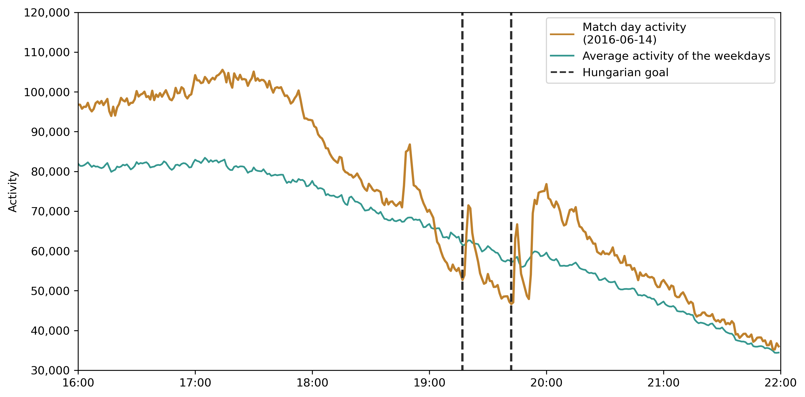
<figcaption><strong>Figure 5.1.:</strong> Mobile phone activity during, and after the Austria--Hungary Euro 2016 match, in comparison with the average of the previous and the following two days.</figcaption>
</figure>

### Iceland vs. Hungary {#sec:iceland_vs_hungary}

The match against Iceland was played on Saturday, June 18, 2016. Figure <a href="/docs/social_sensing#fig:isl_hun_timeseries">5.2</a> shows the mobile phone activity levels before, during and after the match. As the weekend activity is generally lower (see Figure <a href="/docs/data_sources#fig:vod201606_timeseries">3.5</a>), the average of the weekdays was used as a reference. The match began at 18:00, and from that point, the activity level was significantly below the average, except for the half-time break and the peak after the Hungarian goal. Interestingly, the Icelandic goal did not result in such a significant peak. Only a very moderate one can be seen in the time series.

Traag et al. [<a href="/docs/bibliography#traag2011social" title="V. A. Traag, A. Browet, F. Calabrese, and F. Morlot, “Social event detection in massive mobile phone data using probabilistic location inference,” in 2011 IEEE Third International Conference on Privacy, Security, Risk and Trust and 2011 IEEE Third International Conference on Social Computing, 2011, pp. 625–628.">20</a>] also found activity drop during a game, but in that case, the area of the stadium was analyzed, where the match was played, and there was no peak during the match.

<figure id="fig:isl_hun_timeseries">
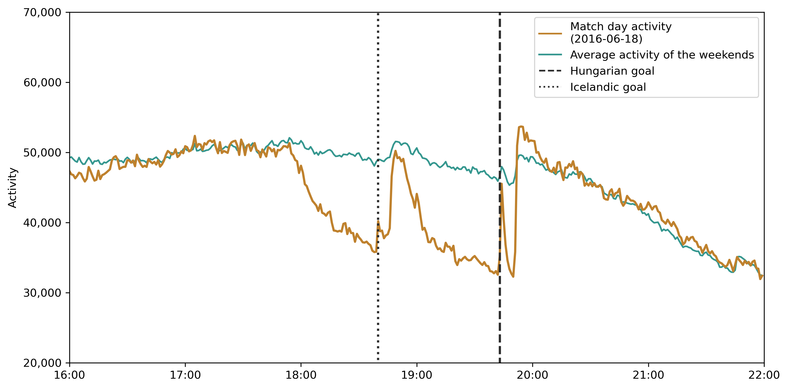
<figcaption><strong>Figure 5.2.:</strong> Mobile phone activity during and after the Iceland--Hungary Euro 2016 match, in comparison with the average activity of the weekends.</figcaption>
</figure>

### Hungary vs. Portugal {#sec:hungary_vs_portugal}

On Wednesday, June 22, 2016, in the third match of the group stage of the 2016 UEFA European Football Championship, Hungary played a draw with Portugal. Both teams scored three goals, and with this result, Hungary won their group and qualified for the knockout phase. During the match, the mobile phone activity dropped below the average, but the goals against Portugal resulted in significant peaks, especially the first one (see Figure <a href="/docs/social_sensing#fig:hun_prt_timeseries">5.3</a>). On the other hand, the Portuguese equalizer goal(s) did not cause a significant mark in the activity. In the second half, the teams scored four goals in a relatively short time period, but only the Hungarian goals resulted in peaks. This observation suggests that the football fans had a notable influence on the mobile network traffic.

After the match, the activity level was over the average, which might represent the spontaneous festival in downtown Budapest. According to the MTI (Hungarian news agency), thousands of people celebrated in the streets, starting from the fan zones, mainly from Erzsébet square (Figure <a href="/docs/social_sensing#fig:post_match_festival">5.5</a> a), Margaret Island (Figure <a href="/docs/social_sensing#fig:post_match_festival">5.5</a> b) and Erzsébet square (Figure <a href="/docs/social_sensing#fig:post_match_festival">5.5</a> c) direction Budapest Nyugati railway station. The celebrating crowd completely occupied the Grand Boulevard, and the public transportation was disrupted along the affected lines.

This social event is comparable to mass protests from a mobile phone network perspective. In Section <a href="/docs/social_sensing#sec:IstandwithCEU">In Social Media</a> I have analyzed the mobile phone activity at the route of a mass protest. The activity of the cells was significantly high when the protesters passed through the cell. In this case, however, the affected area was smaller, and the sites along the Grand Boulevard were very busy at the same time after the game.

<figure id="fig:hun_prt_timeseries">
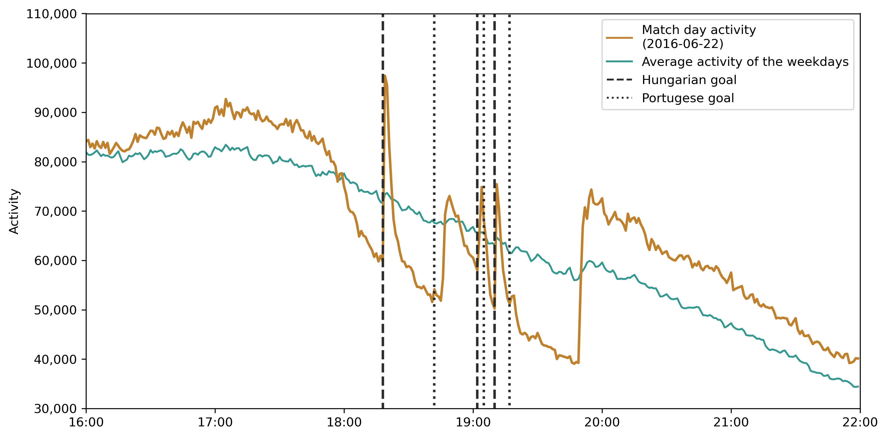
<figcaption><strong>Figure 5.3.:</strong> Mobile phone activity during and after the Hungary--Portugal Euro 2016 match, in comparison with the average of the previous and the following two days.</figcaption>
</figure>

The activities of the sites (multiple cells aggregated by the base stations) in Budapest downtown are illustrated in Figure <a href="/docs/social_sensing#fig:post_match_festival_timeseries">5.4</a>. The highlighted site covers mostly Szabadság square (for the location, see Figure <a href="/docs/social_sensing#fig:post_match_festival">5.5</a> a), where one of the main fan zones was set up with a big screen. The activity curve follows the trends of the whole data set (see Figure <a href="/docs/social_sensing#fig:hun_prt_timeseries">5.3</a>). There was high activity before the match, during half-time, and after the match for a short period. During the match, the activity decreased except for four not-so-significant peaks around the goals.

In the highlighted site, in Figure <a href="/docs/social_sensing#fig:post_match_festival_timeseries">5.4</a>, almost 7 thousand SIM cards had been detected between 17:00 and 20:00. The data shows that 53.57% of the subscribers were between 20 and 50 years old, while 33.49% had no age data.

After the match, there was a significant increase in the activity in some other sites. These sites were (mostly) around the Grand Boulevard, where the fans marched and celebrated the advancement of the national football team to the knockout phase.

Figure <a href="/docs/social_sensing#fig:post_match_festival">5.5</a> shows the spatial distribution of this social event using Voronoi polygons generated around the base stations locations. The polygons are colored by the mobile phone network activity increase at 20:15, compared to the weekday activity average. For the comparison, the standard scor[^2] was determined for every base station with a 5-minute temporal aggregation. The darker colors indicate the higher activity surplus in an area. The figure also denotes the three main fan zones in the area, the routes of the fans by arrows, and the affected streets by thicker lines.

<figure id="fig:post_match_festival_timeseries">

<figcaption><strong>Figure 5.4.:</strong> Cell activities, in Budapest downtown, on the day of the Hungary vs. Portugal football match (June 22, 2016). The highlighted cell covers mostly the Szabadság square, where one of the main fan zone was set up.</figcaption>
</figure>

<figure id="fig:post_match_festival">
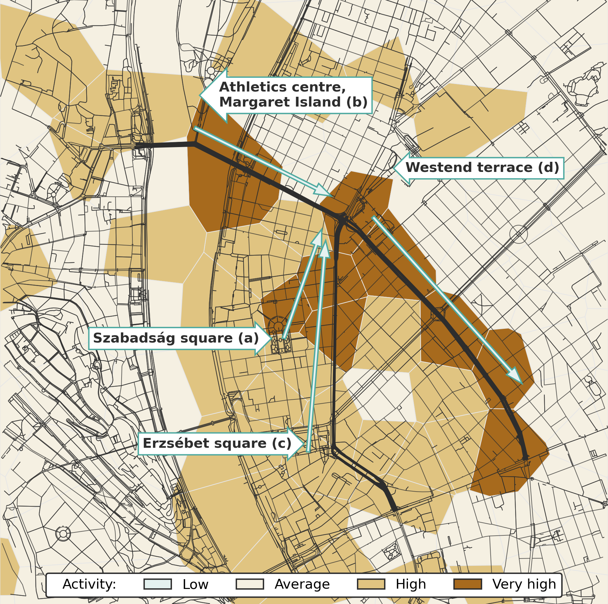
<figcaption><strong>Figure 5.5.:</strong> After the Hungary vs. Portugal football match, the fans, delirious with joy, filled the streets. The arrows show their route from the main fanzones to along with the Grand Boulevard. Voronoi polygons colored by the mobile phone network activity at 20:20.</figcaption>
</figure>

### Hungary vs. Belgium {#sec:hungary_vs_belgium}

On Sunday, June 26, 2016, Hungary played the fourth and last Euro 2016 match against Belgium. Figure <a href="/docs/social_sensing#fig:hun_bel_timeseries">5.6</a> shows the mobile phone network activity before, during, and after the match. During the match, the activity level was below the weekend average. The activity after the match was slightly higher than the average since the match ended late on Sunday when the activity average is usually low. This activity surplus may only indicate that the fans were leaving the fan zones and going home.

<figure id="fig:hun_bel_timeseries">
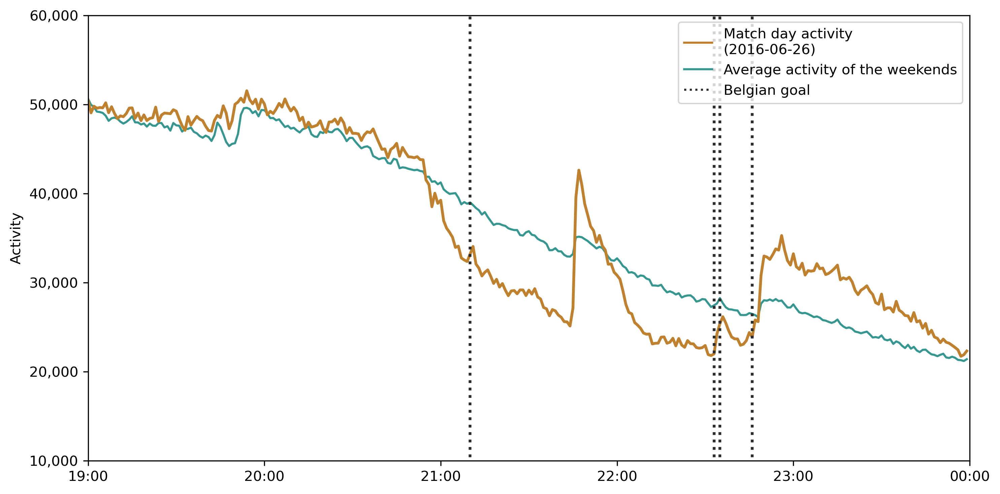
<figcaption><strong>Figure 5.6.:</strong> Mobile phone activity during and after the Hungary--Belgium Euro 2016 match, in comparison with the average of the previous and the following two days.</figcaption>
</figure>

### Homecoming {#sec:homecoming}

The Hungarian national football team returned to Budapest on June 27, 2016. A welcome event at the Heroes' Square has been held, where the football fans can greet the national football team. According to the M4 Sport television channel, approximately 20 thousand people attended the event [<a href="/docs/bibliography#hiradohu2016tizezrek" title="hirado.hu/MTI, “Tízezrek ünnepelték a magyar válogatottat a Hősök terén.” Available: https://hirado.hu/2016/06/27/hatalmas-fiesztara-keszul-este-budapest/">136</a>]. Between 18:00 and 19:30, there were 4246 unique, non-phone SIM cards active on the site that covers the Heroes' Square. 3425 are known to use smartphones based on the operating system column of the GSMArena data set.

The cells of this base station cover a larger area, so not all of these subscribers attended the event, but on the other hand, it is not compulsory to use mobile phones during this event. Supposing that the mobile phone operator preferences among the attendees corresponded to the nationwide trends in 2016, there could even be about 17 thousand people, as the data provider had 25.3% market share [<a href="/docs/bibliography#nmhh_mobile_market_report" title="National Media and Infocommunications Authority, Hungary, “A Nemzeti Média- és Hírközlési Hatóság mobilpiaci jelentése 2015. IV. – 2019. II. negyedév,” National Media and Infocommunications Authority, 23-25. Ostrom u., Budapest 1015, Hungary, Dec. 2019. Available: http://nmhh.hu/document/208458/NMHH_mobilpiaci_jelentes_2015Q42019Q2.pdf">109</a>].

Figure <a href="/docs/social_sensing#fig:heroes_square_welcoming">5.7b</a> shows a part of District 6 and the City Park with the Heroes' Square and the Voronoi polygons of the area are colored according to the Z-score values to indicate the mobile phone activity in the area at 18:35. The activity is considered low below $-1$, average between $-1$ and $1$, high between $1$ and $2.5$ and very high above $2.5$. Figure <a href="/docs/social_sensing#fig:heroes_square_welcoming_time_series">5.7a</a> shows the mobile phone network activity (upper) and the Z-score (bottom) of the site, covering Heroes' Square. It is clear that the activity is significantly higher than the weekday average during the event, and the Z-score values also follow that.

<figure id="fig:welcoming">

<figcaption><strong>(a)</strong> Activity and Z-score of the site, at Heroes' square.</figcaption>
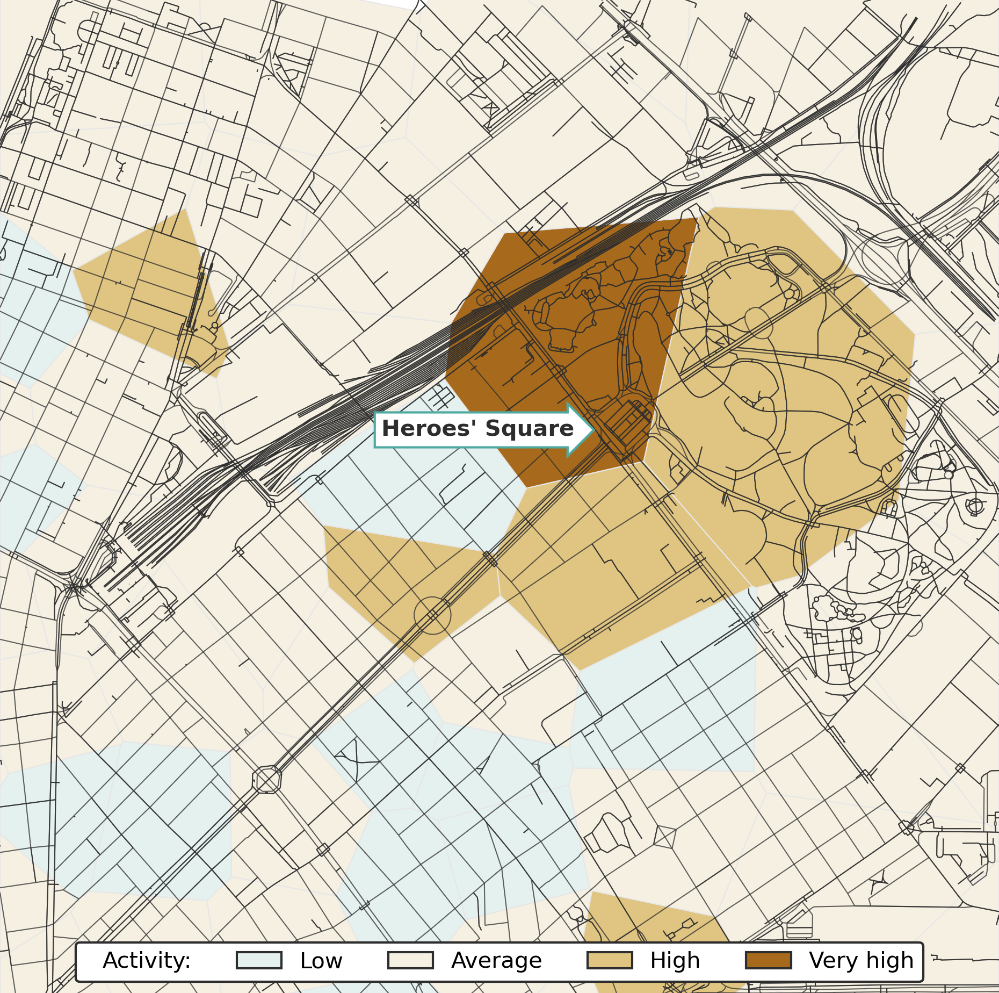
<figcaption><strong>(b)</strong> Spatial view of the activity at 18:35.</figcaption>
<figcaption><strong>Figure 5.7.:</strong> Mobile phone network activity at Heroes' Square and its neighborhood, during the welcoming event of the Hungarian national football team.</figcaption>
</figure>

## Those Who Stood with CEU {#sec:ceudemo}

The CDRs of this event have been utilized in the conference paper [<a href="/docs/bibliography#pinter2018analysis" title="G. H. Pintér, L. Nádai, and I. Felde, “Analysis of Mobility Patterns during a Large Social Event,” in 2018 IEEE 16th International Symposium on Intelligent Systems and Informatics (SISY), 2018, pp. 339–344. doi: 10.1109/SISY.2018.8524674.">137</a>] and its improved version [<a href="/docs/bibliography#pinter2019activity" title="G. H. Pintér, L. Nádai, G. Bognár, Z. Biczó, and I. Felde, “Activity Pattern Analysis of the Mobile Phone Network During a Large Social Event,” in 2019 IEEE-RIVF International Conference on Computing and Communication Technologies (RIVF), 2019, pp. 1–5. doi: 10.1109/RIVF.2019.8713741.">138</a>].

<figure id="fig:ceudemo_locations">

<figcaption><strong>Figure 5.8.:</strong> The main locations of the demonstration, that started at the Castle Garden and ended at the Parliament.</figcaption>
</figure>

On April 4, 2017, the Hungarian Parliament passed amendments to the Higher Education Law of Hungary that restricts the operation of international universities, such as CEU. Many people considered it a threat to academic freedom, so on April 9, 2017, people took to the streets to protest for the Central European University and against the modification of the Hungarian higher education law. This case study focuses on the movement of the people who participated in a demonstration against the modification of the Hungarian higher education law on April 9, 2017. It was reported [<a href="/docs/bibliography#guardian2017thousands" title="TheGuardian, “Thousands protest in Hungary over threat to Soros university.” Available: https://www.theguardian.com/world/2017/apr/09/thousands-protest-in-hungary-over-bill-threat-to-soros-university">139</a>] that tens of thousands of people attended the event, which started at the Castle Garden (Figure <a href="/docs/social_sensing#fig:ceudemo_locations">5.8</a>a) at 17:00. Then, the demonstrators headed north along the riverbank and went through the Széchenyi Chain Bridge (Figure <a href="/docs/social_sensing#fig:ceudemo_locations">5.8</a>b), past the campus of the Central European University (Figure <a href="/docs/social_sensing#fig:ceudemo_locations">5.8</a>c) to the Hungarian Parliament Building (Figure <a href="/docs/social_sensing#fig:ceudemo_locations">5.8</a>d). At 19:00, the demonstration officially ended in the Kossuth Lajos square (at the Hungarian Parliament Building), but it took a while for the crowd to disperse.

<figure id="fig:ceudemo_timeseries">

<figcaption><strong>Figure 5.9.:</strong> Cell activities in the path of the Central European University demonstration. Friedrich Born quay is located between the Elisabeth Bridge and the Chain Bridge. Kossuth Square is at the parliament.</figcaption>
</figure>

The cells covering the path of the demonstration are selected (see Figure <a href="/docs/framework#fig:area_relevant_cells">4.7b</a>), and the devices that were present in these cells at the time of the demonstration are considered participants. The query resulted in more than 10000 unique devices. Note that using the phone from some of these cells does not mean that the user is a protester. Also, it is not guaranteed that every protester used their phones during the demonstration. Supposing that the choice of cell phone operator among the demonstrators corresponds with the nationwide trends, then the total number of the demonstrators could be more than fourfold this number, as the operator has about 25.5% market share in 2017 Q2 [<a href="/docs/bibliography#nmhh_mobile_market_report" title="National Media and Infocommunications Authority, Hungary, “A Nemzeti Média- és Hírközlési Hatóság mobilpiaci jelentése 2015. IV. – 2019. II. negyedév,” National Media and Infocommunications Authority, 23-25. Ostrom u., Budapest 1015, Hungary, Dec. 2019. Available: http://nmhh.hu/document/208458/NMHH_mobilpiaci_jelentes_2015Q42019Q2.pdf">109</a>].

Figure <a href="/docs/social_sensing#fig:ceudemo_timeseries">5.9</a> shows the activity counts -- aggregated by 5 minutes -- of the cells that cover the path of the demonstration. Figure <a href="/docs/social_sensing#fig:ceudemo_spatial">5.10</a> displays the activity in the Voronoi zones during the demonstration. The activity along the Friedrich Born quay and at the Castle Garden was above average even before the official start of the demonstration. Then, the high activity areas highlight the path of the event. Note that the people only passed by the CEU building, so many people did not assemble there.

According to the reports [<a href="/docs/bibliography#dull2017ekkora" title="Dull, Szabolcs, “Ekkora tömeg régen vonult utcára Orbán ellen.” Apr. 10, 2017. Available: https://index.hu/belfold/2017/04/10/ekkora_tomeg_regen_vonult_utcara_orban_ellen/">140</a>], the first protesters were already at the parliament when the end of the march was still at Buda, and it took one and a half hours for everyone to arrive at the Kossuth Square. The mobile network data can confirm that.

<figure id="fig:ceudemo_spatial">
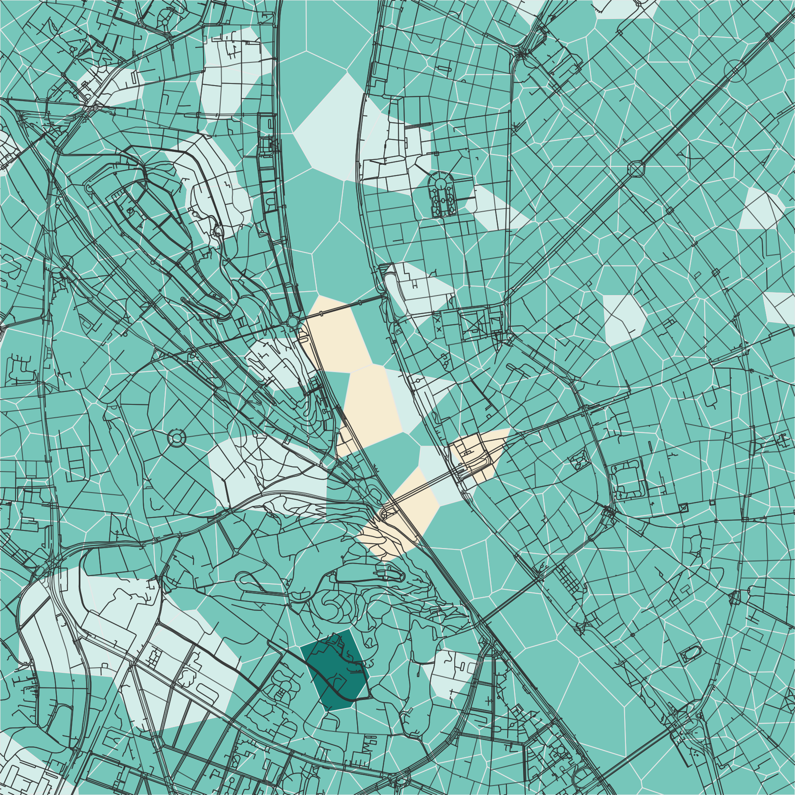
<figcaption><strong>(a)</strong> 16:50</figcaption>
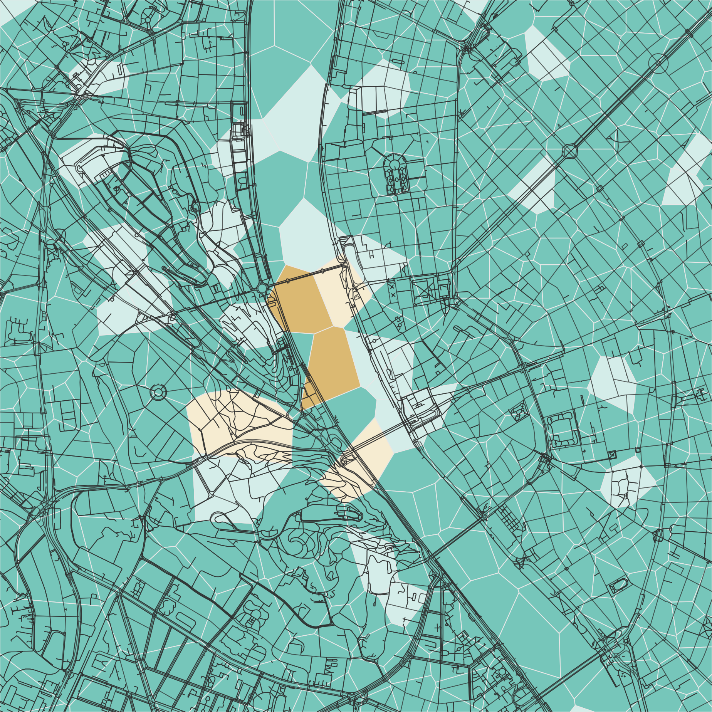
<figcaption><strong>(b)</strong> 17:00</figcaption>
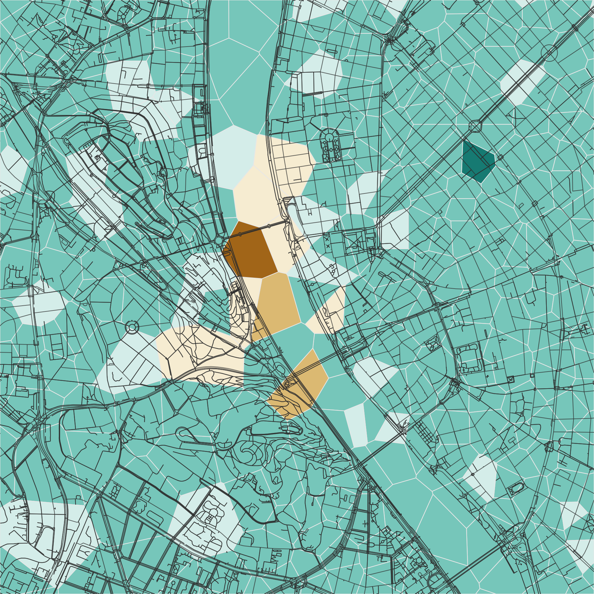
<figcaption><strong>(c)</strong> 17:20</figcaption>

<figcaption><strong>(d)</strong> 17:40</figcaption>
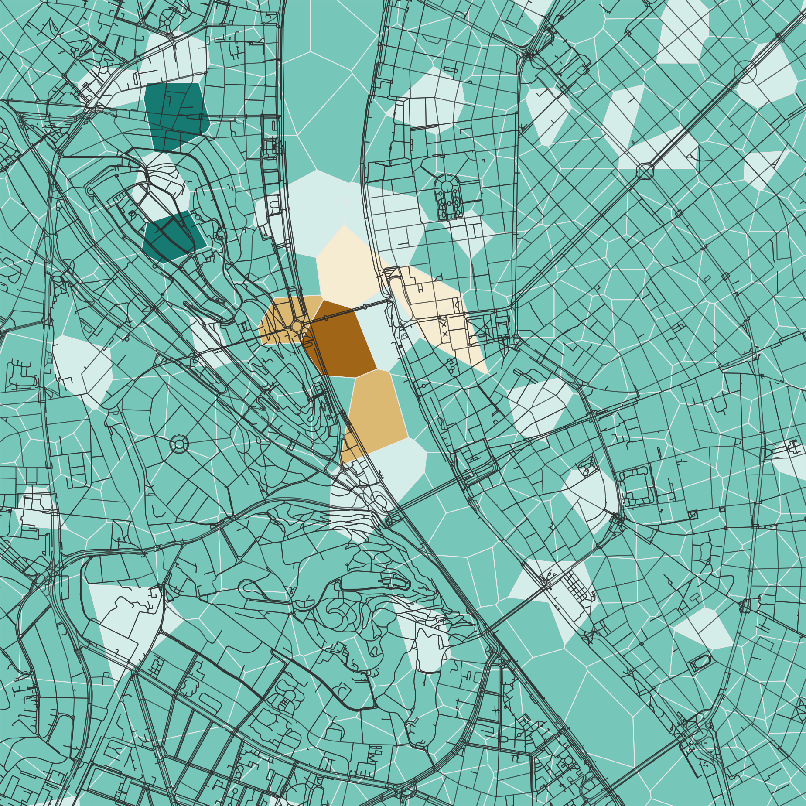
<figcaption><strong>(e)</strong> 18:00</figcaption>

<figcaption><strong>(f)</strong> 18:20</figcaption>
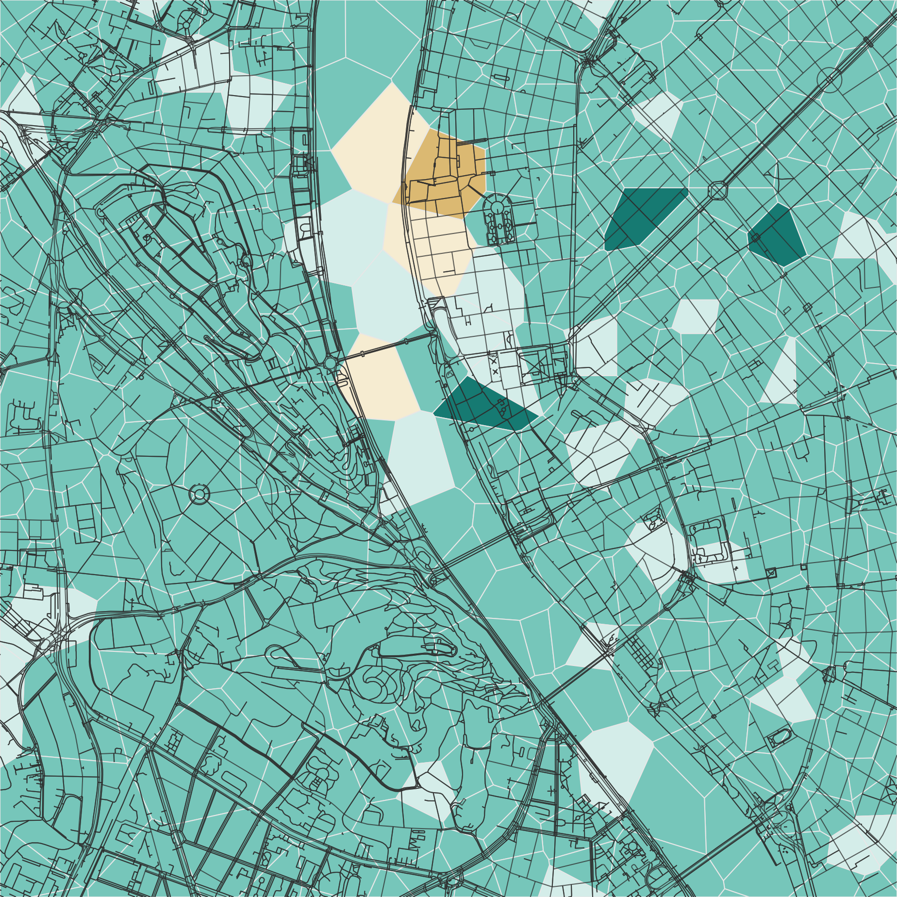
<figcaption><strong>(g)</strong> 18:40</figcaption>

<figcaption><strong>(h)</strong> 19:00</figcaption>

<figcaption><strong>(i)</strong> 19:30</figcaption>
<figcaption><strong>Figure 5.10.:</strong> Mobile network activity, during the mass protest.</figcaption>
</figure>

### In Social Media {#sec:IstandwithCEU}

The motto "I stand with CEU" was used, also in social media to express solidarity and support with the CEU. Figure <a href="/docs/social_sensing#fig:tweet_distribution">5.11</a> displays the distribution of the tweets, with the hashtag "#IstandwithCEU", using different colors for genuine tweets and retweets. There was a notable peak during the protest, while the retweets showed some delay. On the other hand, the retweets still circulated the following day, while not too many new tweets were posted.

<figure id="fig:tweet_distribution">
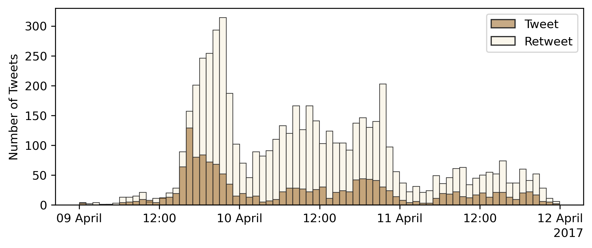
<figcaption><strong>Figure 5.11.:</strong> The distribution of tweets with the hashtag “IstandwithCEU”, on the day of the protest and the following two days.</figcaption>
</figure>

[^1]: According to the Hungarian Central Statistical Office (KSH), the population of Hungary was about 9.83 million in 2016 [<a href="/docs/bibliography#ksh22.1.1.1" title="Központi Statisztikai Hivatal, “22.1.1.1. A népesség, népmozgalom főbb mutatói.” Available: https://www.ksh.hu/stadat_files/nep/hu/nep0001.html">141</a>].

[^2]: The standard score (or z-score) is defined as ${z = \frac{x-\mu}{\sigma}}$, where $\mu$ is the mean and $\sigma$ is the standard deviation.
