In this chapter, the relations between mobility indicators and measures of socioeconomic status are explored. I have used two different approaches to characterize socioeconomic status: a more direct and a more indirect one. The latter is the housing price. As I demonstrated in Chapter <a href="/docs/commuting">Commuting</a>, the home location estimation is reliable. When the home location of a subscriber is known, the typical housing price of that area can be associated with the subscriber, considering that if someone lives in a more expensive area, their socioeconomic status is higher.

The other approach uses the price and the age of the cellphone that a subscriber was using. As it is described in Section <a href="/docs/data_sources#sec:device_types">Device Types</a>, the device in which the SIM card operates is known, so the price and the release date of the cellphone are also available.

## Housing Prices {#sec:ses_housing_prices}

Applying housing prices as a socioeconomic indicator has precedent in the literature (Section <a href="/docs/literature_review#sec:ses_literature">Socioeconomic Status</a>). My contribution, in this regard, is to consider the housing prices at both the home and the work locations. The data source was the *ingatlan.com* estate selling portal (Section <a href="/docs/data_sources#sec:estate_price">Estate Price Data</a>).

Based on my mobile network data processing, Amir Mosavi presented a hybrid machine learning approach to model real estate prices based on the subscribers' mobility metrics [<a href="/docs/bibliography#pinter2020artificial" title="G. H. Pintér, A. Mosavi, and I. Felde, “Artificial intelligence for modeling real estate price using call detail records and hybrid machine learning approach,” Entropy, vol. 22, no. 12, p. 1421, 2020, doi: 10.3390/e22121421.">148</a>].

Figure <a href="/docs/data_sources#fig:cell_price_map">3.14</a> shows the spatial distribution of the estate price, which clearly illustrates that the Buda side of Budapest is much more expensive. Figure <a href="/docs/ses#fig:stacked_price">8.1a</a> displays the normalized housing prices by the real estate advertisements, distinguished by the Buda and Pest side of the city, while Figure <a href="/docs/ses#fig:dweller_price_hist">8.1b</a> shows the average housing price distribution per cell. The cells with a very light color in the middle of the city are Margaret Island, a recreational area with large parks, sport establishments, and hotels without any residential zone. So, there was no estate for sale in the data.

<figure id="fig:norm_price_hist">
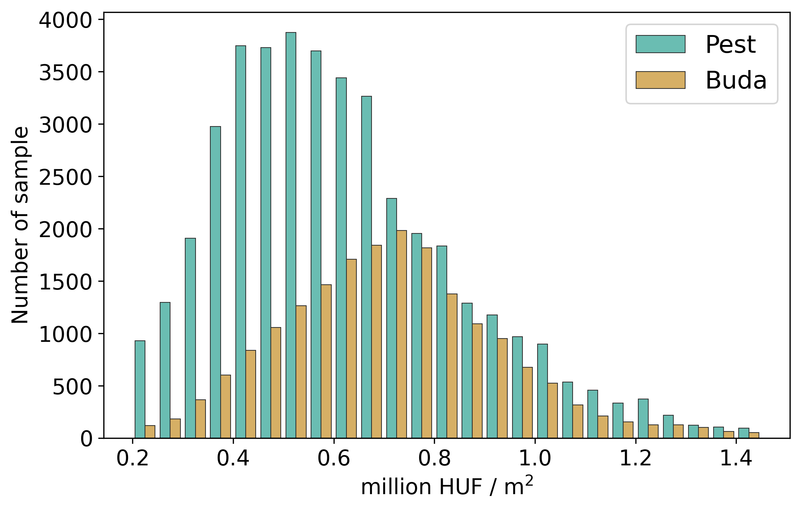
<figcaption><strong>(a)</strong> Distribution of the estate price samples by Buda and Pest</figcaption>
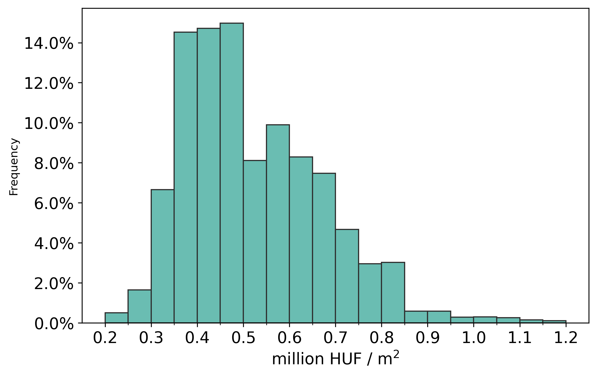
<figcaption><strong>(b)</strong> Normalized price distribution of the home locations (cells)</figcaption>
<figcaption><strong>Figure 8.1.:</strong> Distributions of the estate price: (a) shows the distribution of the estate price samples distinguished by the Buda and Pest of the city, and (b) shows the distribution of the home location prices of the individuals.</figcaption>
</figure>

I also analyzed the correlation between property prices at home and work areas. It was found that the economic status of the home and work locations for each mobile phone user has a directly proportional relationship (Figure <a href="/docs/ses#fig:work_price">8.2d</a>). Higher mean values of housing prices, where the people spend their working hours, belong to the higher home price classes. Notably, the mean value of property prices in work locations is higher than the home classes for residents whose housing price is between 0.2--0.6 and 0.9--1.1 million HUF. The total range (max--min) and the Q1--Q3 range of the property prices at workplaces is inversely proportional with home housing prices, in the 0.2--0.6 and directly proportional in the 0.7--1.1 million HUF range. This observation suggests that a few workplaces are in the cheaper areas of Budapest, and therefore, most of the dwellers spend their working hours in the more expensive regions. The smallest scatter of the property values at workplaces is given for the residents living in the 0.6 million HUF price regions. Nevertheless, the results in Figure <a href="/docs/ses#fig:work_price">8.2d</a> suggest that job and home locations have a notable relationship.

## Principal Component Analysis {#sec:pca}

The individuals were classified into ten categories, in the price range of 0.2 to 1.2 million HUF / m^2^, based on the mean estate price of their home location (cell). Then the mean value of the indicators was determined within the classes. Figure <a href="/docs/ses#fig:pricecat">8.2</a>, shows the Radius of Gyration, the Entropy, and the Home-Work distance of the financial classes, where only the Home-Work distance (Figure <a href="/docs/ses#fig:whd_pricecat">8.2c</a>) shows a slight tendency between classes.

<figure id="fig:pricecat">
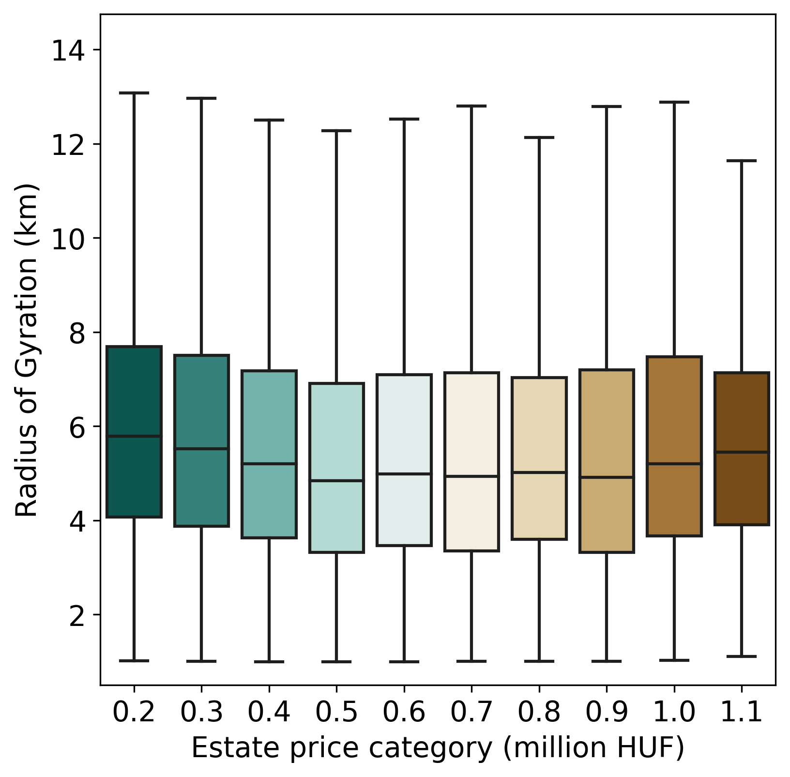
<figcaption><strong>(a)</strong> Radius of Gyration</figcaption>
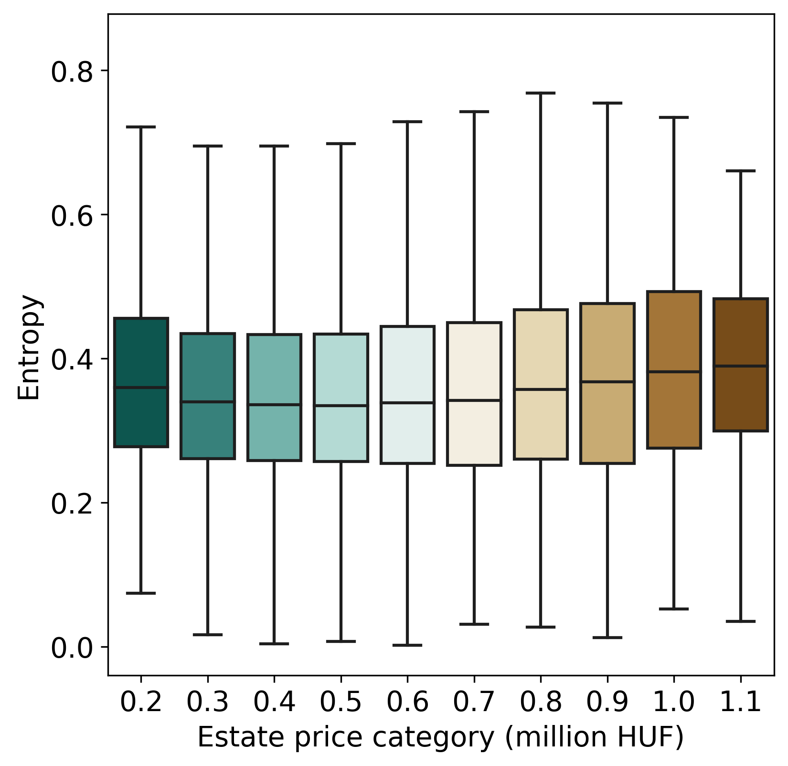
<figcaption><strong>(b)</strong> Entropy</figcaption>

<figcaption><strong>(c)</strong> Home-Work distance</figcaption>

<figcaption><strong>(d)</strong> Estate prices of the work locations in contrast to the workers' home location estate prices</figcaption>
<figcaption><strong>Figure 8.2.:</strong> Indicators by financial category.</figcaption>
</figure>

The Radius of Gyration defines a circle in which an individual lives their life, and the Entropy measures the diversity of an individual's visited locations. However, both of them are highly affected by the data quality. The data used for this work contains only those visited locations where billed activity (phone calls, short messages, or data transfer) happened. Everything beyond that is invisible. Even with only the active communication, the mobility customs of an individual can be described, but this seems to be insufficient to distinguish using financial status criteria.

Figure <a href="/docs/ses#fig:work_price">8.2d</a> shows the typical Estate Prices of the work locations in contrast to Estate Prices of the home locations using a box plot without the outliers. For every home location estate price category, the box plot (Figure <a href="/docs/ses#fig:work_price">8.2d</a>) splits the SIM cards into three groups: (i) those between the first and the third quartile (Q1--Q3), (ii) those below the first quartile (between the minimum and the Q1: min--Q1), and (iii) those above the third quartile (between Q3 and the maximum, Q3--max). The idea was to treat the SIM cards within the interquartile range (IQR) separately from those below and above the IQR.

The SIM cards were aggregated by the home and workplace estate price categories (0.2--1.2 million HUF) and the twenty Radius of Gyration and Entropy categories (using 0.5 km distance ranges between 0.5 and 20 km for the Radius of Gyration and Entropy values with 0.05 steps between 0.05 and 1.00). The data structure used for the Principal Component Analysis is defined as follows. Every row consists of 40 columns representing 40 gyration radius bins between 0.5 and 20 km and 20 columns representing 20 Entropy bins between 0.05 and 1.00. The bins contain the number of SIM cards that have been normalized by metrics to compare them. Although the workdays and the holidays were treated separately during the whole study, the data were not explicitly labeled by them. The same table was constructed using holiday metrics, and its rows were appended after the workday ones. The home and workplace estate price columns were not provided to the PCA algorithm.

### Evaluation {#sec:pca_evaluation}

The relationship between the mobility metrics (during weekdays and weekends) and the Social Economic Status (SES) was investigated using the result of Principal Component Analysis (PCA). By applying the PCA, the 60-dimension vector was reduced to two dimensions, and those variables were plotted to be analyzed. The results of this section were published in [<a href="/docs/bibliography#pinter2021evaluating" title="G. Pintér and I. Felde, “Evaluating the Effect of the Financial Status to the Mobility Customs,” ISPRS International Journal of Geo-Information, vol. 10, no. 5, p. 328, 2021, doi: 10.3390/ijgi10050328.">149</a>].

Figure <a href="/docs/ses#fig:pca_var">8.3</a>, shows the Pareto Histogram for the 60 components. The first two components (about 50% of the explained variance) are sufficient to represent the variance of the variables. Figure <a href="/docs/ses#fig:pca">8.4</a> shows the first two components of an unsupervised PCA analysis applied. The marker styles, colors, and sizes each represent one label of the data. First, the brownish colors represent the workdays, the greenish ones the holidays, and they clearly form two separate clusters, though the workday and the weekend rows were not distinguished. This means that the first principal components are expressive enough to distinguish between workday and holiday mobility habits.

Marker size represents the estate price at the home location. There is a noteworthy tendency along the PC2 axis that the markers increase. Although the trend-line is more like a curve bending to the right, the results seem to distinguish the wealthier subscribers. The low-cost region's mobility can be found at the bottom part of the chart, and the higher the property prices, the higher the vertical positions of the mobility metrics. The second principal component seems to be a proper variable for representing the influence of housing prices on gyration and entropy. It has to be noted that the smallest markers look out of place. Those represent extremely inexpensive areas that are not residential but more like industrial zones, and only a minority of the subscribers are classified into those categories. The mobility habits of dwellers living in the wealthiest regions are visibly separated from the others, especially on the working and rest days.

The mentioned quartile groups are represented with different markers and hues. The symbols representing the mobility metrics of the min--Q1 group are to the left, and the markers representing the mobility metrics of the Q3-max group are to the right of the Q1--Q3 group in most of the house pricing groups. This means that the first principal component looks to be a determinative parameter to distinguish the workday and weekend mobility patterns and the quartile range of the housing price categories at the home location.

The range of PC1 between 0.0 and 2.5 includes markers of the first quartile for the most part, while a mixture of representatives belonging to Q1--Q3 and Q3--max groups located in the 2.5 -- 10.0 range. The weekday mobility customs of people belonging to the min-Q1 group significantly differ from the other inhabitants' groups. This suggests that even though these residents are living in a similarly valuable neighborhood to the ones of the groups Q1--Q3, they are managing their lives differently. Notably, the deviation is smaller in the lowest and highest housing price categories while bigger in the middle-level property price range. It seems that people having homes in the middle price level area in the city have more diverse habits than those living in the poorer or wealthier districts.

The mobility characteristics related to the dwellers associated with the Q1--Q3 and Q3--max groups are quite similar. In the range of PC1 between 2.5 and 5.0, several markers from different groups and different housing price categories overlap each other. The markers on the chart (i.e., in the range of PC2 between 0.0 and -0.2) probably show that residents living in the cheapest and the middle price level categories have very similar traveling patterns independently if they belong to the Q1--Q3 and Q3--max groups. It is also remarkable that during the weekdays and the weekends, the mobility customs of the wealthiest districts' population are completely separated from others. This observation suggests that the daily traveling routines of the residents having homes in the most expensive area of Budapest are significantly different from the others.

<figure id="fig:pca_var">
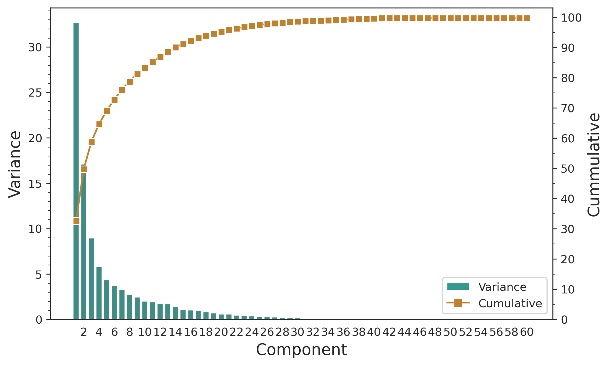
<figcaption><strong>Figure 8.3.:</strong> The Pareto histogram for the 60 components of the Principal Component Analysis.</figcaption>
</figure>

<figure id="fig:pca">

<figcaption><strong>Figure 8.4.:</strong> Scatter plot of the 2-component Principal Component Analysis. Marker sizes indicates the home price category, the color/type work price category and also the day type (Weekday/Weekend).</figcaption>
</figure>

Figure <a href="/docs/ses#fig:gyr_pricecat">8.2a</a> represents the relationship between the radius of gyration and the normalized housing prices. I ranked the subscribers into ten groups (q = 10). I found that subscribers living in the middle price range (0.5--0.7 million HUF) areas have smaller Radius of Gyration on average than the cheaper (poorer) regions. Dwellers in poorer zones travel around 5 km on average, while the Radius of Gyration in the inhabitants from the middle class and more expensive regions is lower. These findings can be explained by the fact that mean of people living in middle price houses (Figure <a href="/docs/ses#fig:gyr_pricecat">8.2a</a>) have a better chance to have different job and recreation opportunities, and therefore they do not need to travel long distances. The average and the interquartile range of subscribers living in the most expensive area (\>1.0 million HUF) is larger than in the less costly area. This also follows that fewer people have homes in more wealthy regions, and therefore, the mean and the scatter of Gyration Radius are higher.

Figure <a href="/docs/ses#fig:ent_pricecat">8.2b</a> illustrates the relationships between SES and activity entropy, which indicator of mobility is dedicated to describing the regularity of subscribers' daily travel and activity patterns. The results show a low variability across SES for activity entropy. The mean values of each house pricing class remained in the range of 3.5--4.5. One potential reason is that for most people, their daily activities mainly concentrate in a few locations (e.g., home and work locations). However, a slightly increasing tendency can be observed, which suggests that the occupants living in more expensive sectors were visiting more places. The regularity of activities at the wealthier locations has a slight impact on the activity diversity of the subscribers. This finding differs from the results of [<a href="/docs/bibliography#xu2018human" title="Y. Xu, A. Belyi, I. Bojic, and C. Ratti, “Human mobility and socioeconomic status: Analysis of Singapore and Boston,” Computers, Environment and Urban Systems, vol. 72, pp. 51–67, 2018.">10</a>]. Xu et al. showed that the wealth level of people, at least in Singapore and Boston, is not a limiting factor that affects how they travel around in the city. It seems that the residents living in more expensive areas in Budapest --- are more likely or forced to --- visit more places than the ones having homes in the less expensive regions.

We examined the relationship between the work-home distances and SES. Figure <a href="/docs/ses#fig:whd_pricecat">8.2c</a> illustrates the mileage between the home and job locations as a function of home location prices. The descending trend mean values of distance related to home prices from the lower to the higher property prices suggest that SES has a significant role on how much the dwellers have to travel to their workplaces. The cheapest homes are the farthest from the job location (the mean is 8.4 km and the maximum is 27.5 km), while the shortest daily work trips belong to the homes located in the 0.9 million HUF category (the mean is 5.2 km and the maximum is 21.8 km). In other words, the people living in the poorer area have to travel more to their work locations. More time spent on daily commuting by the people living in cheaper places might affect their opportunities to visit more attractions in the city. This capability may also explain the relationship between activity entropy and SES (Figure <a href="/docs/ses#fig:ent_pricecat">8.2b</a>).

## Cellphone Price and Age {#sec:phone_price_and_age}

Note that the results of this section are based on the "June 2016" dataset (Section <a href="/docs/data_sources#sec:vod201606">Vodafone June 2016</a>). The contents of this section were published in [<a href="/docs/bibliography#pinter2021analyzing" title="G. H. Pintér and I. Felde, “Analyzing the Behavior and Financial Status of Soccer Fans from a Mobile Phone Network Perspective: Euro 2016, a Case Study,” Information, vol. 12, no. 11, p. 468, 2021, doi: 10.3390/info12110468.">150</a>].

Earlier in this chapter, the real estate price of the subscribers' home locations were used to describe their socioeconomic status. In this section, the CDRs were enriched by phone prices, and the phone price is assumed to apply as a socioeconomic indicator. To demonstrate the applicability of the mobile phone price as a socioeconomic indicator, it was examined in respect of the mobility indicators, applying Principal Component Analysis (PCA), as described before.

The SIM cards were aggregated by the subscriber age categories (5-year steps between 20 and 80) and the phone price categories (100 EUR steps to 700 EUR), the Radius of Gyration, and Entropy categories. For the Radius of Gyration, 0.5 km distance ranges were used between 0.5 and 20 km, and the Entropy values were divided into twelve bins between 0.05 and 1.00. The data structure used for the Principal Component Analysis is defined as follows.

A table has been generated where every row consists of 40 columns representing 40 gyration radius bins between 0.5 and 20 km and 20 columns representing 20 Entropy bins between 0.05 and 1.00. The subscribers belonging to each bin are counted, and the cardinality has been normalized by metrics to be able to compare them. The categories were not explicitly labeled by them, so the subscriber age and the phone price descriptor columns were not provided to the PCA algorithm. The same table was constructed using weekend/holiday metrics, and its rows were appended after the weekday ones.

When the PCA was applied, the 60-dimension vector was reduced to two dimensions based on the mobility customs, where the bins were weighted by the number of subscribers. The cumulative variance of the two best components is about 61% (see Figure <a href="/docs/ses#fig:age_pp_pca_var">8.5b</a>). The bins representing the two new dimensions (PC1 and PC2) were plotted (see Figure <a href="/docs/ses#fig:age_pp_pca">8.6</a>), where the markers were colored by the phone price, and marker sizes indicate the subscriber age category, using larger markers for younger subscribers.

As Figure <a href="/docs/ses#fig:age_pp_pca">8.6</a> shows, the markers are clustered by color --- in other words, the phone price --- that is proportional to PC1 but inversely proportional to PC2. Within each phone price group, the younger subscribers (larger markers) are closer to the origin, indicating that the mobility custom of the younger subscribers differs from the elders, although this difference is smaller within the higher price categories. This finding coincides with [<a href="/docs/bibliography#fernando2018predicting" title="L. Fernando, A. Surendra, S. Lokanathan, and T. Gomez, “Predicting population-level socio-economic characteristics using Call Detail Records (CDRs) in Sri Lanka,” in Proceedings of the Fourth International Workshop on Data Science for Macro-Modeling with Financial and Economic Datasets, 2018, pp. 1–12.">151</a>], where Fernando et al. found a correlation between subscribers' age and mobility metrics.

To give context to Figure <a href="/docs/ses#fig:age_pp_pca">8.6</a>, Figure <a href="/docs/ses#fig:pp_hist">8.5a</a>, shows the phone price distribution: most of the phones are within the 50--200 EUR range. Note that there are only a few phones over 550 EUR, but the owners of those have significantly different mobility patterns.

Figure <a href="/docs/ses#fig:age_pp_pca">8.6</a> does not only show that the phone price forms clusters but also reveals the effect of the subscription type on the mobility. Within the phone price categories, except for the highest with only a very few subscribers, the postpaid groups are usually closer to the origin. Prepaid subscriptions are usually for those, who do not use their mobile phone extensively, and it seems that people with a prepaid subscription have similar mobility customs as people with less expensive phones but postpaid subscription. That is most notable at (-6, 2) and (-5, -1).

<figure id="fig:pp_dist_and_pca">
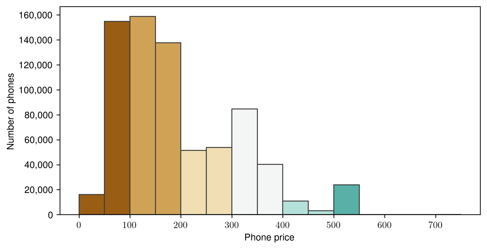
<figcaption><strong>(a)</strong> Phone price distribution.</figcaption>
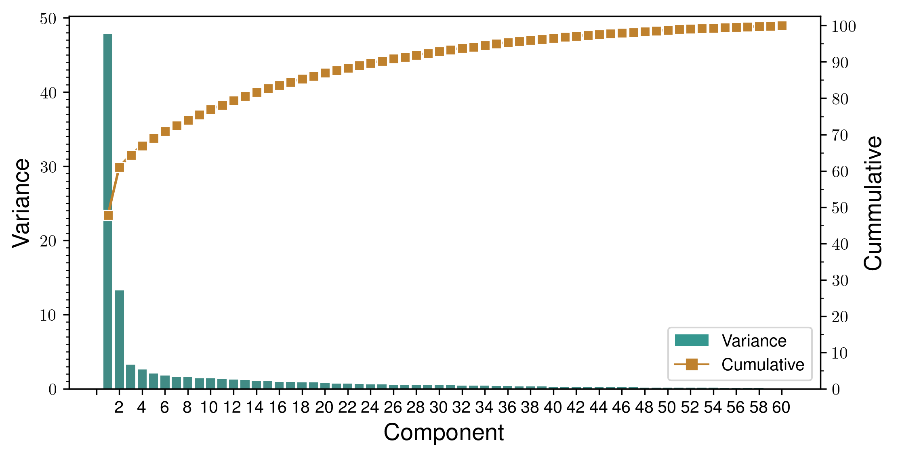
<figcaption><strong>(b)</strong> The Pareto histogram for the Principal Component Analysis.</figcaption>
<figcaption><strong>Figure 8.5.:</strong> Phone price distribution and the Pareto histogram for the 60 components of the Principal Component Analysis.</figcaption>
</figure>

<figure id="fig:age_pp_pca">

<figcaption><strong>Figure 8.6.:</strong> Scatter plot of the 2-component Principal Component Analysis. Marker sizes indicate subscriber age category, the color represents the phone price category and the subscription type (Prepaid/Postpaid) is distinguished by the marker type.</figcaption>
</figure>

Sultan et al. identified areas in Jhelum, Pakistan, where more expensive phones appear more often [<a href="/docs/bibliography#sultan2015mobile" title="S. F. Sultan, H. Humayun, U. Nadeem, Z. K. Bhatti, and S. Khan, “Mobile phone price as a proxy for socio-economic indicators,” in Proceedings of the Seventh International Conference on Information and Communication Technologies and Development, 2015, pp. 1–4.">12</a>]. Using the same method, Budapest and its agglomeration were evaluated: the average phone prices from the activity records are determined for every site. The ground truth is that the real estate prices are higher on the Buda side (West of river Danube) of Budapest and downtown, and this tendency can be clearly seen in Figure <a href="/docs/ses#fig:avg_phone_price_map">8.7</a>. The airport area has a significantly higher average than its surroundings, which is not surprising. The spatial tendencies of the mobile phone price, along with the result of the PCA (Figure <a href="/docs/ses#fig:age_pp_pca">8.6</a>), clearly demonstrates the expressiveness of the phone price as a socioeconomic indicator.

<figure id="fig:avg_phone_price_map">

<figcaption><strong>Figure 8.7.:</strong> Average price (in EUR) of the mobile phones, that generated the activity records in each site, during the whole observation period (June 2016).</figcaption>
</figure>

### Socioeconomic Status of the Football Fans {#socioeconomic-status-of-the-football-fans .unnumbered}

During Hungary vs. Portugal match, there were three Hungarian goals (Figure <a href="/docs/social_sensing#fig:hun_prt_timeseries">5.3</a>), so there were three peaks, starting at 18:18, 19:02, and 19:18. All of them had about 5-minute fall times. Who was responsible for these peaks? To answer this question, the SIM cards that were active during any two of the peaks were selected. Selecting SIM cards that were active during any of the peaks would also include many subscribers that cannot be considered football fans. The participation of all the three peaks, on the other hand, would be too restrictive.

Figure <a href="/docs/ses#fig:hun_prt_activity_of_fans">8.8a</a>, presents the activity of the selected 44646 SIM cards and the owner of these cards, which may belong to the football fans. Removing these SIM cards from the data set should result in an activity curve without peaks and at the same time similar, in tendency, to the average activity. However, as Figure <a href="/docs/ses#fig:hun_prt_activity_without_fans">8.8b</a> shows, the activity still drops during the match. Therefore, the 'football fan' category should be divided into 'active' and 'passive' fans from the mobile phone network perspective. Active fans are assumed to express their joy using the mobile phone network (presumably to access social media) and cause the peaks. It seems that the passive fans ceased the other activities and watched the game, which caused some lack of activity compared to the average. By removing the active fans from the observed set of SIM cards, the activity level decreased in general (Figure <a href="/docs/ses#fig:hun_prt_activity_without_fans">8.8b</a>). However, this is not surprising, as these people reacted to the goals, they probably often use the mobile phone network. There are also some negative peaks, indicating that the selection is not perfect.

Is there any difference between the active fans regarding the phone age and price compared to the other subscribers? Figure <a href="/docs/ses#fig:phone_age_of_subscribers">8.9a</a> shows the relative age of the phones in respect of the subscribers' behavior after the goals. No significant difference has been realized between the active fans and other subscribers, the median of the relative phone age is about two years, and there are some much older (nearly ten years old) phones in use. It should be noted that older devices are used by elderly people. The phone prices show an opposite tendency: the younger subscribers own more expensive phones (Figure <a href="/docs/ses#fig:phone_price_of_subscribers">8.9b</a>).

Naturally, not all of these 169089 SIM cards (without the ones operating non-phone devices) generated activity after all the goals. 83352 devices were active after the first goal, 70603 after the second and 68882 after the third. After at least two goals 44646, and after all the three goals, only 9102 devices had activity within 5 minutes.

<figure id="fig:hun_prt_activity_fan_activity">

<figcaption><strong>(a)</strong> Activity of fans.</figcaption>
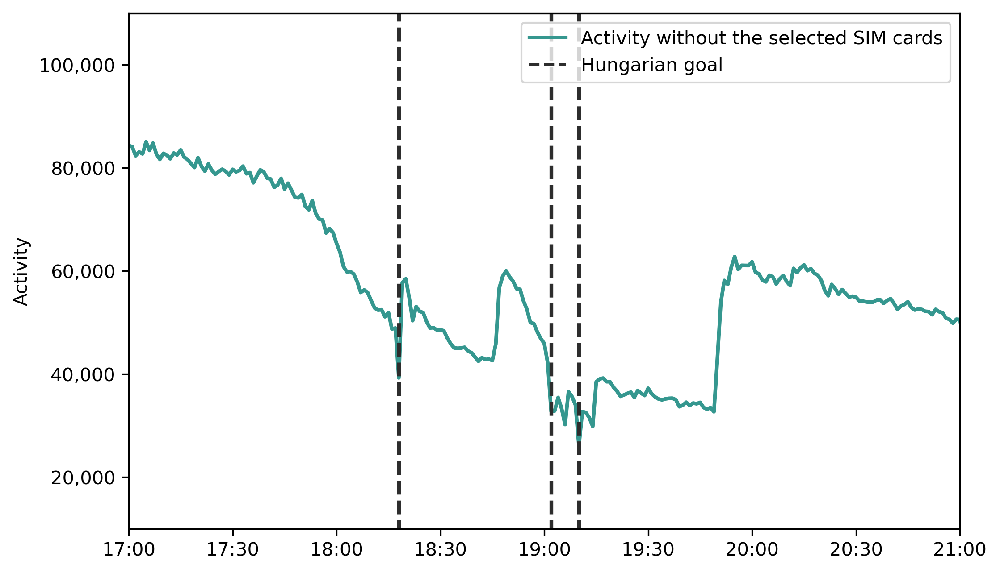
<figcaption><strong>(b)</strong> Activity without the fans.</figcaption>
<figcaption><strong>Figure 8.8.:</strong> Mobile phone network activity of the Subscriber Identity Module cards (fans), that had activity right after any two of the Hungarian goals, and the mobile phone activity of the other Subscriber Identity Module cards.</figcaption>
</figure>

Why would they use the mobile phone network to access social media? If they were at home, they would have used the wired connection via Wi-Fi for mobile devices. In Hungary, the 79.2% of the households had wired internet connection, according to the KSH[<a href="/docs/bibliography#ksh12.8.1.9" title="Központi Statisztikai Hivatal, “12.8.1.9. A háztartások internetkapcsolat típusainak aránya.” Available: https://www.ksh.hu/stadat_files/ikt/hu/ikt0047.html">152</a>], and it could be even higher in Budapest. However, if they were at fan zones, for example, in Szabadság Square, using the mobile network is more obvious.

<figure id="fig:phone_age_and_price_of_subscribers">
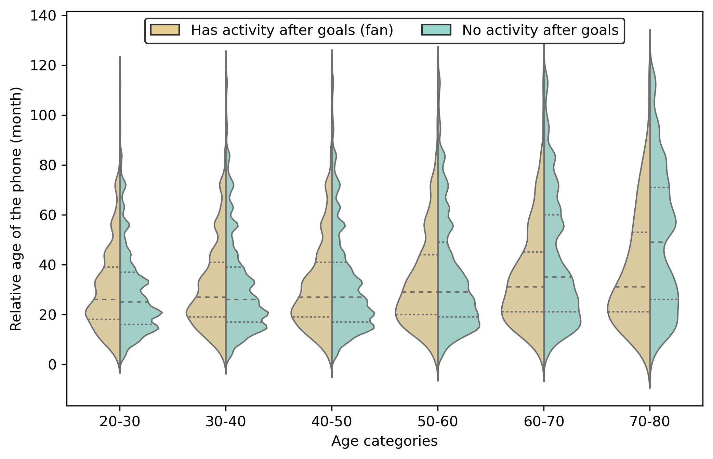
<figcaption><strong>(a)</strong> Relative age of the phones.</figcaption>

<figcaption><strong>(b)</strong> Price of the Phones.</figcaption>
<figcaption><strong>Figure 8.9.:</strong> Mobile phone relative age and the price distributions in different age categories, comparing the fans, who had activity right after any two of the Hungarian goals, and the rest of the Subscriber Identity Module cards.</figcaption>
</figure>

As Figure <a href="/docs/ses#fig:phone_age_and_price_of_subscribers">8.9</a> shows, there is no significant difference in the phone age between the active football fans and the rest of the subscribers. The medians are almost the same within the young adult and the middle-age categories, but elders tend to use older devices, especially those who did not react to the goals. The active football fans' median phone price is 180 EUR, in contrast to the 160 EUR median of the rest of the subscribers. However, older subscribers tend to use less expensive phones. This tendency is also present within the football fans but stronger within the other group.

Figure <a href="/docs/ses#fig:gyration_and_entropy_of_subscribers">8.10</a> illustrates the mobility metrics in different age categories, also comparing the football fans and the rest of the subscribers. The Radius of Gyration median is almost the same in all the age categories and groups. The Entropy medians have a notable difference between the two groups but do not really change between the age categories. This means that the mobility customs of the football fans, who use the mobile phone network more actively, are similar, regardless of the subscribers' age.

<figure id="fig:gyration_and_entropy_of_subscribers">
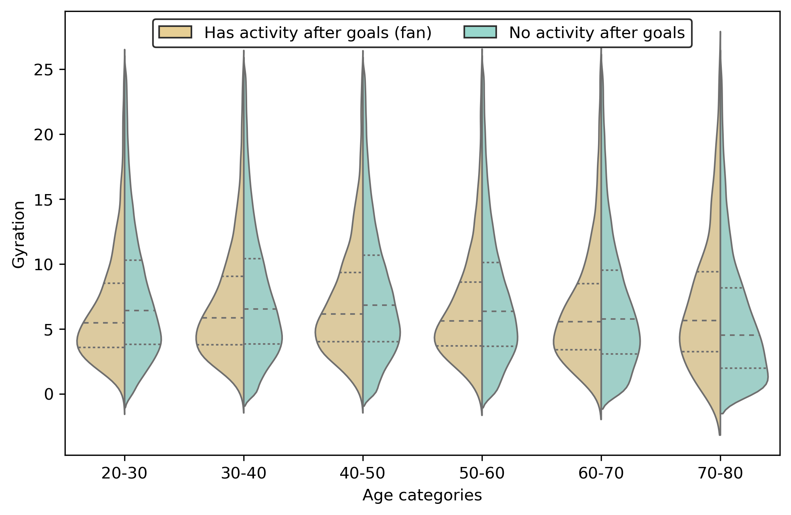
<figcaption><strong>(a)</strong> Radius of Gyration of the subscribers.</figcaption>

<figcaption><strong>(b)</strong> Entropy of the subscribers.</figcaption>
<figcaption><strong>Figure 8.10.:</strong> Radius of Gyration and Entropy distributions in different age categories, comparing the fans, who had activity right after any two of the Hungarian goals, and the rest of the Subscriber Identity Module cards.</figcaption>
</figure>

## Wake-up Time and Socioeconomic Status

Earlier in this chapter, the correlation has been demonstrated between the mobility customs, the distance between the home and work locations, and the socioeconomic status. We found that people who live in less expensive parts of Budapest tend to travel more to their workplace. The larger distance should indicate longer travel times and earlier wake-up times, as the work mostly starts at the same time in the morning. Lotero et al. previously found that "rich people do not rise early" [<a href="/docs/bibliography#lotero2016rich" title="L. Lotero, R. G. Hurtado, L. M. Florı́a, and J. Gómez-Gardeñes, “Rich do not rise early: spatio-temporal patterns in the mobility networks of different socio-economic classes,” Royal Society open science, vol. 3, no. 10, p. 150654, 2016.">96</a>], analyzing two cities of Colombia.

As for Budapest, there is a positive correlation between socioeconomic status and wake-up time. The inhabitant-based approach is used for this analysis, as the socioeconomic indicators are applied to subscribers. Besides the real estate prices (Section <a href="/docs/socioeconomic_status#sec:ses_housing_prices">Housing Prices</a>), two properties of the mobile phones (Section <a href="/docs/socioeconomic_status#sec:phone_price_and_age">Cellphone Price and Age</a>) were considered: the price and relative age. Figure <a href="/docs/ses#fig:hp_pp_wuwd">8.11a</a> shows the wake-up times in contrast to the real property price and the mobile phone price categories. To give context to these categories, Figure <a href="/docs/ses#fig:hp_pp_wuwd_cardinality">8.11b</a> illustrates the number of subscribers in each category. Figure <a href="/docs/ses#fig:homeprice_phoneage_wakeup">8.12</a> has the same structure but applied to the age of the cell phones.

Four property price categories and five phone price categories were formed. As Figure <a href="/docs/data_sources#fig:price_histogram">3.13</a> shows, most of the price of one square meter in most of the real estate advertisements are under 0.6 million HUF. The property price categories are: (i) 0.3--0.5, (ii) 0.5--0.7, (iii) 0.7--0.9 and (iv) 0.9--1.3 million HUF. Mobile phone price categories are: (i) 0--150, (ii) 150--300, (iii) 300-450, (iv) 450--600 and (v) 600--750 EUR. As for the mobile phone age, five categories were formed from 0 to 5 years. The older phones were omitted. As Figure <a href="/docs/data_sources#fig:pp_hist_vod201704">3.10a</a> indicates, most of the subscribers lived in less expensive homes and used less expensive cell phones that were 1 to 3 years old.

In Figure <a href="/docs/ses#fig:hp_pp_wuwd">8.11a</a>, the wake-up times are increasing in both dimensions. The lowest wake-up value is in the top-left corner, where the owners of the least expensive home locations and cell phones are located. Towards the bottom-right corner, the wake-up times are increasing. This observation clearly indicates that the richer people start their days somewhat later than the less wealthy. The differences are numerically not large between the categories, but the observation area is also relatively small. Budapest is 525 square kilometers, and its diameter is about 30 km. The farthest part of the agglomeration is about 40 km from the city center.

Figure <a href="/docs/ses#fig:hp_pa_wuwd">8.12a</a> reveals a negative correlation between phone age and wake-up time. This result implies that wealthier people do not only use more expensive phones but tend to use the latest models. Presumably, they replace their phones more often.

<figure id="fig:homeprice_phoneprice_wakeup">

<figcaption><strong>(a)</strong> </figcaption>
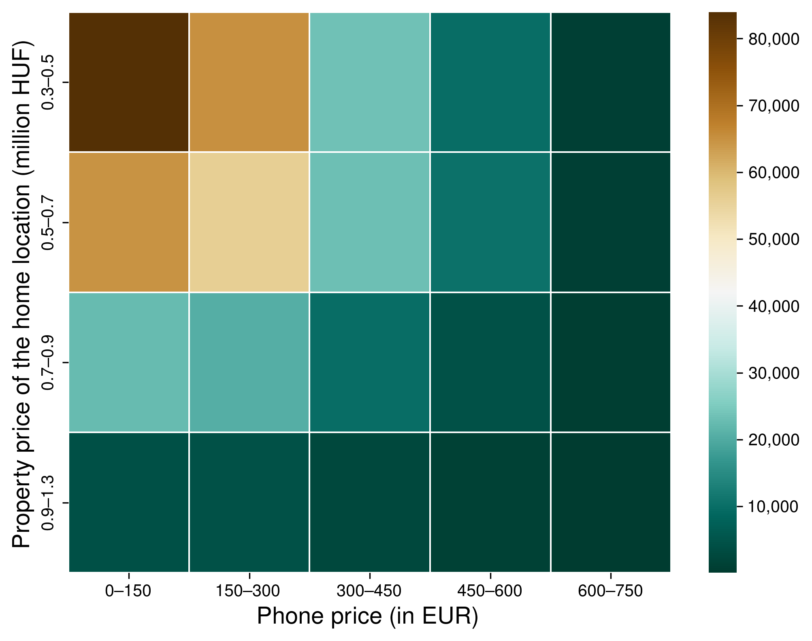
<figcaption><strong>(b)</strong> </figcaption>
<figcaption><strong>Figure 8.11.:</strong> The inhabitant-based wake-up times in the socioeconomic categories, based on the property price of the home location and mobile phone price (<strong>a</strong>), and the number of the subscribers in each category (<strong>b</strong>).</figcaption>
</figure>

<figure id="fig:homeprice_phoneage_wakeup">

<figcaption><strong>(a)</strong> </figcaption>
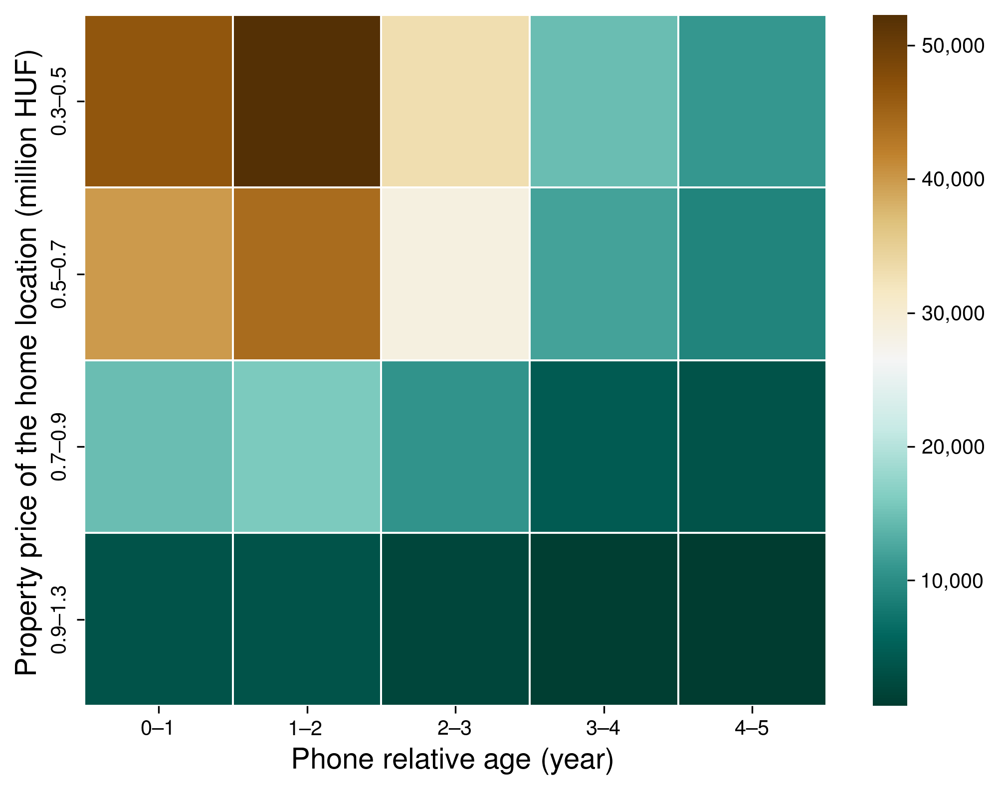
<figcaption><strong>(b)</strong> </figcaption>
<figcaption><strong>Figure 8.12.:</strong> The inhabitant-based wake-up times in the socioeconomic categories, based on the property price of the home location and the relative age of the mobile phone (<strong>a</strong>), and the number of the subscribers in each category (<strong>b</strong>).</figcaption>
</figure>

## Limitations

As for the housing-price-based approach, the inhabitants were associated with the mean property value at their home cell location (i.e., Voronoi polygons). In some regions of the city, where the density of the cellphone towers is low, this approach could lead to inaccuracy on the SES of residents (the housing prices vary in relatively bigger zones). Only one variable (housing price) was used, and other sociodemographic factors were not considered. Family and household size and education level can also be essential dimensions of SES.

As for the cellphone price base approach, subscribers' SES was associated with the release price of their cell phones. However, it is not necessary for them to buy their phones at that price. Many people buy their phone on sale or discount via the operator in exchange for signing an x-year contract.

Also, the subscribers can change their phone devices at any time, so only those subscribers have been taken into consideration, who had used only one device during the observation period or had a dominant device that generated most of the activity records of the given subscriber. It also has to be noted that people can even have more than one cellphone (e.g., a private and a work-related), but the presented model cannot take this into account.

I have fused three data sets to exclude the non-phone SIM cards, but the identified devices are not complete. There remained devices whose models are unknown, and there are phones whose release date and price are unknown. It is not possible to determine SES of these subscribers with the proposed solution. Furthermore, as Section <a href="/docs/data_sources#sec:iphone">iPhones</a> demonstrated, the phone prices seem to be depreciated, which might have distorted the results, but using actual release prices should fix this.

## Possible Enhancements

One possible research enhancement would be to use more precise data sources for the financial classification, for example, the type and price of mobile phones. The combination of the housing prices and the price of the mobile phone device might provide a better result. Moreover, the relative age of the cell phone might be used as a weight for the phone price when applied as SES indicator to distinguish between the phone price categories as an expensive but old phone is not worth as much as a newer one with the same price.

Using a data set containing information about both participants of a call, not only the social network could be built, but that network could be weighted with the financial status of the subscribers.

It may be possible to enhance this work by examining the visited places of the wealthiest classes, whether they tend to appear in areas, for example, with elegant restaurants or theaters outside of normal work hours.

Although the current solution to select the football fans' SIM cards that caused the peaks gives a reasonable result but could be improved by analyzing the activity during the whole observation period. For example, applying a machine learning technique.

Extending the list of the non-phone TACs could also help to refine the results, and combining the mobile phone prices with the real estate prices of the home location would most certainly enhance the socioeconomic characterization.

## Conclusion

In this chapter, I presented a method based on Principal Component Analysis to evaluate socioeconomic status (SES) depending on the indicators of human mobility. I have utilized two features to characterize SES, a direct and an indirect one. The indirect is the housing prices because the level of a neighborhood was used to infer the SES. When the home location is known, the typical housing price of that area can be associated with the subscriber.

I found that the mean distance between home and work locations is significantly correlated to housing prices. The people living in cheaper regions have to take longer routes to their work sites. Analyzing the residents' real estate values at home and work locations, I have found a strong positive relationship. Living in a high-priced neighborhood in Budapest requires working in more expensive regions and vice versa.

A more direct feature for the SES is the price of the subscriber's cellphone. Although the actual purchase price of a mobile phone is unknown, the recommended retail price was available along with the release date. The mobile phone price was also proved to be an expressive socioeconomic indicator that can be applied to distinguish the subscribers by mobility customs.

Using socioeconomic classes derived from housing prices at the home location, mobile phone prices, and the age of the cell phone, a correlation between the wake-up time and the socioeconomic status was also identified. The subscribers living in less expensive apartments get up earlier, and this tendency holds true in respect of the mobile phone prices: subscribers who own more expensive cell phones tend to get up later.
